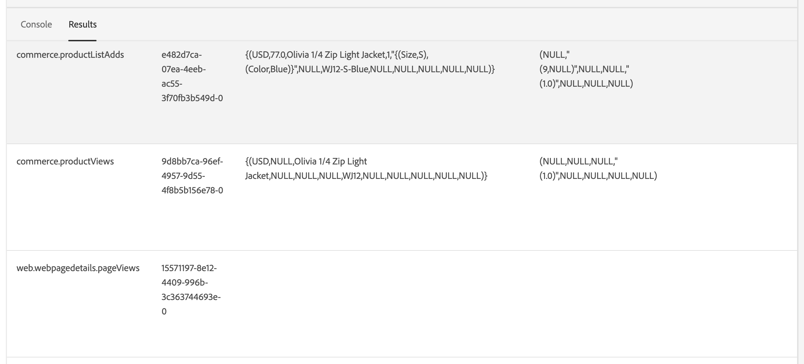

# Commerce データのAdobe Experience Platformへの接続

をインストールする場合 [!DNL Data Connection] 拡張機能では、2 つの新しい設定ページがに表示されます。 **システム** の下のメニュー **サービス** Commerce内 _Admin_.

- Commerce サービスコネクタ
- [!DNL Data Connection]

Adobe Commerce インスタンスをAdobe Experience Platformに接続するには、最初にCommerce Services コネクタを設定し、最後にコネクタを設定する必要があります [!DNL Data Connection] 拡張機能。

## Commerce サービスコネクタの設定

以前にCommerce サービスをインストールしている場合は、Adobe Commerce サービスコネクタは既に設定されているはずです。 そうでない場合は、で次のタスクを完了する必要があります [Commerce サービスコネクタ](../landing/saas.md) ページ：

1. Commerce アカウントにログインして [実稼動環境およびサンドボックス API キーの取得](../landing/saas.md#credentials).
1. を選択 [SaaS データ領域](../landing/saas.md#saas-configuration).
1. へのAdobeアカウントへのログイン [組織 ID の取得](../landing/saas.md#ims-organization-optional).

Commerce サービスコネクタを設定した後、次の設定を行います [!DNL Data Connection] 拡張機能。

## の設定 [!DNL Data Connection] 拡張子

この節では、を設定する方法について説明します [!DNL Data Connection] 拡張機能。

### サービスアカウントと資格情報の詳細の追加

収集して送信する予定がある場合 [注文履歴データ](#send-historical-order-data) または [顧客プロファイルデータ](#send-customer-profile-data)サービスアカウントと資格情報の詳細を追加する必要があります。 また、を設定している場合は [Audience Activation](https://experienceleague.adobe.com/docs/commerce-admin/customers/audience-activation.html) 拡張機能を使用する場合は、次の手順を実行する必要があります。

ストアフロントまたはバックオフィスのデータの収集と送信のみを行う場合は、 [一般](#general) セクション。

#### 手順 1:Adobe Developer コンソールでのプロジェクトの作成

Adobe Developerを認証するプロジェクトをCommerce コンソールで作成して、Experience Platformの API 呼び出しを行えるようにします。

プロジェクトを作成するには、で説明されている手順に従います [Experience PlatformAPI の認証とアクセス](https://experienceleague.adobe.com/docs/experience-platform/landing/platform-apis/api-authentication.html) チュートリアル。

チュートリアルを進める際は、プロジェクトに次のものが含まれていることを確認します。

- 以下へのアクセス [製品プロファイル](https://experienceleague.adobe.com/docs/experience-platform/landing/platform-apis/api-authentication.html#select-product-profiles): **デフォルトの実稼働 – すべてのアクセス** および **AEP のデフォルトのすべてのアクセス**.
- 正解 [役割と権限が設定されます](https://experienceleague.adobe.com/docs/experience-platform/landing/platform-apis/api-authentication.html#assign-api-to-a-role).
- サーバー間認証方法として JSON web トークン（JWT）を使用することにした場合は、秘密鍵もアップロードする必要があります。

この手順の結果、次の手順で使用する設定ファイルが作成されます。

#### 手順 2：設定ファイルのダウンロード

をダウンロード [ワークスペース設定ファイル](https://developer.adobe.com/commerce/extensibility/events/project-setup/#download-the-workspace-configuration-file). このファイルの内容をコピーして、に貼り付けます **サービスアカウント/資格情報の詳細** コマース管理者のページ。

1. Commerce Admin で、に移動します。 **ストア** > 設定 > **設定** > **サービス** > **[!DNL Data Connection]**.

1. から実装したサーバー間認証方法を選択します **Adobe Developer認証タイプ** メニュー。 Adobeでは、OAuth を使用することをお勧めします。 JWT は非推奨（廃止予定）になりました。 [詳細情報](https://developer.adobe.com/developer-console/docs/guides/authentication/ServerToServerAuthentication/migration/).

1. （JWT のみ）の内容をコピーして貼り付けます `private.key` にファイルを送信 **クライアント秘密鍵** フィールド。 次のコマンドを使用して、コンテンツをコピーします。

   ```bash
   cat config/private.key | pbcopy
   ```

   参照： [サービスアカウント（JWT）認証](https://developer.adobe.com/developer-console/docs/guides/authentication/JWT/) について `private.key` ファイル。

1. の内容をコピーします `<workspace-name>.json` にファイルを送信 **サービスアカウント/資格情報の詳細** フィールド。

   ![[!DNL Data Connection] Admin Configuration](./assets/epc-admin-config.png){width="700" zoomable="yes"}

1. クリック **設定を保存**.

### 一般

1. 管理者で、に移動します。 **システム** / サービス / **[!DNL Data Connection]**.

1. 日 **設定** タブの下 **一般**&#x200B;で設定しているように、Adobe Experience Platform アカウントに関連付けられた ID を確認します。 [Commerce サービスコネクタ](../landing/saas.md#organizationid). 組織 ID はグローバルです。 Adobe Commerce インスタンスごとに関連付けることができる組織 ID は 1 つだけです。

1. が含まれる **範囲** ドロップダウンで、コンテキストをに設定 **Web サイト**.

1. （オプション）既に [AEP Web SDK （alloy）](https://experienceleague.adobe.com/docs/experience-platform/edge/home.html) サイトにデプロイするには、このチェックボックスを有効にして、AEP Web SDK の名前を追加します。 それ以外の場合は、これらのフィールドを空白のままにし、 [!DNL Data Connection] 拡張機能によって自動的にデプロイされます。

   >[!NOTE]
   >
   >独自の AEP Web SDK を指定する場合、 [!DNL Data Connection] 拡張機能では、このページで指定されたデータストリーム ID （存在する場合）ではなく、その SDK に関連付けられたデータストリーム ID を使用します。

### データ収集

このセクションでは、Experience Platformエッジに収集して送信するデータのタイプを指定します。 データには次の 3 つのタイプがあります。

- **行動** （クライアントサイドのデータ）は、ストアフロントでキャプチャされたデータです。 これには、次のような買い物客インタラクションが含まれます `View Page`, `View Product`, `Add to Cart`、および [要求リスト](events.md#b2b-events) 情報（B2B マーチャント用）。

- **バックオフィス** （サーバーサイドのデータ）は、Commerce サーバーで取得されるデータです。 注文のステータスに関する情報（注文が行われた、キャンセルされた、払い戻された、出荷された、完了したかどうかなど）が含まれます。 また、次も含まれます [注文履歴データ](#send-historical-order-data).

- **プロファイル （ベータ版）** は、買い物客のプロファイル情報に関連するデータです。 学ぶ [詳細](#send-customer-profile-data).

Adobe Commerce インスタンスがデータ収集を開始できるようにするには、を確認してください。 [前提条件](overview.md#prerequisites).

について詳しくは、イベントのトピックを参照してください [ストアフロント](events.md#storefront-events), [バックオフィス](events-backoffice.md)、および [profile](events-backoffice.md#customer-profile-events-server-side) イベント。

>[!NOTE]
>
>のすべてのフィールド **データ収集** セクションの適用先 **Web サイト** スコープ以上。

1. を選択 **ストアフロントイベント** ストアフロントの行動データを送信する場合。

1. を選択 **バックオフィスイベント** 注文が行われた、キャンセルされた、払い戻された、出荷されたかなど、注文ステータス情報を送信する場合。

   >[!NOTE]
   >
   >を選択する場合 **バックオフィスイベント**&#x200B;すべてのバックオフィスのデータは、Experience Platformエッジに送信されます。 買い物客がデータ収集のオプトアウトを選択した場合は、Experience Platformで買い物客のプライバシー環境設定を明示的に設定する必要があります。 これは、コレクターが既に買い物客の好みに基づいて同意を処理するストアフロントイベントとは異なります。 学ぶ [詳細](https://experienceleague.adobe.com/docs/experience-platform/landing/governance-privacy-security/consent/adobe/dataset.html) Experience Platformでの買い物客のプライバシー環境設定について。

1. （独自の AEP Web SDK を使用している場合は、この手順をスキップします）。 [作成](https://experienceleague.adobe.com/docs/experience-platform/datastreams/configure.html#create) Adobe Experience Platformのデータストリーム、または収集に使用する既存のデータストリームを選択します。 そのデータストリーム ID を **データストリーム ID** フィールド。

1. を入力 **データセット ID** Commerce データを含める。 データセット ID を見つけるには：

   1. Experience PlatformUI を開き、を選択します。 **データセット** 左側のナビゲーションでを開きます **データセット** ダッシュボード。 ダッシュボードには、組織で使用可能なすべてのデータセットが一覧表示されます。 リストに表示された各データセットに関する詳細（名前、データセットが準拠するスキーマ、最新の取得実行のステータスなど）が表示されます。
   1. データストリームに関連付けられたデータセットを開きます。
   1. 右側のパネルで、データセットに関する詳細を表示します。 データセット ID をコピーします。

1. スケジュールに基づいてバックオフィスイベントデータを確実に更新する [cron](https://experienceleague.adobe.com/docs/commerce-admin/systems/tools/cron.html) ジョブ、を変更する必要があります `Sales Orders Feed` インデックス先 `Update by Schedule`.

   1. 日 _Admin_ サイドバー、に移動 **[!UICONTROL System]** > _[!UICONTROL Tools]_>**[!UICONTROL Index Management]**.

   1. のチェックボックスをオンにします。 `Sales Orders Feed` インデクサー。

   1. を設定 **[!UICONTROL Actions]** 対象： `Update by Schedule`.

   1. 初めてバックオフィスのデータを有効にする場合は、次のコマンドを実行して再インデックスを実行し、再同期をトリガーします。 その後の再同期は、 [cron](https://experienceleague.adobe.com/docs/commerce-admin/systems/tools/cron.html) ジョブが正しく設定されている。

      ```bash
      bin/magento index:reindex sales_order_data_exporter_v2
      ```

      ```bash
      bin/magento saas:resync --feed orders
      ```

#### フィールドの説明

| フィールド | 説明 |
|--- |--- |
| 範囲 | 設定を適用する特定の web サイト。 |
| 組織 ID （グローバル） | DXAdobeを購入した組織に属する ID。 この ID は、Adobe Commerce インスタンスをAdobe Experience Platformにリンクします。 |
| は、AEP Web SDK として既にサイトにデプロイされています | 独自の AEP Web SDK をサイトにデプロイした場合は、このチェックボックスを選択します |
| AEP Web SDK 名（グローバル） | Experience Platform Web SDK が既にサイトにデプロイされている場合は、このフィールドにその SDK の名前を指定します。 Experience Platformこれにより、Storefront Event Collector および Storefront Event SDK で、 [!DNL Data Connection] 拡張機能。 Experience Platform Web SDK をサイトにデプロイしていない場合は、このフィールドを空白のままにします。その後、 [!DNL Data Connection] 拡張機能によって自動的にデプロイされます。 |
| ストアフロントイベント | 組織 ID とデータストリーム ID が有効な場合、デフォルトではがオンになっています。 ストアフロントイベントは、サイトを閲覧する買い物客から匿名化された行動データを収集します。 |
| バックオフィスイベント | オンにした場合、イベントペイロードには、注文が行われた、キャンセルされた、払い戻された、出荷されたかなど、匿名の注文ステータス情報が含まれます。 |
| データストリーム ID （web サイト） | Adobe Experience Platformから他のAdobeDX 製品にデータを送信するための ID です。 この ID は、特定のAdobe Commerce インスタンス内の特定の web サイトに関連付ける必要があります。 独自のExperience Platform Web SDK を指定する場合、このフィールドではデータストリーム ID を指定しないでください。 この [!DNL Data Connection] 拡張機能では、その SDK に関連付けられたデータストリーム ID を使用し、このフィールドで指定されたデータストリーム ID を無視します（ある場合）。 |
| データセット ID （web サイト） | Commerce データを含むデータセットの ID。 このフィールドは、を選択解除していない限り必須です **ストアフロントイベント** または **バックオフィスイベント** チェックボックス。 また、独自のExperience Platform Web SDK を使用していて、データストリーム ID を指定しなかった場合でも、データストリームに関連付けられたデータセット ID を追加する必要があります。 それ以外の場合は、このフォームを保存できません。 |

オンボーディング後、ストアフロントデータがExperience Platformエッジに流れ始めます。 バックオフィスのデータがエッジに表示されるまでに約 5 分かかります。 その後の更新は、cron スケジュールに基づいてエッジに表示されます。

### 顧客プロファイルデータの送信

>[!IMPORTANT]
>
>この機能はベータ版です。

Experience Platformに送信できるプロファイルデータには、プロファイルレコードと時系列プロファイルイベントの 2 つのタイプがあります。

プロファイルレコードには、買い物客がCommerce インスタンスでプロファイルを作成する際に保存されるデータ（買い物客の名前など）が含まれています。 スキーマとデータセットが次のような場合 [適切に設定されている](profile-data.md)を選択すると、プロファイルレコードがExperience Platformに送信され、Adobeのプロファイル管理およびセグメント化サービスに転送されます。 [Real-Time CDP](https://experienceleague.adobe.com/docs/experience-platform/rtcdp/intro/rtcdp-intro/overview.html?lang=ja).

時系列プロファイルイベントには、サイト上でアカウントが作成、編集、削除されたかどうかなど、買い物客のプロファイル情報に関するデータが含まれます。 プロファイルイベントデータがExperience Platformに送信されると、データセットに格納され、他の DX 製品で使用できます。

1. 次が揃っていることを確認します [提供](#add-service-account-and-credential-details) サービスアカウントと資格情報の詳細。

1. にスキーマとデータセットが指定されていることを確認します [プロファイルレコードデータ取り込み](profile-data.md) および [時系列プロファイルイベントデータの取り込み](update-xdm.md#time-series-profile-event-data).

1. にチェックマークを付けます。 **顧客プロファイル** プロファイルデータをExperience Platformに送信する場合は、「」チェックボックスをオンにします。

1. を入力 **プロファイルデータセット ID**.

   プロファイルレコードデータでは、行動およびバックオフィスイベントデータに現在使用しているデータセットとは異なるデータセットを使用する必要があります。

1. 行動データとバックオフィスデータに使用しているものと同じデータストリーム ID でプロファイルイベントをストリーミングしない場合は、 **同じデータストリーム ID を使用した顧客プロファイルのストリーミング** 代わりに、使用するデータストリーム ID を入力します。

Real-Time CDPでプロファイルレコードが使用可能になるまで、約 10 分かかることがあります。 プロファイルイベントのストリーミングは直ちに開始されます。

#### フィールドの説明

| フィールド | 説明 |
|--- |--- |
| 顧客プロファイル | 顧客プロファイルレコードを収集して送信する場合は、このチェックボックスを選択します。 |
| プロファイルデータセット ID | プロファイルレコードでは、行動イベントやバックオフィスイベントに使用するデータセットとは異なるデータセットを使用する必要があります。 |
| 同じデータストリーム ID を使用した顧客プロファイルのストリーミング | 行動イベントとバックオフィスイベントで現在使用されているのと同じデータストリームを使用するかどうかを決定します。 |
| 顧客プロファイルのデータストリーム | 顧客プロファイルレコード固有のデータストリームを指定します。 |

### 注文履歴データの送信

Adobe Commerceは、最大 5 年間のを収集します [注文の履歴データとステータス](events-backoffice.md#back-office-events). を使用できます [!DNL Data Connection] 拡張機能：履歴データをExperience Platformに送信して、顧客プロファイルを充実させ、過去の注文に基づいてカスタマーエクスペリエンスをパーソナライズします。 データは、Experience Platform内のデータセットに保存されます。

Commerceは既に注文の履歴データを収集していますが、データをExperience Platformに送信するには、いくつかの手順を実行する必要があります。

注文履歴の詳細については、このビデオをご覧ください。次の手順を完了して、注文履歴の収集を実装します。

>[!VIDEO](https://video.tv.adobe.com/v/3424672)

#### Order Sync サービスの設定

注文同期サービスは、 [メッセージキューフレームワーク](https://developer.adobe.com/commerce/php/development/components/message-queues/) とRabbitMQ。 これらの手順を完了すると、注文ステータスデータが SaaS に同期されます。この同期は、Experience Platformに送信される前に必要になります。

1. 次が揃っていることを確認します [提供](#add-service-account-and-credential-details) サービスアカウントと資格情報の詳細。

1. [Enable （有効）](https://experienceleague.adobe.com/docs/commerce-cloud-service/user-guide/configure/service/rabbitmq.html) RabbitMQ。

   >[!NOTE]
   >
   >Commerce バージョン 2.4.7 以降ではRabbitMQが既に設定されていますが、コンシューマーを有効にする必要があります。

1. の cron ジョブによるメッセージキューコンシューマーの有効化 `.magento.env.yaml` 使用 `CRON_CONSUMERS_RUNNER` 環境変数。

   ```yaml
      stage:
        deploy:
          CRON_CONSUMERS_RUNNER:
            cron_run: true
   ```

   >[!NOTE]
   >
   >を参照してください。 [変数のデプロイ ドキュメント](https://experienceleague.adobe.com/docs/commerce-cloud-service/user-guide/configure/env/stage/variables-deploy.html#cron_consumers_runner) 使用可能なすべての設定オプションについては、を参照してください。

注文同期サービスを有効にすると、過去の注文日付範囲をで指定できるようになります **[!UICONTROL [!DNL Data Connection]]** ページ。

#### 注文履歴の日付範囲の指定

Experience Platformに送付する過去の注文の日付範囲を指定します。

1. 管理者で、に移動します。 **システム** / サービス / **[!DNL Data Connection]**.

1. 「」を選択します **注文履歴** タブ。

1. 次の下 **注文履歴の同期**, **設定からデータセット ID をコピー** チェックボックスは既に有効になっています。 これにより、で指定したのと同じデータセットを使用していることになります **設定** タブ。

1. が含まれる **送信元** および **終了** フィールドに、送信する過去の注文データの日付範囲を指定します。 日付範囲は 5 年を超えることはできません。

1. を選択 **[!UICONTROL Start Sync]** 同期をトリガーして開始します。 注文の履歴データは、ストリーミングデータであるストアフロントおよびバックオフィスデータとは対照的に、バッチデータです。 バッチ処理されたデータがExperience Platformに到着するまで約 45 分かかります。

##### フィールドの説明

| フィールド | 説明 |
|--- |--- |
| 設定からデータセット ID をコピー | で入力したデータセット ID をコピーします **設定** タブ。 |
| データセット ID （web サイト） | Commerce データを含むデータセットの ID。 このフィールドは、を選択解除していない限り必須です **ストアフロントイベント** または **バックオフィスイベント** チェックボックス。 また、独自のExperience Platform Web SDK を使用していて、データストリーム ID を指定しなかった場合でも、データストリームに関連付けられたデータセット ID を追加する必要があります。 それ以外の場合は、このフォームを保存できません。 |
| 送信元 | 注文履歴データの収集を開始する日付。 |
| 終了 | 注文履歴データの収集を終了する日付。 |
| 同期を開始 | 注文履歴データをExperience Platformエッジに同期するプロセスを開始します。 このボタンは、 **[!UICONTROL Dataset ID]** フィールドが空白か、データセット ID が無効です。 |

## イベントデータが収集されることを確認します

データがCommerce ストアから収集されていることを確認するには、 [Adobe Experience Platform debugger](https://experienceleague.adobe.com/docs/experience-platform/debugger/home.html) Commerce サイトを確認します。 データが収集されていることを確認したら、からデータを返すクエリを実行して、ストアフロントおよびバックオフィスイベントデータがエッジに表示されることを確認できます [作成したデータセット](overview.md#prerequisites).

1. を選択 **クエリ** Experience Platformの左側のナビゲーションで、 [!UICONTROL Create Query].

   

1. クエリエディターが開いたら、データセットからデータを選択するクエリを入力します。

   

   例えば、クエリは次のようになります。

   ```sql
   SELECT * from `your_dataset_name` ORDER by TIMESTAMP DESC
   ```

1. クエリの実行後、結果がに表示されます **結果** タブ、の横 **コンソール** タブ。 このビューには、クエリの表形式出力が表示されます。

   

この例では、からのイベントデータを確認できます [`commerce.productListAdds`](events.md#addtocart), [`commerce.productViews`](events.md#productpageview), [`web.webpagedetails.pageViews`](events.md#pageview)など。 このビューを使用すると、Commerce データがエッジに到達したことを確認できます。

結果が期待どおりでない場合は、データセットを開いて、失敗したバッチの読み込みを探します。 の詳細情報 [バッチインポートのトラブルシューティング](https://experienceleague.adobe.com/docs/experience-platform/ingestion/batch/troubleshooting.html).

## 次の手順

CommerceのデータがExperience Platformエッジに送信されると、Adobe Journey Optimizerなどの他のAdobe Experience Cloud製品でそのデータを使用できます。 例えば、特定のイベントをリッスンするようにJourney Optimizerを設定し、そのイベントデータに基づいて、初回ユーザーの場合はメールをトリガーし、放棄された買い物かごがある場合はメッセージを送信することができます。 次の方法でCommerce プラットフォームを拡張する方法について説明します [カスタマージャーニーの作成](using-ajo.md) Journey Optimizerで。
