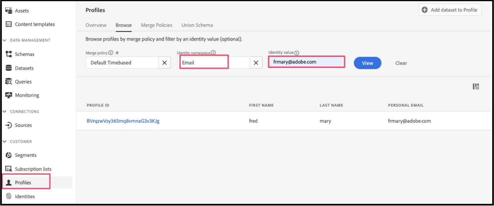
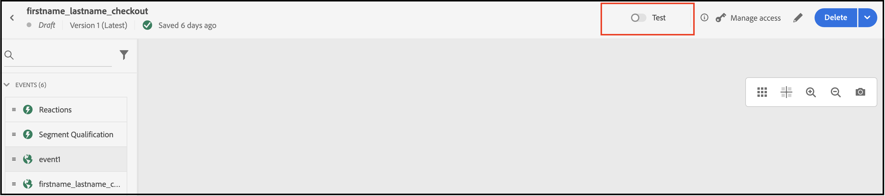

# Adobe Journey Optimizerを使用した買い物かごの放棄に関する電子メールの送信

[Adobe Journey Optimizer](https://experienceleague.adobe.com/docs/journey-optimizer/using/get-started/get-started.html) は、買い物客のコマースエクスペリエンスをパーソナライズするのに役立ちます。 例えば、Journey Optimizerを使用して、小売店向けの週別プロモーションなどのスケジュールされたマーケティングキャンペーンを作成して配信したり、顧客が買い物かごに製品を追加したがチェックアウトプロセスを完了しなかった場合に買い物かごの放棄済み電子メールを生成したりできます。

次の手順に従うことで、 `checkout` イベントを作成し、Journey Optimizerでそのイベントに応答して、買い物かごの放棄された電子メールを作成します。

>[!IMPORTANT]
>
>デモ用に、コマースサンドボックス環境を使用していることを確認してください。 これにより、Experience Platformに送信するストアフロントおよびバックオフィスのイベントデータが、実稼動イベントデータを希薄化しなくなります。

## 前提条件

これらの手順を開始する前に、次の点を確認してください。

- Adobe Journey Optimizerを使用するようにプロビジョニングされています
- あなた [設定済み](connect-data.md) の [!DNL Data Connection] 拡張
- あなた [確認済み](connect-data.md#confirm-that-event-data-is-collected) コマースイベントデータがExperience Platformの端に到達する

## 手順 1：コマースサンドボックス環境でユーザーを作成する

サンドボックス環境でユーザーを作成し、そのユーザーアカウント情報が「Experience Platform」に表示されることを確認します。 指定した電子メールが、後でこの節で使用され、放棄された買い物かごの電子メールを送信する際に有効であることを確認します。

1. コマースサンドボックス環境にログインするか、アカウントを作成します。

   {width="700" zoomable="yes"}

   を使用 [!DNL Data Connection] インストールおよび設定された拡張機能。このアカウント情報は、プロファイルとしてExperience Platformに送信されます。

1. ユーザーアカウント情報が **[!UICONTROL Profile]** Experience Platformの

   に移動します。 **[!UICONTROL Profiles]** Adobe Experience Platformで クリック **[!UICONTROL Detail]** を選択し、作成したプロファイルを確認します。

   {width="700" zoomable="yes"}

## 手順 2:Journey Optimizerでイベントを表示する

コマースサンドボックス環境で、製品ページの表示、買い物かごへの項目の追加、買い物客が実行するその他の様々なアクティビティをおこないます。 これらのアクティビティトリガーイベントは、ストアフロントで発生します。 これらのイベントがJourney Optimizerに送信されていることを確認できます。

1. Launch [Adobe Journey Optimizer](https://experienceleague.adobe.com/docs/journey-optimizer/using/get-started/user-interface.html).
1. 選択 **[!UICONTROL Profiles]**.
1. 設定 **[!UICONTROL Identity namespace]** から `Email`.
1. を設定します。 **[!UICONTROL Identity value]** を電子メールアドレスに追加します。
1. プロファイルを選択し、 **[!UICONTROL Events]** タブをクリックします。

   {width="700" zoomable="yes"}

   を探します。 `commerce.checkouts` イベントを参照し、イベントペイロードを確認します。

   ```json
   "personID": "84281643067178465783746543501073369488", 
   "eventType": "commerce.checkouts", 
   "_id": "4b41703f-e42e-485b-8d63-7001e3580856-0", 
   "commerce": { 
       "cart": {}, 
       "checkouts": { 
           "value": 1 
       } 
   ```

   ご覧のように、完全なイベントペイロードには、リッチイベントデータが含まれています。 次の節では、Journey Optimizerでイベントを設定して、 `commerce.checkouts` イベントが Commerce ストアフロントから生成されました。

## 手順 3:Journey Optimizerでのイベントの設定

Journey Optimizerで 2 つのイベントを設定します。1 つのイベントで `commerce.checkouts` イベントを Commerce から送信し、もう 1 つは基本的なタイムアウトイベントで、買い物かごの放棄された電子メールをトリガーする前に、特定の時間が経過するのを待機します。

### リスナーイベントを作成

1. Launch [Adobe Journey Optimizer](https://experienceleague.adobe.com/docs/journey-optimizer/using/get-started/user-interface.html).

1. クリック **[!UICONTROL Configurations]** の下に **[!UICONTROL Administration]** 」セクションに表示されます。

1. Adobe Analytics の **[!UICONTROL Events]** タイル、クリック **[!UICONTROL Manage]**.

   {width="700" zoomable="yes"}

1. 次の日： **[!UICONTROL Events]** ページ、クリック **[!UICONTROL Create Event]**.

1. 右側のナビゲーションで、次のようにイベントを設定します。

   1. を設定します。 **[!UICONTROL Name]** 移動先： `firstname_lastname_checkout`.
   1. 設定 **[!UICONTROL Type]** から **[!UICONTROL Unitary]**.
   1. 設定 **[!UICONTROL Event id typ]e** から **[!UICONTROL Rule based]**.
   1. 設定 **[!UICONTROL Schema]** をコマースに追加します。 [スキーマ](update-xdm.md).
   1. 選択 **[!UICONTROL Fields]** また、 **[!UICONTROL Fields]** 表示されるページで、このイベントに役立つフィールドを選択します。 例えば、「 **[!UICONTROL Product list items]**, **[!UICONTROL Commerce]**, **[!UICONTROL eventType]**、および **[!UICONTROL Web]**.
   1. クリック **[!UICONTROL OK]** をクリックして、選択したフィールドを保存します。
   1. 内側をクリック **[!UICONTROL Event id condition]** フィールドに入り、条件を作成する `eventType` 次と等しい `commerce.checkouts` および `personalEmail.address` は、前のセクションでプロファイルを作成した際に使用した E メールアドレスと等しくなります。

      {width="700" zoomable="yes"}

   1. クリック **[!UICONTROL OK]**.
   1. クリック **[!UICONTROL Save]** をクリックしてイベントを保存します。

### タイムアウトイベントの作成

1. 以前と同様に、Journey Optimizerでイベントを作成します。

1. 右側のナビゲーションで、次のようにイベントを設定します。

   1. を設定します。 **[!UICONTROL Name]** 移動先： `firstname_lastname_timeout`.
   1. 設定 **[!UICONTROL Type]** から **[!UICONTROL Unitary]**.
   1. 設定 **[!UICONTROL Event id typ]e** から **[!UICONTROL Rule based]**.
   1. 設定 **[!UICONTROL Schema]** をコマースに追加します。 [スキーマ](update-xdm.md).
   1. を設定します。 **[!UICONTROL Schema]**, **[!UICONTROL Fields]**、および **[!UICONTROL Event id condition]** 上記と同じに設定します。
   1. クリック **[!UICONTROL Save]** をクリックしてイベントを保存します。

これらの 2 つのイベントを設定したら、放棄された買い物かごの電子メールを送信するジャーニーを作成します。

## 手順 4：チェックアウトジャーニーの構築

をリッスンするジャーニーの作成 `commerce.checkouts` イベントを追加し、指定された時間が経過した後で、買い物かごの放棄済み電子メールを送信します。

1. Journey Optimizerで、 **[!UICONTROL Journeys]** under **J[!UICONTROL OURNEY MANAGEMENT]**.
1. クリック **[!UICONTROL Create Journey]**.
1. ジャーニーの名前を指定します。
1. クリック **[!UICONTROL OK]** ジャーニーを保存します。
1. 左側のナビゲーションで、 **[!UICONTROL EVENTS]** 「 」セクションで、以前に作成したチェックアウトイベントを検索します。 `firstname_lastname_checkout` をクリックし、キャンバスにドラッグ&amp;ドロップします。

   >[!TIP]
   >
   >イベントをダブルクリックすると、キャンバスに自動的に追加されます。

1. タイムアウトイベントを検索し、キャンバスに追加します。
1. タイムアウトイベントをダブルクリックします。

   1. Adobe Analytics の **[!UICONTROL Timeout]** セクションで、 **[!UICONTROL Define the event time]** チェックボックス。
   1. Adobe Analytics の **[!UICONTROL Wait for]** フィールド入力 `1` および `Minute`.
   1. を選択します。 **[!UICONTROL Set a timeout path]** チェックボックス。

   このタイムアウト設定を使用すると、チェックアウトを実行したが、このタイムアウト分岐で 1 分以内に注文を完了しない買い物客が、トリガーを完了しません。 実際の実稼動環境では、24 時間のように長い期間設定します。

1. 左側のナビゲーションで、 **[!UICONTROL ACTIONS]**、 **[!UICONTROL Email]** アクションをタイムアウトブランチに追加します。 ジャーニーは次のようになります。

   {width="700" zoomable="yes"}

### 放棄された買い物かごの電子メールの作成

放棄された買い物かごが検出された際に送信される、放棄された買い物かごの電子メールを作成します。

1. 上で作成したジャーニーで、 **[!UICONTROL Email]** アイコンをクリックします。

1. フォロー： [手順](https://experienceleague.adobe.com/docs/journey-optimizer/using/content-management/personalization/personalization-use-cases/personalization-use-case-helper-functions.html#configure-email) ( Journey Optimizerガイド ) を参照し、買い物かごから放棄された電子メールを作成します。

これで、Journey Optimizerで `commerce.checkouts` イベントを作成します。また、一定期間経過後に送信される、離脱した買い物かご電子メールも送信されます。 次の節では、ジャーニーをテストします。

## 手順 5：チェックアウトイベントをリアルタイムでトリガー化します。

この節では、イベントをリアルタイムでテストします。

1. Journey Optimizerで、テストモードをオンに切り替えます。

   {width="700" zoomable="yes"}

1. このジャーニーをリアルタイムでテストするには、別のブラウザータブを開き、サンドボックスコマース Web サイトに移動します。

   1. 買い物かごに製品を追加します。
   1. チェックアウトページに移動します。
   1. チェックアウトページから、メインページに戻るかタブを閉じることで、買い物かごを放棄します。

      ジャーニーがトリガーされました。 確認するには、Journey Optimizerでジャーニーを持つタブを開きます。 ユーザーが通ったパスを示す緑色の矢印が表示されます。

1. メールの受信トレイを確認します。
