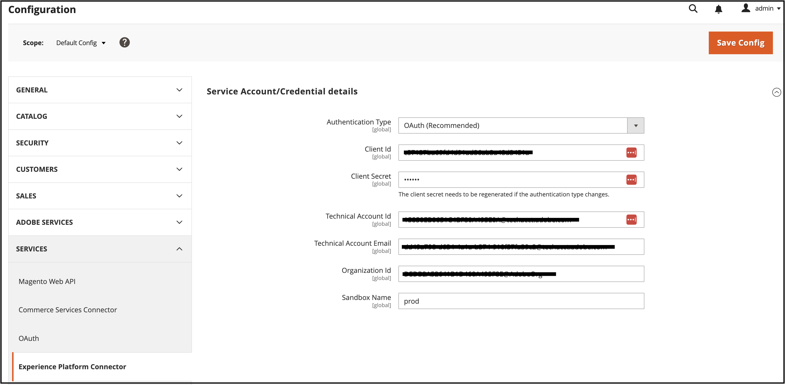

# コマースデータをAdobe Experience Platformに接続

Experience Platformコネクタをインストールすると、 **システム** 下のメニュー **サービス** （コマース内） _管理者_.

- Commerce Services コネクタ
- Experience Platformコネクタ

Adobe CommerceインスタンスをAdobe Experience Platformに接続するには、両方のコネクタを設定する必要があります。まず Commerce Services コネクタを設定し、次にExperience Platformコネクタを設定します。

## Commerce Services コネクタの更新

既にAdobe Commerceサービスをインストールしている場合は、既に Commerce Services コネクタが設定されている可能性があります。 そうでない場合は、 [Commerce Services コネクタ](../landing/saas.md) ページ：

1. Commerce アカウントにログインして、 [実稼動環境とサンドボックス API キーの取得](../landing/saas.md#credentials).
1. を選択します。 [SaaS データ容量](../landing/saas.md#saas-configuration).
1. にAdobeアカウントにログイン [組織 ID の取得](../landing/saas.md#ims-organization-optional).

コマースサービスコネクタを設定した後、Experience Platformコネクタを設定します。

## Experience Platformコネクタの更新

このセクションでは、組織 ID を使用してAdobe CommerceインスタンスをAdobe Experience Platformに接続します。 次に、データのタイプ（ストアフロントとバックオフィス）を指定して、Experience PlatformEdge に送信できます。


## 一般

1. 管理者で、に移動します。 **システム** /サービス/ **Experience Platformコネクタ**.

1. 次の日： **設定** 下のタブ **一般**&#x200B;に設定されているように、Adobe Experience Platformアカウントに関連付けられている ID を確認します。 [Commerce Services コネクタ](../landing/saas.md#organizationid). 組織 ID はグローバルです。 1 つのAdobe Commerceインスタンスに関連付けることができる組織 ID は 1 つだけです。

1. Adobe Analytics の **範囲** ドロップダウンで、コンテキストを次に設定します。 **Web サイト**.

1. （オプション）既に [AEP Web SDK（合金）](https://experienceleague.adobe.com/docs/experience-platform/edge/home.html) サイトにデプロイし、チェックボックスを有効にして、AEP Web SDK の名前を追加します。 それ以外の場合は、これらのフィールドを空白のままにすると、Experience Platformコネクタによって自動的にデプロイされます。

   >[!NOTE]
   >
   >独自の AEP Web SDK を指定した場合、Experience Platformコネクタは、このページで指定されたデータストリーム ID（存在する場合）ではなく、その SDK に関連付けられたデータストリーム ID を使用します。

## データ収集

このセクションでは、Experience PlatformEdge に送信するデータのタイプを指定します。 データには、クライアント側とサーバー側の 2 種類があります。

クライアントサイドのデータは、ストアフロントでキャプチャされるデータです。 これには、買い物客のインタラクション ( `View Page`, `View Product`, `Add to Cart`、および [購買依頼リスト](events.md#b2b-events) 情報（B2B 商人用） サーバーサイドのデータ（バックオフィスのデータ）は、コマースサーバーでキャプチャされるデータです。 これには、注文が発行されたか、取り消されたか、返金されたか、発送されたか、完了したかなど、注文のステータスに関する情報が含まれます。

Adobe Commerceインスタンスがデータ収集を開始できることを確認するには、 [前提条件](overview.md#prerequisites).

詳しくは、イベントのトピックを参照してください。 [店頭の](events.md#storefront-events) および [バックオフィス](events.md#back-office-events) イベント。

>[!NOTE]
>
>すべてのフィールド ( **データ収集** セクションの適用対象： **Web サイト** 範囲以上。

1. 選択 **ストアフロントイベント** storefront 行動データを送信する場合。

1. 選択 **バックオフィスイベント** 注文が発行されたか、取り消されたか、返金されたか、出荷されたかなど、注文ステータス情報を送信する場合。

   >[!NOTE]
   >
   >次を選択した場合、 **バックオフィスイベント**&#x200B;に設定されていない場合、すべてのバックオフィスデータがExperience PlatformEdge に送信されます。 買い物客がデータ収集をオプトアウトする場合は、Experience Platformで買い物客のプライバシー設定を明示的に設定する必要があります。 これは、コレクターが買い物客の環境設定に基づいて既に同意を処理しているストアフロントイベントとは異なります。 [詳細情報](https://experienceleague.adobe.com/docs/experience-platform/landing/governance-privacy-security/consent/adobe/dataset.html) Experience Platformでの買い物客のプライバシー設定に関する情報。

1. （独自の AEP Web SDK を使用している場合は、この手順をスキップします）。 [作成](https://experienceleague.adobe.com/docs/experience-platform/datastreams/configure.html#create) Adobe Experience Platformのデータストリーム、または収集に使用する既存のデータストリームを選択します。 そのデータストリーム ID を **Datastream ID** フィールドに入力します。

1. 次を入力します。 **データセット ID** Commerce データを含める必要があります。 データセット ID を見つけるには：

   1. Experience PlatformUI を開き、「 」を選択します。 **データセット** 左側のナビゲーションで、 **データセット** ダッシュボード。 ダッシュボードには、組織で使用可能なすべてのデータセットがリストされます。 リストに表示された各データセットに関する詳細（名前、データセットが適用されるスキーマ、最新の取り込み実行のステータスなど）が表示されます。
   1. データストリームに関連付けられたデータセットを開きます。
   1. 右側のウィンドウで、データセットの詳細を表示します。 データセット ID をコピーします。

   {width="700" zoomable="yes"}

1. バックオフィスのイベントデータを、 [cron](https://experienceleague.adobe.com/docs/commerce-admin/systems/tools/cron.html) ジョブの場合は、 `Sales Orders Feed` インデックス `Update by Schedule`.

   1. 次の日： _管理者_ サイドバー、移動 **[!UICONTROL System]** > _[!UICONTROL Tools]_>**[!UICONTROL Index Management]**.

   1. のチェックボックスをオンにします。 `Sales Orders Feed` インデクサー。

   1. 設定 **[!UICONTROL Actions]** から `Update by Schedule`.

   1. バックオフィスのデータを初めて有効にする場合は、次のコマンドを実行して再インデックスを作成し、再同期をトリガーします。 その後の再同期は、 [cron](https://experienceleague.adobe.com/docs/commerce-admin/systems/tools/cron.html) ジョブが正しく設定されている。

      ```bash
      bin/magento index:reindex sales_order_data_exporter_v2
      ```

      ```bash
      bin/magento saas:resync --feed orders
      ```

## フィールドの説明

| フィールド | 説明 |
|--- |--- |
| 範囲 | 設定を適用する特定の Web サイト。 |
| 組織 ID （グローバル） | AdobeDX 製品を購入した組織に属する ID。 この ID は、Adobe CommerceインスタンスをAdobe Experience Platformにリンクします。 |
| AEP Web SDK が既にサイトにデプロイされているか。 | 独自の AEP Web SDK をサイトにデプロイした場合は、このチェックボックスを選択します。 |
| AEP Web SDK 名（グローバル） | 既にサイトにExperience PlatformWeb SDK がデプロイされている場合は、このフィールドにその SDK の名前を指定します。 これにより、Storefront Event Collector および Storefront Event SDK は、Experience PlatformコネクタによってデプロイされたExperience Platformではなく、Web SDK を使用できます。 サイトにExperience PlatformWeb SDK がデプロイされていない場合は、このフィールドを空白のままにしておくと、Experience Platformコネクタがユーザーに代わってデプロイします。 |
| ストアフロントイベント | 組織 ID とデータストリーム ID が有効である限り、デフォルトでオンになります。 Storefront イベントは、サイトを閲覧する買い物客から匿名化された行動データを収集します。 |
| バックオフィスイベント | オンにすると、イベントペイロードには、注文が発行されたか、キャンセルされたか、返金されたか、発送されたかなど、匿名化された注文ステータス情報が含まれます。 |
| Datastream ID（Web サイト） | Adobe Experience Platformから他のAdobeDX 製品にデータを送信できるようにする ID。 この ID は、特定のAdobe Commerceインスタンス内の特定の Web サイトに関連付ける必要があります。 独自のExperience PlatformWeb SDK を指定する場合は、このフィールドにデータストリーム ID を指定しないでください。 Experience Platformコネクタは、その SDK に関連付けられたデータストリーム ID を使用し、このフィールドで指定されたデータストリーム ID を無視します（存在する場合）。 |
| データセット ID （Web サイト） | コマースデータを含むデータセットの ID。 このフィールドは、 **ストアフロントイベント** または **バックオフィスイベント** チェックボックス。 また、独自のExperience PlatformWeb SDK を使用していて、データストリーム ID を指定していない場合でも、データストリームに関連付けられたデータセット ID を追加する必要があります。 そうしないと、このフォームを保存できません。 |

>[!NOTE]
>
>オンボーディング後、ストアフロントデータがExperience Platformエッジに送られ始めます。 バックオフィスのデータが最後に表示されるまでに約 5 分かかります。 その後の更新は、Cron スケジュールに基づいてエッジで表示されます。

## 履歴注文データの送信

Adobe Commerceは最大 5 年間を収集 [過去の注文データとステータス](events.md#back-office-events). Experience Platformコネクタを使用して、その履歴データをExperience Platformに送信し、過去の注文に基づいて、顧客プロファイルを強化し、顧客エクスペリエンスをパーソナライズできます。 データは、Experience Platform内のデータセットに保存されます。

Commerce は既に履歴注文データを収集していますが、そのデータをExperience Platformに送信するには、いくつかの手順を完了する必要があります。

このビデオを見て、注文履歴の詳細を確認し、次の手順を実行して、注文履歴の収集と設定を実装します。

>[!VIDEO](https://video.tv.adobe.com/v/3424672)

### 手順 1：履歴注文データ収集をインストールする

履歴注文データの収集を有効にするには、プロジェクトのルートを更新する必要があります [!DNL Composer] `.json` ファイルの内容は次のとおりです。

1. ルートを開く `composer.json` ファイルと検索 `magento/experience-platform-connector`.

1. Adobe Analytics の `require` 「 」セクションで、次のようにバージョン番号を更新します。

   ```json
   "require": {
      ...
      "magento/experience-platform-connector": "^3.0.0",
      ...
    }
   ```

1. B2B マーチャントの場合は、 `.json` ファイルの内容は次のとおりです。

   ```json
   "require": {
     ...
     "magento/experience-platform-connector-b2b": "^2.0.0"
     ...
   }
   ```

1. **保存** `composer.json`. 次に、コマンドラインから次の操作を実行します。

   ```bash
   composer update magento/experience-platform-connector –-with-dependencies
   ```

   B2B 商人の場合は次のようになります。

   ```bash
   composer update magento/experience-platform-connector-b2b --with-dependencies
   ```

### 手順 2:Adobe Developer Console でプロジェクトを作成する

>[!NOTE]
>
>既にをインストールして有効にしている場合は、 [Audience Activation](https://experienceleague.adobe.com/docs/commerce-admin/customers/audience-activation.html) 拡張機能には、手順 2 および 3 が既に完了しています。

コマースを認証してExperience PlatformAPI を呼び出すためのプロジェクトをAdobe Developerコンソールで作成します。

プロジェクトを作成するには、 [Experience PlatformAPI の認証とアクセス](https://experienceleague.adobe.com/docs/experience-platform/landing/platform-apis/api-authentication.html) チュートリアル

チュートリアルを進めながら、プロジェクトに次の内容が含まれていることを確認します。

- 次へのアクセス [製品プロファイル](https://experienceleague.adobe.com/docs/experience-platform/landing/platform-apis/api-authentication.html#select-product-profiles): **デフォルトの実稼動環境へのすべてのアクセス** および **AEP デフォルトのすべてのアクセス**.
- 正しい [役割と権限が設定されている](https://experienceleague.adobe.com/docs/experience-platform/landing/platform-apis/api-authentication.html#assign-api-to-a-role).
- JSON Web トークン (JWT) をサーバー間認証方式として使用する場合は、秘密鍵もアップロードする必要があります。

この手順の結果、次の手順で使用する設定ファイルが作成されます。

### 手順 3：設定ファイルをダウンロードする

をダウンロードします。 [ワークスペース設定ファイル](https://developer.adobe.com/commerce/extensibility/events/project-setup/#download-the-workspace-configuration-file). このファイルの内容をコピーし、 **サービスアカウント/資格情報の詳細** コマース管理のページ。

1. コマース管理で、に移動します。 **ストア** /設定/ **設定** > **サービス** > **Experience Platformコネクタ**.

1. 実装したサーバー間認証方法を、 **Adobe I/O認証タイプ** メニュー。 Adobeでは、OAuth の使用をお勧めします。 JWT は非推奨（廃止予定）となりました。 [詳細情報](https://developer.adobe.com/developer-console/docs/guides/authentication/ServerToServerAuthentication/migration/).

1. （JWT のみ） `private.key` ～に入る **クライアントの秘密鍵** フィールドに入力します。 次のコマンドを使用して、コンテンツをコピーします。

   ```bash
   cat config/private.key | pbcopy
   ```

   詳しくは、 [サービスアカウント (JWT) 認証](https://developer.adobe.com/developer-console/docs/guides/authentication/JWT/) を参照してください。 `private.key` ファイル。

1. の内容をコピーします。 `<workspace-name>.json` ～に入る **サービスアカウント/資格情報の詳細** フィールドに入力します。

   {width="700" zoomable="yes"}

1. クリック **設定を保存**.

### 手順 4：注文同期サービスのセットアップ

開発者資格情報を入力したら、注文同期サービスを設定します。 注文同期サービスは、 [メッセージキューフレームワーク](https://developer.adobe.com/commerce/php/development/components/message-queues/) RabbitMQ これらの手順を完了すると、注文ステータスデータを SaaS に同期できます。SaaS は、Experience Platformに送信される前に必要です。

1. [有効にする](https://experienceleague.adobe.com/docs/commerce-cloud-service/user-guide/configure/service/rabbitmq.html) RabbitMQ。

   >[!NOTE]
   >
   >RabbitMQは既にコマースバージョン 2.4.7 以降用に設定されていますが、コンシューマーを有効にする必要があります。

1. 次の cron ジョブでメッセージキューコンシューマーを有効にする： `.magento.env.yaml` using `CRON_CONSUMERS_RUNNER` 環境変数。

   ```yaml
      stage:
        deploy:
          CRON_CONSUMERS_RUNNER:
            cron_run: true
   ```

   >[!NOTE]
   >
   >詳しくは、 [変数のデプロイに関するドキュメント](https://experienceleague.adobe.com/docs/commerce-cloud-service/user-guide/configure/env/stage/variables-deploy.html#cron_consumers_runner) を参照して、使用可能なすべての設定オプションについて確認してください。

注文同期サービスを有効にすると、「Experience Platformコネクタ」ページで注文の履歴日付範囲を指定できます。

### 手順 5：注文履歴の日付範囲の指定

Experience Platformに送信する過去の注文の日付範囲を指定します。

{width="700" zoomable="yes"}

1. 管理者で、に移動します。 **システム** /サービス/ **Experience Platformコネクタ**.

1. を選択します。 **注文履歴** タブをクリックします。

1. の下 **注文履歴の同期**、 **設定からデータセット ID をコピーする** チェックボックスは既に有効になっています。 これにより、 **設定** タブをクリックします。

1. Adobe Analytics の **送信者** および **宛先** 「 」フィールドで、送信する履歴注文データの日付範囲を指定します。 5 年を超える日付範囲は選択できません。

1. 選択 **[!UICONTROL Start Sync]** ：同期を開始するトリガーを設定します。 履歴注文データは、ストリーミングデータであるストアフロントおよびバックオフィスデータとは異なり、バッチデータになります。 バッチ処理されたデータがExperience Platformに到着するまでに約 45 分かかります。

| フィールド | 説明 |
|--- |--- |
| 設定からデータセット ID をコピーする | に入力したデータセット ID をコピーします。 **設定** タブをクリックします。 |
| データセット ID （Web サイト） | コマースデータを含むデータセットの ID。 このフィールドは、 **ストアフロントイベント** または **バックオフィスイベント** チェックボックス。 また、独自のExperience PlatformWeb SDK を使用していて、データストリーム ID を指定していない場合でも、データストリームに関連付けられたデータセット ID を追加する必要があります。 そうしないと、このフォームを保存できません。 |
| 送信者 | 注文履歴データの収集を開始する日付。 |
| 宛先 | 注文履歴データの収集を終了する日付。 |
| 同期を開始 | 注文履歴データとExperience PlatformEdge の同期プロセスを開始します。 このボタンは、 **[!UICONTROL Dataset ID]** フィールドが空白であるか、データセット ID が無効です。 |

## イベントデータが収集されていることを確認する

データがコマースストアから収集されていることを確認するには、 [Adobe Experience Platform debugger](https://experienceleague.adobe.com/docs/experience-platform/debugger/home.html) をクリックして、コマースサイトを確認します。 データが収集されていることを確認したら、ストアフロントおよびバックオフィスのイベントデータがエッジに表示されていることを確認するには、 [作成したデータセット](overview.md#prerequisites).

1. 選択 **クエリ** をクリックし、Experience Platformの左側のナビゲーションで [!UICONTROL Create Query].

   

1. クエリエディターが開いたら、データセットからデータを選択するクエリを入力します。

   

   例えば、クエリは次のようになります。

   ```sql
   SELECT * from `your_dataset_name` ORDER by TIMESTAMP DESC
   ```

1. クエリを実行すると、結果が **結果** タブ（横） **コンソール** タブをクリックします。 このビューは、クエリの出力を表形式で表示します。

   

この例では、 [`commerce.productListAdds`](events.md#addtocart), [`commerce.productViews`](events.md#productpageview), [`web.webpagedetails.pageViews`](events.md#pageview)など。 このビューを使用すると、コマースデータがエッジに到達したことを確認できます。

結果が期待どおりでない場合は、データセットを開き、失敗したバッチのインポートを探します。 詳細情報： [バッチインポートのトラブルシューティング](https://experienceleague.adobe.com/docs/experience-platform/ingestion/batch/troubleshooting.html).

## 次の手順

コマースデータがExperience Platformエッジに送信されると、Adobe Journey Optimizerなどの他のAdobe Experience Cloud製品でそのデータを使用できます。 例えば、Journey Optimizerが特定のイベントをリッスンするように設定し、そのイベントデータに基づいて、初めてのユーザーに対して電子メールをトリガーしたり、買い物かごに放棄があった場合に使用したりできます。 次の方法でコマースプラットフォームを拡張する方法を説明します： [カスタマージャーニーの作成](using-ajo.md) Journey Optimizerで
