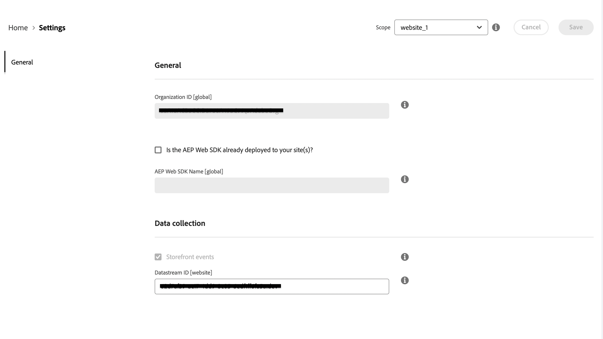

# コマースデータをAdobe Experience Platformに接続 {#connectaep}

Adobe CommerceインスタンスをAdobe Experience Platformに接続するには、組織 ID とデータストリーム ID を指定する必要があります。

## 一般

1. でAdobeアカウントにサインイン [Commerce Services コネクタ](../landing/saas.md#organizationid) 組織 ID を選択します。

1. 管理者で、に移動します。 **システム** /サービス/ **Experience Platformコネクタ**.

1. 内 **範囲** ドロップダウンで、コンテキストを **Web サイト**.

1. 内 **組織 ID** 」フィールドに、Adobe Experience Platformアカウントに関連付けられている ID が表示されます。この ID は、 [Commerce Services コネクタ](../landing/saas.md#organizationid). 組織 ID はグローバルです。 1 つのAdobe Commerceインスタンスに関連付けることができる組織 ID は 1 つだけです。

1. （オプション）既に [AEP Web SDK（合金）](https://experienceleague.adobe.com/docs/experience-platform/edge/home.html) サイトにデプロイし、チェックボックスを有効にして、AEP Web SDK の名前を追加します。 それ以外の場合は、これらのフィールドを空白のままにすると、Experience Platformコネクタによって自動的にデプロイされます。

   >[!NOTE]
   >
   >独自の AEP Web SDK を指定した場合、Experience Platformコネクタは、このページで指定されたデータストリーム ID（存在する場合）ではなく、その SDK に関連付けられたデータストリーム ID を使用します。

## データ収集

内 **データ収集** 「 」セクションでは、収集してExperience Platformedge に送信するデータのタイプを指定します。 AEP Web SDK と組織 ID が有効である限り、デフォルトでは、ストアフロントイベントが自動的に送信されます。 詳しくは、イベントのトピックを参照してください [店頭](events.md#storefront-events) および [バックオフィス](events.md#back-office-events) イベント。

>[!NOTE]
>
>すべてのフィールド ( **データ収集** セクションの適用対象 **Web サイト** 範囲以上。

1. 選択 **バックオフィスイベント** 注文が発行されたか、取り消されたか、返金されたか、出荷されたかなど、注文ステータス情報を送信する場合。

   >[!NOTE]
   >
   >デフォルトでは、すべてのバックオフィスデータがExperience Platformエッジに送信されます。 買い物客がデータ収集をオプトアウトする場合は、Experience Platformで買い物客のプライバシー設定を明示的に設定する必要があります。 これは、コレクターが買い物客の環境設定に基づいて既に同意を処理しているストアフロントイベントとは異なります。 [詳細情報](https://experienceleague.adobe.com/docs/experience-platform/landing/governance-privacy-security/consent/adobe/dataset.html) Experience Platformでの買い物客のプライバシー設定に関する情報。

1. （独自の AEP Web SDK を使用している場合は、この手順をスキップします）。 [作成](https://experienceleague.adobe.com/docs/experience-platform/edge/datastreams/configure.html#create) Adobe Experience Platformのデータストリーム、または収集に使用する既存のデータストリームを選択します。

1. （独自の AEP Web SDK を使用している場合は、この手順をスキップします）。 内 **データストリーム ID** 「 」フィールドに、新規または既存のデータストリームの ID を貼り付けます。

## フィールドの説明

| フィールド | 説明 |
|--- |--- |
| 範囲 | 設定を適用する特定の Web サイト。 |
| 組織 ID （グローバル） | AdobeDX 製品を購入した組織に属する ID。 この ID は、Adobe CommerceインスタンスをAdobe Experience Platformにリンクします。 |
| AEP Web SDK が既にサイトにデプロイされているか。 | 独自の AEP Web SDK をサイトにデプロイした場合は、このチェックボックスを選択します。 |
| AEP Web SDK 名（グローバル） | 既にサイトにExperience PlatformWeb SDK がデプロイされている場合は、このフィールドにその SDK の名前を指定します。 これにより、Storefront Event Collector および Storefront Event SDK は、Experience PlatformコネクタによってデプロイされたExperience Platformではなく、Web SDK を使用できます。 サイトにExperience PlatformWeb SDK がデプロイされていない場合、このフィールドを空白のままにすると、Experience Platformコネクタがデプロイします。 |
| ストアフロントイベント | 組織 ID とデータストリーム ID が有効である限り、デフォルトでオンになります。 Storefront イベントは、サイトを閲覧する買い物客から匿名化された行動データを収集します。 |
| バックオフィスイベント | オンにすると、イベントペイロードには、注文が発行されたか、キャンセルされたか、返金されたか、発送されたかなど、匿名化された注文ステータス情報が含まれます。 |
| Datastream ID (Website) | Adobe Experience Platformから他のAdobeDX 製品にデータを送信できるようにする ID。 この ID は、特定のAdobe Commerceインスタンス内の特定の Web サイトに関連付ける必要があります。 独自のExperience PlatformWeb SDK を指定する場合は、このフィールドにデータストリーム ID を指定しないでください。 Experience Platformコネクタは、その SDK に関連付けられたデータストリーム ID を使用し、このフィールドで指定されたデータストリーム ID を無視します（存在する場合）。 |

Experience Platformコネクタ拡張機能がインストールされ、Adobe CommerceとAdobe Experience Platform間のリンクが作成され、Datastream ID が指定されると、Commerce データがAdobe Experience Platformエッジおよび他のAdobeDX 製品に送られ始めます。

>[!NOTE]
>
> エッジから他のAdobeDX 製品へのデータの流れに要する時間は異なる場合があります。

## データがExperience Platformに送信されていることを確認

コマースデータがAdobe Experience Platform Edge に送信されると、次のようなレポートを作成できます。

_Adobe Experience Managerのコマースデータ_
