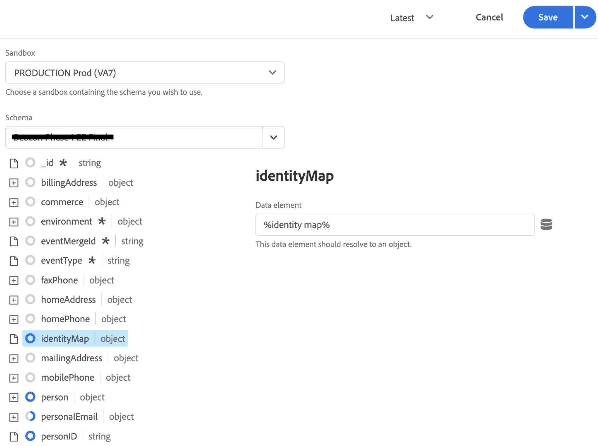
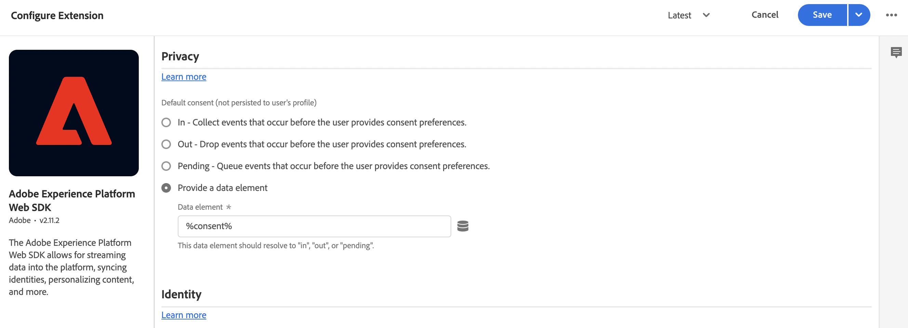

# Adobe Experience Platformタグを使用したコマースデータの収集

Experience Platformコネクタを使用してストアフロントイベントの公開と購読をおこなうことはできますが、一部のマーチャントは、既にデータ収集ソリューション ( [Adobe Experience Platformタグ](https://experienceleague.adobe.com/docs/platform-learn/data-collection/tags/create-a-property.html). これらのマーチャントに対して、Adobe Commerceでは、Adobe Commerce Event SDK を使用するExperience Platformコネクタで公開専用のオプションが提供されています。


_Experience Platform付きコネクタのデータフロー_

このトピックでは、Experience Platformコネクタが提供するストアフロントイベント値を、既に使用しているAdobe Experience Platformタグソリューションにマッピングする方法について説明します。

## Adobe Commerceからイベントデータを収集

コマースイベントデータを収集するには：

- のインストール [Adobe Commerce Events SDK](https://github.com/adobe/commerce-events/tree/main/packages/commerce-events-sdk). PHP ストアフロントについては、 [インストール](install.md) トピック。 PWA Studioストアフロントについては、 [PWA Studioガイド](https://developer.adobe.com/commerce/pwa-studio/integrations/adobe-commerce/aep/).

  >[!NOTE]
  >
  > 実行 **not** [設定](connect-data.md) 組織 ID およびデータストリーム ID。

## コマースストアフロントデータのAdobe Experience Platformへのマッピング

Commerce ストアフロントデータをAdobe Experience Platformにマッピングするには、Adobe Experience Platformタグ内から次を設定してインストールします。

1. [タグプロパティの設定](https://experienceleague.adobe.com/docs/platform-learn/implement-in-websites/configure-tags/create-a-property.html) (Adobe Experience Platform Data Collection) を参照してください。

1. の下 **オーサリング**&#x200B;を選択します。 **拡張機能** 次の拡張機能をインストールして設定します。

   - [Adobeクライアントデータレイヤー](https://experienceleague.adobe.com/docs/experience-platform/tags/extensions/adobe/client-data-layer/overview.html)

   - [Adobe Experience Platform Web SDK](https://experienceleague.adobe.com/docs/experience-platform/edge/fundamentals/installing-the-sdk.html)

1. [タグを公開](https://experienceleague.adobe.com/docs/experience-platform/tags/publish/overview.html) を開発環境に追加します。

1. フォロー： **イベントマッピング** 以下の手順で、特定のイベントのデータ要素とルールを設定します。

### イベントマッピング

タグを使用したデータ収集はAdobe Commerce Event SDK を使用した場合とは異なるので、両方のフレームワークで使用される同等の用語を理解することが重要です。

| Adobe Experience Platformタグ用語 | Adobe Commerce Event SDK の用語 |
|---|---|
| _データ要素_ | context |
| _ルール_ | イベント |
|  | _ルール条件_  — イベントリスナー（ACDL から）<br><br>_ルールアクション_  — イベントハンドラー (Adobe Experience Platformに送信 ) |

Adobe Experience Platformタグのデータ要素とルールをAdobe Commerce固有のイベントデータで更新する場合、次のような一般的な手順を実行できます。

例えば、Adobe Commerce `signOut` イベントからAdobe Experience Platformタグへ 以下で説明する手順は、設定した特定の値を除き、を追加する方法を示します。 [データ要素](https://experienceleague.adobe.com/docs/experience-platform/collection/e2e.html#data-element) および [ルール](https://experienceleague.adobe.com/docs/experience-platform/collection/e2e.html#create-a-rule)：タグに追加するすべてのAdobe Commerceイベントに適用されます。

1. データ要素の作成：

   
   _新規データ要素の作成_

1. 設定 **名前** から `sign out`.

1. 設定 **拡張** から `Adobe Experience Platform Web SDK`.

1. 設定 **データ要素タイプ** から `XDM object`.

1. を選択します。 **サンドボックス** および **スキーマ** を更新します。

1. の下 **userAccount** > **ログアウト**、 **値** in **訪問者ログアウト** から `1`.

   
   _サインアウト値の更新_

1. 選択 **保存**.

1. ルールの作成：

   
   _新規ルールの作成_

1. 選択 **追加** under **イベント**.

1. 設定 **拡張** から `Adobe Client Data Layer`.

1. 設定 **イベントタイプ** から `Data Pushed`.

1. 選択 **特定のイベント** そして、 **登録するイベント/キー** から `sign-out`.

1. 選択 **変更を保持** をクリックして新しいルールを保存します。

1. アクションを追加します。

1. 設定 **拡張** から `Adobe Experience Platform Web SDK`.

1. 設定 **アクションタイプ** から `Send Event`.

1. 設定 **インスタンス** から `Alloy`.

1. 設定 **タイプ** から `userAccount.logout`.

1. 設定 **XDM データ** から `%sign out%`.

1. クリック **保存**.

   スキーマに、 `signOut` Adobe Commerceからのイベント また、Adobe Commerceストアフロントからイベントが発生したときに発生する必要がある特定のアクションを持つルールを作成しました。

以下に説明する各Adobe Commerceイベントに対して、上記の手順をタグで繰り返します。

## 使用可能なイベント

以下の各イベントについて、上記の手順に従ってAdobe Commerceイベントを XDM にマッピングします。

- [&#39;signOut&#39;](#signout)
- [&#39;サインイン&#39;](#signin)
- [&#39;createAccount&#39;](#createaccount)
- [&#39;editAccount&#39;](#editaccount)
- [&#39;pageView&#39;](#pageview)
- [&#39;productView&#39;](#productview)
- [&#39;searchRequestSent&#39;](#searchrequestsent)
- [&#39;searchResponseReceived&#39;](#searchresponsereceived)
- [&#39;addToCart&#39;](#addtocart)
- [&#39;openCart&#39;](#opencart)
- [&#39;viewCart&#39;](#viewcart)
- [&#39;removeFromCart&#39;](#removefromcart)
- [&#39;initiateCheckout&#39;](#initiatecheckout)
- [&#39;placeOrder&#39;](#placeorder)

### signOut

買い物客がサインアウトを試みたときにトリガーされます。

#### データ要素

次のデータ要素を作成します。

1. ログアウト：

   - **名前**: `Sign out`
   - **拡張**: `Adobe Experience Platform Web SDK`
   - **データ要素タイプ**: `XDM object`
   - **フィールドグループ**: `userAccount` > `logout`
   - **訪問者ログアウト**: **値** = `1`

#### ルール 

- **名前**: `Sign out`
- **拡張**: `Adobe Client Data Layer`
- **イベントタイプ**: `Data Pushed`
- **特定のイベント**: `sign-out`

##### アクション

- **拡張**: `Adobe Experience Platform Web SDK`
- **アクションタイプ**: `Send event`
- **タイプ**: `userAccount.logout`
- **XDM データ**: `%sign-out%`

### signIn

買い物客がログインしようとしたときにトリガーされます。

#### データ要素

次のデータ要素を作成します。

1. アカウントの電子メール：

   - **名前**: `account email`
   - **拡張**: `Adobe Client Data Layer`
   - **データ要素タイプ**: `Data Layer Computed State`
   - **[オプション] パス**: `accountContext.emailAddress`

1. アカウントタイプ：

   - **名前**: `account type`
   - **拡張**: `Adobe Client Data Layer`
   - **データ要素タイプ**: `Data Layer Computed State`
   - **[オプション] パス**: `accountContext.accountType`

1. アカウント ID :

   - **名前**: `account id`
   - **拡張**: `Adobe Client Data Layer`
   - **データ要素タイプ**: `Data Layer Computed State`
   - **[オプション] パス***: `accountContext.accountId`

1. ログイン：

   - **名前**: `sign in`
   - **拡張**: `Adobe Experience Platform Web SDK`
   - **データ要素タイプ**: `XDM object`
   - **フィールドグループ**: `person` > `accountID`
   - **アカウント ID**: **値** = `%account id%`
   - **フィールドグループ**: `person` > `accountType`
   - **アカウントタイプ**: **値** = `%account type%`
   - **フィールドグループ**: `person` > `personalEmailID`
   - **個人の電子メールアドレス**: **値** = `%account email%`
   - **フィールドグループ**: `personalEmail` > `address`
   - **住所**: **値** = `%account email%`
   - **フィールドグループ**: `userAccount` > `login`
   - **訪問者ログイン**: **値** = `1`

#### ルール 

- **名前**: `sign in`
- **拡張**: `Adobe Client Data Layer`
- **イベントタイプ**: `Data Pushed`
- **特定のイベント**: `sign-in`

##### アクション

- **拡張**: `Adobe Experience Platform Web SDK`
- **アクションタイプ**: `Send event`
- **タイプ**: `userAccount.login`
- **XDM データ**: `%sign in%`

### createAccount

買い物客がアカウントを作成しようとしたときにトリガーされます。

#### データ要素

次のデータ要素を作成します。

1. アカウントの電子メール：

   - **名前**: `account email`
   - **拡張**: `Adobe Client Data Layer`
   - **データ要素タイプ**: `Data Layer Computed State`
   - **[オプション] パス**: `accountContext.emailAddress`

1. アカウントタイプ：

   - **名前**: `account type`
   - **拡張**: `Adobe Client Data Layer`
   - **データ要素タイプ**: `Data Layer Computed State`
   - **[オプション] パス**: `accountContext.accountType`

1. アカウント ID :

   - **名前**: `account id`
   - **拡張**: `Adobe Client Data Layer`
   - **データ要素タイプ**: `Data Layer Computed State`
   - **[オプション] パス**: `accountContext.accountId`

1. アカウントを作成：

   - **名前**: `Create account`
   - **拡張**: `Adobe Experience Platform Web SDK`
   - **データ要素タイプ**: `XDM object`
   - **フィールドグループ**: `person` > `accountID`
   - **アカウント ID**: **値** = `%account id%`
   - **フィールドグループ**: `person` > `accountType`
   - **アカウントタイプ**: **値** = `%account type%`
   - **フィールドグループ**: `person` > `personalEmailID`
   - **個人の電子メールアドレス**: **値** = `%account email%`
   - **フィールドグループ**: `personalEmail` > `address`
   - **住所**: **値** = `%account email%`
   - **フィールドグループ**: `userAccount` > `createProfile`
   - **アカウントプロファイルの作成**: **値** = `1`

#### ルール 

- **名前**: `Create account`
- **拡張**: `Adobe Client Data Layer`
- **イベントタイプ**: `Data Pushed`
- **特定のイベント**: `create-account`

##### アクション

- **拡張**: `Adobe Experience Platform Web SDK`
- **アクションタイプ**: `Send event`
- **タイプ**: `userAccount.createProfile`
- **XDM データ**: `%create account%`

### editAccount

買い物客がアカウントを編集しようとしたときにトリガーされます。

#### データ要素

次のデータ要素を作成します。

1. アカウントの電子メール：

   - **名前**: `account email`
   - **拡張**: `Adobe Client Data Layer`
   - **データ要素タイプ**: `Data Layer Computed State`
   - **[オプション] パス**: `accountContext.emailAddress`

1. アカウントタイプ：

   - **名前**: `account type`
   - **拡張**: `Adobe Client Data Layer`
   - **データ要素タイプ**: `Data Layer Computed State`
   - **[オプション] パス**: `accountContext.accountType`

1. アカウント ID :

   - **名前**: `account id`
   - **拡張**: `Adobe Client Data Layer`
   - **データ要素タイプ**: `Data Layer Computed State`
   - **[オプション] パス**: `accountContext.accountId`

1. アカウントを編集：

   - **名前**: `Edit account`
   - **拡張**: `Adobe Experience Platform Web SDK`
   - **データ要素タイプ**: `XDM object`
   - **フィールドグループ**: `person` > `accountID`
   - **アカウント ID**: **値** = `%account id%`
   - **フィールドグループ**: `person` > `accountType`
   - **アカウントタイプ**: **値** = `%account type%`
   - **フィールドグループ**: `person` > `personalEmailID`
   - **個人の電子メールアドレス**: **値** = `%account email%`
   - **フィールドグループ**: `personalEmail` > `address`
   - **住所**: **値** = `%account email%`
   - **フィールドグループ**: `userAccount` > `updateProfile`
   - **アカウントプロファイルの作成**: **値** = `1`

#### ルール

- **名前**: `Edit account`
- **拡張**: `Adobe Client Data Layer`
- **イベントタイプ**: `Data Pushed`
- **特定のイベント**: `edit-account`

##### アクション

- **拡張**: `Adobe Experience Platform Web SDK`
- **アクションタイプ**: `Send event`
- **タイプ**: `userAccount.updateProfile`
- **XDM データ**: `%edit account%`

### pageView

ページが読み込まれたときにトリガーされます。

#### データ要素

次のデータ要素を作成します。

1. ページ名：

   - **名前**: `page name`
   - **拡張**: `Adobe Client Data Layer`
   - **データ要素タイプ**: `Data Layer Computed State`
   - **[オプション] パス**: `pageContext.pageName`

#### ルール 

- **名前**: `page view`
- **拡張**: `Adobe Client Data Layer`
- **イベントタイプ**: `Data Pushed`
- **特定のイベント**: `page-view`

##### アクション

- **拡張**: `Adobe Experience Platform Web SDK`
- **アクションタイプ**: `Send event`
- **タイプ**: `web.webPageDetails.pageViews`
- **XDM データ**: `%page view%`

### productView

製品ページが読み込まれたときにトリガーされます。

#### データ要素

次のデータ要素を作成します。

1. 製品名：

   - **名前**: `product name`
   - **拡張**: `Adobe Client Data Layer`
   - **データ要素タイプ**: `Data Layer Computed State`
   - **[オプション] パス**: `productContext.name`

1. 製品 SKU:

   - **名前**: `product sku`
   - **拡張**: `Adobe Client Data Layer`
   - **データ要素タイプ**: `Data Layer Computed State`
   - **[オプション] パス**: `productContext.sku`

1. 製品画像 URL:

   - **名前**: `product image`
   - **拡張**: `Adobe Client Data Layer`
   - **データ要素タイプ**: `Data Layer Computed State`
   - **[オプション] パス**: `productContext.mainImageUrl`

1. 製品の通貨：

   - **名前**: `product currency`
   - **拡張**: `Adobe Client Data Layer`
   - **データ要素タイプ**: `Data Layer Computed State`
   - **[オプション] パス**: `productContext.pricing.currencyCode`

1. 通貨コード：

   - **名前**: `currency code`
   - **拡張**: `Core`
   - **データ要素タイプ**: `Custom Code`
   - **編集画面を開く**:

   ```bash
   return _satellite.getVar('product currency') || _satellite.getVar('storefront').storeViewCurrencyCode
   ```

1. 特別価格：

   - **名前**: `special price`
   - **拡張**: `Adobe Client Data Layer`
   - **データ要素タイプ**: `Data Layer Computed State`
   - **[オプション] パス**: `productContext.pricing.specialPrice`

1. 定価：

   - **名前**: `regular price`
   - **拡張**: `Adobe Client Data Layer`
   - **データ要素タイプ**: `Data Layer Computed State`
   - **[オプション] パス**: `productContext.pricing.regularPrice`

1. 製品価格：

   - **名前**: `product price`
   - **拡張**: `Core`
   - **データ要素タイプ**: `Custom Code`
   - **編集画面を開く**:

   ```bash
   return _satellite.getVar('product regular price') || _satellite.getVar('product special price')
   ```

1. 製品表示：

   - **名前**: `product view`
   - **拡張**: `Adobe Experience Platform Web SDK`
   - **データ要素タイプ**: `XDM object`
   - **フィールドグループ**: `productListItems`. 選択 **個々の項目を指定** をクリックし、 **項目を追加** 」ボタンをクリックします。 このビューは PDP 用なので、1 つの項目を入力できます。
   - **フィールドグループ**: `productListItems` > `name`
   - **名前**: **値** = `%product name%`
   - **フィールドグループ**: `productListItems` > `SKU`
   - **SKU**: **値** = `%product sku%`
   - **フィールドグループ**: `productListItems` > `priceTotal`
   - **価格合計**: **値** = `%product price%`
   - **フィールドグループ**: `productListItems` > `currencyCode`
   - **通貨コード**: **値** = `%currency code%`
   - **フィールドグループ**: `productListItems` > `ProductImageUrl`
   - **ProductImageUrl**: **値** = `%product image%`
   - **フィールドグループ**: `commerce` > `productViews` > `value`
   - **値**: **値** = `1`

#### ルール 

- **名前**: `product view`
- **拡張**: `Adobe Client Data Layer`
- **イベントタイプ**: `Data Pushed`
- **特定のイベント**: `product-page-view`

##### アクション

- **拡張**: `Adobe Experience Platform Web SDK`
- **アクションタイプ**: `Send event`
- **タイプ**: `commerce.productViews`
- **XDM データ**: `%product view%`

### searchRequestSent

「入力時に検索」ポップオーバーのイベントおよび検索結果ページのイベントによってトリガーされます。

#### データ要素

次のデータ要素を作成します。

1. 入力を検索

   - **名前**: `search input`
   - **拡張**: `Adobe Client Data Layer`
   - **データ要素タイプ**: `Data Layer Computed State`
   - **[オプション] パス**: `searchInputContext.units[0]`

1. 入力フレーズを検索

   - **名前**: `search input phrase`
   - **拡張**: `Core`
   - **データ要素タイプ**: `Custom Code`
   - **編集画面を開く**:

   ```bash
   return _satellite.getVar('search input').phrase;
   ```

1. 検索入力の並べ替え

   - **名前**: `search input sort`
   - **拡張**: `Core`
   - **データ要素タイプ**: `Custom Code`
   - **編集画面を開く**:

   ```bash
   const searchInput = _satellite.getVar('search input');
   const sortFromInput = searchInput ? searchInput.sort : [];
   const sort = sortFromInput.map((searchSort) => {
       return {
           attribute: searchSort.attribute,
           order: searchSort.direction,
       };
   });
   return sort;
   ```

1. 入力フィルターを検索

   - **名前**: `search input filters`
   - **拡張**: `Core`
   - **データ要素タイプ**: `Custom Code`
   - **編集画面を開く**:

   ```bash
   const searchInput = _satellite.getVar('search input');
   const filtersFromInput = searchInput ? searchInput.filter : [];
   const filters = filtersFromInput.map(
       (searchFilter) => {
           let value = [];
           let isRange = false;
           if (searchFilter.eq) {
               value.push(searchFilter.eq);
           } else if (searchFilter.in) {
               value = searchFilter.in;
           } else if (searchFilter.range) {
               isRange = true;
               value.push(String(searchFilter.range.from));
               value.push(String(searchFilter.range.to));
           }
           return {
               attribute: searchFilter.attribute,
               value,
               isRange,
           };
       }
   );
   
   return filters;
   ```

1. 検索リクエスト：

   - **名前**: `search request`
   - **拡張**: `Adobe Experience Platform Web SDK`
   - **データ要素タイプ**: `XDM object`
   - **フィールドグループ**: `siteSearch` > `phrase`
   - **値**:まだ利用できません
   - **フィールドグループ**: `siteSearch` > `sort`. 選択 **オブジェクト全体を提供**.
   - **フィールドグループ**: `siteSearch` > `filter`. 選択 **オブジェクト全体を提供**.
   - **フィールドグループ**: `searchRequest` > `id`
   - **一意の識別子**: **値** = `%search request ID%`
   - **フィールドグループ**: `searchRequest` > `value`
   - **値**: **値** = `1`

#### ルール 

- **名前**: `search request sent`
- **拡張**: `Adobe Client Data Layer`
- **イベントタイプ**: `Data Pushed`
- **特定のイベント**: `search-request-sent`

##### アクション

- **拡張**: `Adobe Experience Platform Web SDK`
- **アクションタイプ**: `Send event`
- **タイプ**: `searchRequest`
- **XDM データ**: `%search request%`

### searchResponseReceived

「入力時に検索」ポップオーバーまたは検索結果ページの結果がライブ検索で返された場合にトリガーされます。

#### データ要素

次のデータ要素を作成します。

1. 検索結果：

   - **名前**: `search results`
   - **拡張**: `Adobe Client Data Layer`
   - **データ要素タイプ**: `Data Layer Computed State`
   - **[オプション] パス**: `searchResultsContext.units[0]`

1. 製品の検索結果数：

   - **名前**: `search result number of products`
   - **拡張**: `Core`
   - **データ要素タイプ**: `Custom Code`
   - **編集画面を開く**:

   ```bash
   return _satellite.getVar('search result').products.length;
   ```

1. 検索結果の製品：

   - **名前**: `search result products`
   - **拡張**: `Core`
   - **データ要素タイプ**: `Custom Code`
   - **編集画面を開く**:

   ```bash
   const searchResult = _satellite.getVar('search result');
   const productsFromResult = searchResult.products ? searchResult.products : [];
   const products = productsFromResult.map(
       (product) => {
           return { SKU: product.sku, name: product.name };
       }
   );
   return products;
   ```

1. 検索結果の候補：

   - **名前**: `search result products`
   - **拡張**: `Core`
   - **データ要素タイプ**: `Custom Code`
   - **編集画面を開く**:

   ```bash
   const searchResult = _satellite.getVar('search result');
   const suggestionsFromResult = searchResult.suggestions ? searchResult.suggestions : [];
   const suggestions = suggestionsFromResult.map((suggestion) => suggestion.suggestion);
   return suggestions;
   ```

1. 製品画像 URL:

   - **名前**: `product image`
   - **拡張**: `Adobe Client Data Layer`
   - **データ要素タイプ**: `Data Layer Computed State`
   - **[オプション] パス**: `productContext.mainImageUrl`

1. 検索応答：

   - **名前**: `search response`
   - **拡張**: `Adobe Experience Platform Web SDK`
   - **データ要素タイプ**: `XDM object`
   - **フィールドグループ**: `siteSearch` > `suggestions`. 選択 **オブジェクト全体を提供**.
   - **データ要素**: `%search result suggestions%`
   - **フィールドグループ**: `siteSearch` > `numberOfResults`
   - **値**: `%search result number of products%`
   - **フィールドグループ**: `productListItems`. 選択 **オブジェクト全体を提供**.
   - **フィールドグループ**: `productListItems` > `ProductImageUrl`
   - **ProductImageUrl**: **値** = `%product image%`
   - **データ要素**: `%search result products%`
   - **フィールドグループ**: `searchResponse` > `id`
   - **一意の識別子**: **値** = `%search response ID%`
   - **フィールドグループ**: `searchResponse` > `value`
   - **値**: **値** = `1`

#### ルール 

- **名前**: `search response received`
- **拡張**: `Adobe Client Data Layer`
- **イベントタイプ**: `Data Pushed`
- **特定のイベント**: `search-response-received`

##### アクション

- **拡張**: `Adobe Experience Platform Web SDK`
- **アクションタイプ**: `Send event`
- **タイプ**: `searchResponse`
- **XDM データ**: `%search response%`

### addToCart

買い物かごに製品が追加されたとき、または買い物かご内の製品の数量が増加するたびにトリガーされます。

#### データ要素

次のデータ要素を作成します。

1. 製品名：

   - **名前**: `product name`
   - **拡張**: `Adobe Client Data Layer`
   - **データ要素タイプ**: `Data Layer Computed State`
   - **[オプション] パス**: `productContext.name`

1. 製品 sku:

   - **名前**: `product sku`
   - **拡張**: `Adobe Client Data Layer`
   - **データ要素タイプ**: `Data Layer Computed State`
   - **[オプション] パス**: `productContext.sku`

1. 通貨コード：

   - **名前**: `currency code`
   - **拡張**: `Adobe Client Data Layer`
   - **データ要素タイプ**: `Data Layer Computed State`
   - **[オプション] パス**: `productContext.pricing.currencyCode`

1. 製品の特別価格：

   - **名前**: `product special price`
   - **拡張**: `Adobe Client Data Layer`
   - **データ要素タイプ**: `Data Layer Computed State`
   - **[オプション] パス**: `productContext.pricing.specialPrice`

1. 製品画像 URL:

   - **名前**: `product image`
   - **拡張**: `Adobe Client Data Layer`
   - **データ要素タイプ**: `Data Layer Computed State`
   - **[オプション] パス**: `productContext.mainImageUrl`

1. 商品の定価：

   - **名前**: `product regular price`
   - **拡張**: `Adobe Client Data Layer`
   - **データ要素タイプ**: `Data Layer Computed State`
   - **[オプション] パス**: `productContext.pricing.regularPrice`

1. 製品価格：

   - **名前**: `product price`
   - **拡張**: `Core`
   - **データ要素タイプ**: `Custom Code`
   - **編集画面を開く**:

   ```bash
   return _satellite.getVar('product regular price') || _satellite.getVar('product special price') 
   ```

1. 買い物かご：

   - **名前**: `cart`
   - **拡張**: `Adobe Client Data Layer`
   - **データ要素タイプ**: `Data Layer Computed State`
   - **[オプション] パス**: `shoppingCartContext`

1. 買い物かご ID :

   - **名前**: `cart id`
   - **拡張**: `Core`
   - **データ要素タイプ**: `Custom Code`
   - **編集画面を開く**:

   ```bash
   return _satellite.getVar('cart').id
   ```

1. 買い物かごに追加：

   - **名前**: `add to cart`
   - **拡張**: `Adobe Experience Platform Web SDK`
   - **データ要素タイプ**: `XDM object`
   - **フィールドグループ**: `productListItems`. 選択 **個々の項目を指定** をクリックし、 **項目を追加** 」ボタンをクリックします。 このビューは PDP 用なので、1 つの項目を入力できます。
   - **フィールドグループ**: `productListItems` > `name`
   - **名前**: **値** = `%product name%`
   - **フィールドグループ**: `productListItems` > `SKU`
   - **SKU**: **値** = `%product sku%`
   - **フィールドグループ**: `productListItems` > `priceTotal`
   - **価格合計**: **値** = `%product price%`
   - **フィールドグループ**: `productListItems` > `currencyCode`
   - **フィールドグループ**: `productListItems` > `ProductImageUrl`
   - **ProductImageUrl**: **値** = `%product image%`
   - **通貨コード**: **値** = `%currency code%`
   - **フィールドグループ**: `commerce` > `cart` > `cartID`
   - **買い物かご ID**: **値** = `%cart id%`
   - **フィールドグループ**: `commerce` > `productListAdds` > `value`
   - **値**: **値** = `1`

#### ルール 

- **名前**: `add to cart`
- **拡張**: `Adobe Client Data Layer`
- **イベントタイプ**: `Data Pushed`
- **特定のイベント**: `add-to-cart`

##### アクション

- **拡張**: `Adobe Experience Platform Web SDK`
- **アクションタイプ**: `Send event`
- **タイプ**: `commerce.productListAdds`
- **XDM データ**: `%add to cart%`

### openCart

新しい買い物かごが作成されたときにトリガーされます。これは、製品が空の買い物かごに追加されたときに発生します。

#### データ要素

次のデータ要素を作成します。

1. 買い物かごを開く：

   - **名前**: `open cart`
   - **拡張**: `Adobe Experience Platform Web SDK`
   - **データ要素タイプ**: `XDM object`
   - **フィールドグループ**: `commerce` > `productListOpens` > `value`
   - **値**: **値** = `1`
   - **フィールドグループ**: `commerce` > `cart` > `cartID`
   - **買い物かご ID**: **値** = `%cart id%`
   - **フィールドグループ**: `productListItems`. の場合 `productListItems`、複数の項目を事前に計算できます。 選択 **productListItems** > **アレイ全体を提供**.

#### ルール 

- **名前**: `open cart`
- **拡張**: `Adobe Client Data Layer`
- **イベントタイプ**: `Data Pushed`
- **特定のイベント**: `open-cart`

##### アクション

- **拡張**: `Adobe Experience Platform Web SDK`
- **アクションタイプ**: `Send event`
- **タイプ**: `commerce.productListOpens`
- **XDM データ**: `%open cart%`

### viewCart

買い物かごのページが読み込まれたときにトリガーされます。

#### データ要素

次のデータ要素を作成します。

1. ストアフロント：

   - **名前**: `storefront`
   - **拡張**: `Adobe Client Data Layer`
   - **データ要素タイプ**: `Data Layer Computed State`
   - **[オプション] パス**: `storefrontInstanceContext`

1. 製品画像 URL:

   - **名前**: `product image`
   - **拡張**: `Adobe Client Data Layer`
   - **データ要素タイプ**: `Data Layer Computed State`
   - **[オプション] パス**: `productContext.mainImageUrl`

   1. 買い物かご：

   - **名前**: `cart`
   - **拡張**: `Adobe Client Data Layer`
   - **データ要素タイプ**: `Data Layer Computed State`
   - **[オプション] パス**: `shoppingCartContext`

1. 買い物かご ID :

   - **名前**: `cart id`
   - **拡張**: `Core`
   - **データ要素タイプ**: `Custom Code`
   - **編集画面を開く**:

   ```bash
   return _satellite.getVar('cart').id
   ```

1. 製品リスト項目：

   - **名前**: `product list items:`
   - **拡張**: `Core`
   - **データ要素タイプ**: `Custom Code`
   - **編集画面を開く**:

   ```bash
   const storefrontContext = _satellite.getVar('storefront');
   const cart = _satellite.getVar('cart');
   
   const returnList = [];
   cart.items.forEach(item => {
       const selectedOptions = [];
       item.configurableOptions?.forEach(option => {
           selectedOptions.push({
               attribute: option.optionLabel,
               value: option.valueLabel,
           });
       });
   
       const productListItem = {
           SKU: item.product.sku,
           name: item.product.name,
           quantity: item.quantity,
           priceTotal: item.prices.price.value * item.quantity,
           currencyCode: item.prices.price.currency ? item.prices.price.currency : storefrontContext.storeViewCurrencyCode,
           selectedOptions: selectedOptions,
       };
   
       returnList.push(productListItem);
   });
   return returnList;
   ```

1. 買い物かごを表示：

   - **名前**: `view cart`
   - **拡張**: `Adobe Experience Platform Web SDK`
   - **データ要素タイプ**: `XDM object`
   - **フィールドグループ**: `productListItems`. の場合 `productListItems`、事前に計算された複数の項目を指定できます。 選択 **productListItems** > **配列全体の入力**.
   - **データ要素**: `%product list items%`
   - **フィールドグループ**: `productListItems` > `ProductImageUrl`
   - **ProductImageUrl**: **値** = `%product image%`
   - **フィールドグループ**: `commerce` > `cart` > `cartID`
   - **買い物かご ID**: **値** = `%cart id%`
   - **フィールドグループ**: `commerce` > `productListViews` > `value`
   - **値**: **値** = `1`

#### ルール

- **名前**: `view cart`
- **拡張**: `Adobe Client Data Layer`
- **イベントタイプ**: `Data Pushed`
- **特定のイベント**: `shopping-cart-view`

##### アクション

- **拡張**: `Adobe Experience Platform Web SDK`
- **アクションタイプ**: `Send event`
- **タイプ**: `commerce.productListViews`
- **XDM データ**: `%view cart%`

### removeFromCart

買い物かごから製品が削除されたとき、または買い物かご内の製品の量が減少するたびにトリガーされます。

#### データ要素

次のデータ要素を作成します。

1. 製品名：

   - **名前**: `product name`
   - **拡張**: `Adobe Client Data Layer`
   - **データ要素タイプ**: `Data Layer Computed State`
   - **[オプション] パス**: `productContext.name`

1. 製品 sku:

   - **名前**: `product sku`
   - **拡張**: `Adobe Client Data Layer`
   - **データ要素タイプ**: `Data Layer Computed State`
   - **[オプション] パス**: `productContext.sku`

1. 通貨コード：

   - **名前**: `currency code`
   - **拡張**: `Adobe Client Data Layer`
   - **データ要素タイプ**: `Data Layer Computed State`
   - **[オプション] パス**: `productContext.pricing.currencyCode`

1. 製品の特別価格：

   - **名前**: `product special price`
   - **拡張**: `Adobe Client Data Layer`
   - **データ要素タイプ**: `Data Layer Computed State`
   - **[オプション] パス**: `productContext.pricing.specialPrice`

1. 商品の定価：

   - **名前**: `product regular price`
   - **拡張**: `Adobe Client Data Layer`
   - **データ要素タイプ**: `Data Layer Computed State`
   - **[オプション] パス**: `productContext.pricing.regularPrice`

1. 製品価格：

   - **名前**: `product price`
   - **拡張**: `Core`
   - **データ要素タイプ**: `Custom Code`
   - **編集画面を開く**:

   ```bash
   return _satellite.getVar('product regular price') || _satellite.getVar('product special price') 
   ```

1. 買い物かご：

   - **名前**: `cart`
   - **拡張**: `Adobe Client Data Layer`
   - **データ要素タイプ**: `Data Layer Computed State`
   - **[オプション] パス**: `shoppingCartContext`

1. 買い物かご ID :

   - **名前**: `cart id`
   - **拡張**: `Core`
   - **データ要素タイプ**: `Custom Code`
   - **編集画面を開く**:

   ```bash
   return _satellite.getVar('cart').id
   ```

1. 買い物かごから削除：

   - **名前**: `remove from cart`
   - **拡張**: `Adobe Experience Platform Web SDK`
   - **データ要素タイプ**: `XDM object`
   - **フィールドグループ**: `productListItems`. 選択 **個々の項目を指定** をクリックし、 **項目を追加** 」ボタンをクリックします。 このビューは PDP 用なので、1 つの項目を入力できます。
   - **フィールドグループ**: `productListItems` > `name`
   - **名前**: **値** = `%product name%`
   - **フィールドグループ**: `productListItems` > `SKU`
   - **SKU**: **値** = `%product sku%`
   - **フィールドグループ**: `productListItems` > `priceTotal`
   - **価格合計**: **値** = `%product price%`
   - **フィールドグループ**: `productListItems` > `currencyCode`
   - **通貨コード**: **値** = `%currency code%`
   - **フィールドグループ**: `commerce` > `cart` > `cartID`
   - **買い物かご ID**: **値** = `%cart id%`
   - **フィールドグループ**: `commerce` > `productListRemovals` > `value`
   - **値**: **値** = `1`

#### ルール 

- **名前**: `remove from cart`
- **拡張**: `Adobe Client Data Layer`
- **イベントタイプ**: `Data Pushed`
- **特定のイベント**: `remove-from-cart`

##### アクション

- **拡張**: `Adobe Experience Platform Web SDK`
- **アクションタイプ**: `Send event`
- **タイプ**: `commerce.productListRemovals`
- **XDM データ**: `%remove from cart%`

### initiateCheckout

買い物客がチェックアウトボタンをクリックしたときにトリガーされます。

#### データ要素

次のデータ要素を作成します。

1. ストアフロント：

   - **名前**: `storefront`
   - **拡張**: `Adobe Client Data Layer`
   - **データ要素タイプ**: `Data Layer Computed State`
   - **[オプション] パス**: `storefrontInstanceContext`

1. 製品画像 URL:

   - **名前**: `product image`
   - **拡張**: `Adobe Client Data Layer`
   - **データ要素タイプ**: `Data Layer Computed State`
   - **[オプション] パス**: `productContext.mainImageUrl`

1. 買い物かご：

   - **名前**: `cart`
   - **拡張**: `Adobe Client Data Layer`
   - **データ要素タイプ**: `Data Layer Computed State`
   - **[オプション] パス**: `shoppingCartContext`

1. 買い物かご ID :

   - **名前**: `cart id`
   - **拡張**: `Core`
   - **データ要素タイプ**: `Custom Code`
   - **編集画面を開く**:

   ```bash
   return _satellite.getVar('cart').id
   ```

1. 製品リスト項目：

   - **名前**: `product list items`
   - **拡張**: `Core`
   - **データ要素タイプ**: `Custom Code`
   - **編集画面を開く**:

   ```bash
   const storefrontContext = _satellite.getVar('storefront');
   const cart = _satellite.getVar('cart');
   
   const returnList = [];
   cart.items.forEach(item => {
       const selectedOptions = [];
       item.configurableOptions?.forEach(option => {
           selectedOptions.push({
               attribute: option.optionLabel,
               value: option.valueLabel,
           });
       });
   
       const productListItem = {
           SKU: item.product.sku,
           name: item.product.name,
           quantity: item.quantity,
           priceTotal: item.prices.price.value * item.quantity,
           currencyCode: item.prices.price.currency ? item.prices.price.currency : storefrontContext.storeViewCurrencyCode,
           selectedOptions: selectedOptions,
       };
   
       returnList.push(productListItem);
   });
   return returnList;
   ```

1. チェックアウトを開始：

   - **名前**: `initiate checkout`
   - **拡張**: `Adobe Experience Platform Web SDK`
   - **データ要素タイプ**: `XDM object`
   - **フィールドグループ**: `productListItems`. の場合 `productListItems`、事前に計算された複数の項目を指定できます。 選択 **productListItems** > **配列全体の入力**.
   - **データ要素**: `%product list items%`
   - **フィールドグループ**: `productListItems` > `ProductImageUrl`
   - **ProductImageUrl**: **値** = `%product image%`
   - **フィールドグループ**: `commerce` > `cart` > `cartID`
   - **買い物かご ID**: **値** = `%cart id%`
   - **フィールドグループ**: `commerce` > `checkouts` > `value`
   - **値**: **値** = `1`

#### ルール 

- **名前**: `initiate checkout`
- **拡張**: `Adobe Client Data Layer`
- **イベントタイプ**: `Data Pushed`
- **特定のイベント**: `initiate-checkout`

##### アクション

- **拡張**: `Adobe Experience Platform Web SDK`
- **アクションタイプ**: `Send event`
- **タイプ**: `commerce.checkouts`
- **XDM データ**: `%initiate checkout%`

### placeOrder

買い物客が注文したときにトリガーされます。

#### データ要素

次のデータ要素を作成します。

1. アカウントの電子メール：

   - **名前**: `account email`
   - **拡張**: `Adobe Client Data Layer`
   - **データ要素タイプ**: `Data Layer Computed State`
   - **[オプション] パス**: `accountContext.emailAddress`

1. ストアフロント：

   - **名前**: `storefront`
   - **拡張**: `Adobe Client Data Layer`
   - **データ要素タイプ**: `Data Layer Computed State`
   - **[オプション] パス**: `storefrontInstanceContext`

1. 製品画像 URL:

   - **名前**: `product image`
   - **拡張**: `Adobe Client Data Layer`
   - **データ要素タイプ**: `Data Layer Computed State`
   - **[オプション] パス**: `productContext.mainImageUrl`

1. 買い物かご：

   - **名前**: `cart`
   - **拡張**: `Adobe Client Data Layer`
   - **データ要素タイプ**: `Data Layer Computed State`
   - **[オプション] パス**: `shoppingCartContext`

1. 買い物かご ID :

   - **名前**: `cart id`
   - **拡張**: `Core`
   - **データ要素タイプ**: `Custom Code`
   - **編集画面を開く**:

   ```bash
   return _satellite.getVar('cart').id
   ```

1. 注文：

   - **名前**: `order`
   - **拡張**: `Adobe Client Data Layer`
   - **データ要素タイプ**: `Data Layer Computed State`
   - **[オプション] パス**: `orderContext`

1. コマース注文：

   - **名前**: `commerce order`
   - **拡張**: `Core`
   - **データ要素タイプ**: `Custom Code`
   - **編集画面を開く**:

   ```bash
   const order = _satellite.getVar('order');
   const storefront = _satellite.getVar('storefront');
   
   if (order.payments && order.payments.length) {
       payments = order.payments.map(payment => {
           return {
               paymentAmount: payment.total,
               paymentType: payment.paymentMethodCode,
               transactionID: order.orderId.toString(),
           };
       });
   } else {
       payments = [
           {
               paymentAmount: order.grandTotal,
               paymentType: order.paymentMethodCode,
               transactionID: order.orderId.toString(),
           },
       ];
   }
   
   return {
       purchaseID: order.orderId.toString(),
       currencyCode: storefront.storeViewCurrencyCode,
       payments,
   };
   ```

1. 発送の注文：

   - **名前**: `order shipping`
   - **拡張**: `Core`
   - **データ要素タイプ**: `Custom Code`
   - **編集画面を開く**:

   ```bash
   const order = _satellite.getVar('order');
   return {
       shippingMethod: order.shipping.shippingMethod,
       shippingAmount: order.shipping.shippingAmount || 0,
   }
   ```

1. プロモーション ID :

   - **名前**: `promotion id`
   - **拡張**: `Core`
   - **データ要素タイプ**: `Custom Code`
   - **編集画面を開く**:

   ```bash
   return _satellite.getVar('order').appliedCouponCode
   ```

1. 製品リスト項目：

   - **名前**: `product list items`
   - **拡張**: `Core`
   - **データ要素タイプ**: `Custom Code`
   - **編集画面を開く**:

   ```bash
   const storefrontContext = _satellite.getVar('storefront');
   const cart = _satellite.getVar('cart');
   
   const returnList = [];
   cart.items.forEach(item => {
       const selectedOptions = [];
       item.configurableOptions?.forEach(option => {
           selectedOptions.push({
               attribute: option.optionLabel,
               value: option.valueLabel,
           });
       });
   
       const productListItem = {
           SKU: item.product.sku,
           name: item.product.name,
           quantity: item.quantity,
           priceTotal: item.prices.price.value * item.quantity,
           currencyCode: item.prices.price.currency ? item.prices.price.currency : storefrontContext.storeViewCurrencyCode,
           selectedOptions: selectedOptions,
       };
   
       returnList.push(productListItem);
   });
   return returnList;
   ```

1. 発注：

   - **名前**: `place order`
   - **拡張**: `Adobe Experience Platform Web SDK`
   - **データ要素タイプ**: `XDM object`
   - **フィールドグループ**: `productListItems`. の場合 `productListItems`、事前に計算された複数の項目を指定できます。 選択 **productListItems** > **配列全体の入力**.
   - **データ要素**: `%product list items%`
   - **フィールドグループ**: `productListItems` > `ProductImageUrl`
   - **ProductImageUrl**: **値** = `%product image%`
   - **フィールドグループ**: `commerce` > `order`
   - **一意の識別子**: **値** = `%commerce order%`
   - **フィールドグループ**: `commerce` > `shipping`
   - **一意の識別子**: **値** = `%order shipping%`
   - **フィールドグループ**: `commerce` > `promotionID`
   - **プロモーション ID**: **値** = `%promotion id%`
   - **フィールドグループ**: `commerce` > `purchases` > `value`
   - **値**: **値** = `1`
   - **個人の電子メールアドレス**: **値** = `%account email%`
   - **フィールドグループ**: `personalEmail` > `address`
   - **住所**: **値** = `%account email%`

#### ルール 

- **名前**: `place order`
- **拡張**: `Adobe Client Data Layer`
- **イベントタイプ**: `Data Pushed`
- **特定のイベント**: `place-order`

##### アクション

- **拡張**: `Adobe Experience Platform Web SDK`
- **アクションタイプ**: `Send event`
- **タイプ**: `commerce.order`
- **XDM データ**: `%place order%`

## ストアフロントイベントで ID を設定

ストアフロントイベントには、 `personalEmail` （アカウントイベントの場合）および `identityMap` （その他のすべてのストアフロントイベント用）フィールド。 Experience Platformコネクタは、これら 2 つのフィールドに基づいてプロファイルを結合して生成します。 ただし、各フィールドには、プロファイルを作成するための様々な手順があります。

>[!NOTE]
>
>異なるフィールドを使用する以前の設定がある場合は、これらを引き続き使用できます。

- `personalEmail`  — アカウントイベントにのみ適用されます。 概要を説明した手順、ルール、およびアクションに従います [上](#createaccount)
- `identityMap`  — その他すべてのストアフロントイベントに適用されます。 次の例を参照してください。

### 例

次の手順で、 `pageView` イベント `identityMap` Experience Platformコネクタ：

1. ECID のカスタムコードを使用してデータ要素を設定します。

   
   _カスタムコードを使用したデータ要素の設定_

1. 選択 [!UICONTROL Open Editor] 次のカスタムコードを追加します。

   ```javascript
   return alloy("getIdentity").then((result) => {
       var identityMap = {
           ECID: [
           {
               id: ecid,
               primary: true
           }
           ],
           email: [
           {
               id: email,
               primary: false
           }
           ]
       };
     _satelite.setVar("identityMap", identityMap);
   });
   ```

1. XDM スキーマをで更新 `identityMap` ECID として設定：

   
   _ECID として identityMap を設定_

1. ECID を取得するルールアクションを定義します。

   
   _ECID を取得_

## バックオフィスイベントで ID を設定

ECID を使用してプロファイル情報を識別し、リンクするストアフロントイベントとは異なり、バックオフィスイベントデータは SaaS ベースなので、ECID は使用できません。 バックオフィスイベントの場合は、電子メールを使用して買い物客を一意に識別する必要があります。 この節では、電子メールを使用してオフィスのイベントデータを ECID にリンクする方法を学びます。

1. ID マップ要素を作成します。

   
   _バックオフィスの ID マップを作成_

1. 選択 [!UICONTROL Open Editor] 次のカスタムコードを追加します。

```javascript
const IdentityMap = {
  "ECID": [
    {
      id:  _satellite.getVar('ECID'),
      primary: true,
    },
  ],
};
 
if (_satellite.getVar('account email')) {
    IdentityMap.email = [
        {
            id: _satellite.getVar('account email'),
            primary: false,
        },
    ];
}
return IdentityMap;
```

1. この新しい要素を各要素に追加 `identityMap` フィールドに入力します。

   
   _各 identityMap を更新_

## 同意の設定

Adobe CommerceおよびExperience Platformコネクタのデータ収集に関する同意は、デフォルトで有効になっています。 オプトアウトは、 [`mg_dnt` cookie](https://experienceleague.adobe.com/docs/commerce-admin/start/compliance/privacy/compliance-cookie-law.html). を使用する場合は、ここで説明する手順に従うことができます。 `mg_dnt` 同意を管理する この [Adobe Experience Platform Web SDK ドキュメント](https://experienceleague.adobe.com/docs/experience-platform/edge/consent/supporting-consent.html) には、同意を管理するためのその他のオプションがいくつかあります。

1. の作成 **コアカスタムコード** データ要素 (`%do not track cookie%`) `mg_dnt` cookie:

   
   _作成でデータ要素を追跡しない_

1. の作成 **コアカスタムコード** データ要素 (`%consent%`) を返します `out` cookie が設定されていて、 `in` それ以外の場合は、

   
   _同意データ要素の作成_

1. Adobe Experience Platform Web SDK 拡張機能の設定 `%consent%` データ要素：

   
   _同意を得て SDK を更新_

## 警告

- 手順に従わずにイベント収集をオフにすると、Experience Platformが二重にカウントされる結果になります
- このトピックで説明するようにマッピングやイベントを設定しないと、Adobe Analyticsボードに影響を与える可能性があります
- データ収集が無効な場合は、Experience Platformコネクタを通じて Target を設定できません
