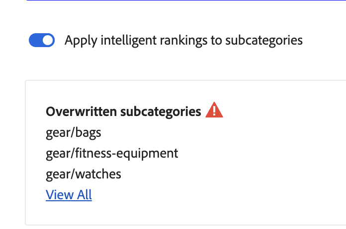
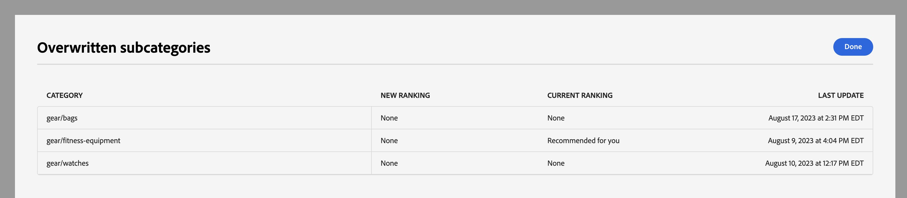
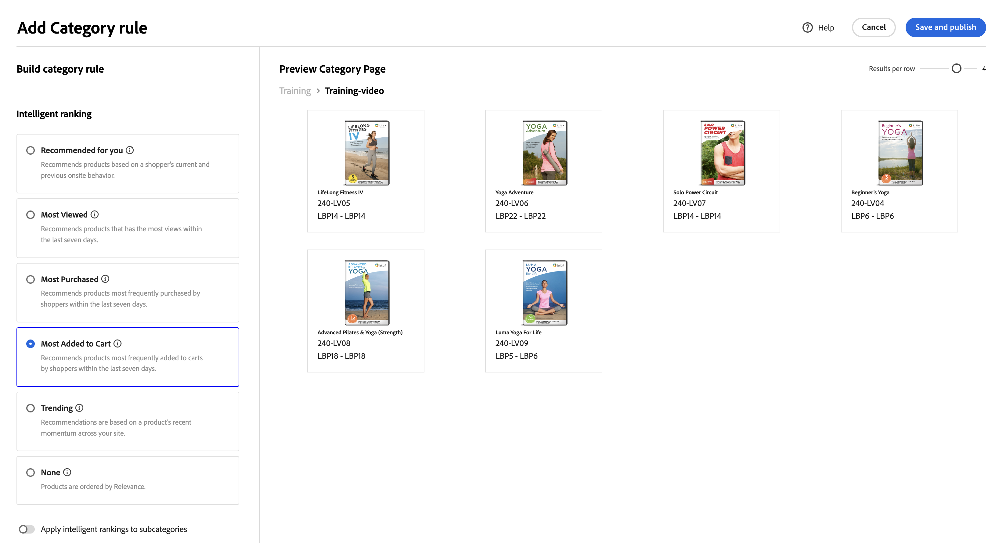

# カテゴリマーチャンダイジング

カテゴリマーチャンダイジングを使用すると、ストアの所有者は [!DNL Live Search] インテリジェントランキング [ルール](rules.md) 製品カテゴリとサブカテゴリに追加します。

この機能には、管理者 ( ) でアクセスします。 **マーケティング** / SEO と検索 > **[!DNL Live Search]** > **カテゴリマーチャンダイジング**.

>[!NOTE]
>
>カテゴリマーチャンダイジングは、 [!DNL Live Search] [3.0.0 以降](release-notes.md). 「カテゴリマーチャンダイジング」タブが表示されてもデータが入力されていない場合は、 [!DNL Live Search] モジュール。

カテゴリマーチャンダイジングビューには、次の列を含む定義済みのカテゴリルールが表示されます。

* カテゴリ
* ランキング戦略
* 継承されたランキング
* 最終更新日
* アクション

「カテゴリで検索」フィールドで、カテゴリまたはサブカテゴリを検索できます。

## ランキング戦略

カテゴリマーチャンダイジングでは、 [個々の製品](rules-workspace.md).
ランキングには、「インテリジェント」と「手動」の 2 種類があります。

**インテリジェントランキング** は、次のストアフロント行動データ分析を活用します。 [Adobe Sensei](https://www.adobe.com/sensei.html) 選択したカテゴリ内のすべての製品を特定のアルゴリズムで並べ替える場合。 インテリジェントランキングを選択すると、基になるデータがAdobe Senseiによって継続的に再分析されるので、製品の特定の順序は時間の経過と共に変化することが予想されます。 例えば、トレンド分析の上位の製品は、買い物客の環境設定が変化すると、時間の経過と共に自動的に変化します。
インテリジェントランキングメソッドは次のとおりです。

* 最も多く購入された：過去 7 日間に買い物客が購入した頻度に基づいて製品をランク付けします。
* 最も買い物かごに追加された：過去 7 日間に買い物客が買い物かごに追加した頻度に基づいて、製品をランク付けします。
* 最も頻繁に閲覧された：過去 7 日間に買い物客が閲覧した頻度に基づいて商品をランク付けします。
* お勧め：各買い物客の前回の行動と現在のオンサイト行動に基づいて、は、各買い物客とのやり取りの可能性に応じて商品をランク付けします。
* トレンド：人気の最近の変更に基づいて、表示に基づいて製品をランク付けします。
* なし：デフォルトの順序で製品をランク付けします。

**手動ランキング** を使用すると、手動ピン、ブースト、バリー、非表示のルールを定義することで、自動製品の並べ替え順序を上書きできます。

## 継承されたランキング

マーチャンダイザーは、「トレンド」で並べ替えるすべての女性の着用カテゴリを選択できるようにしたい場合があります。 これには、「女性用パンツ」、「女性用シャツ」、「女性用アクセサリー」のサブカテゴリが含まれます。 男性のカテゴリーは影響を受けるべきではありません。 継承されたランク付けを使用して、これを実現できます。

サブカテゴリを持つカテゴリまたはサブカテゴリに対してインテリジェントランキング方法を選択する場合、 **サブカテゴリへのインテリジェントランキングの適用** オプション。 これにより、すべてのサブカテゴリにランキング方法が適用されます。

これらのサブカテゴリは、親カテゴリ（「継承されたランキング」列の「はい」）からルールを継承するようになりました。 「アクション」列で使用できるオプションは次のとおりです。 **ルールを編集**、および **詳細を表示**. The **削除** オプションは、サブカテゴリの継承されたルールに対しては無効です。 サブカテゴリの継承を削除するには、親カテゴリの継承を元に戻す必要があります。

どのカテゴリまたはサブカテゴリでも、1 度に 1 つのインテリジェントランキングのみを適用できます。 また、追加の手動ランキングが適用されている場合もあります。

インテリジェントランキングをカテゴリに適用し、 **サブカテゴリにインテリジェントランキングを適用** 」オプションを指定した場合、サブカテゴリに既に適用されているインテリジェントランキングが上書きされます。

{width="700"}

次をクリックした場合： **すべて表示**&#x200B;をクリックすると、提案された変更の詳細を示すダイアログが開きます。

インテリジェントランキングが継承されたカテゴリにインテリジェントランキングを直接追加する場合、新しいインテリジェントランキングによって継承が上書きされます。

カテゴリからインテリジェントランキングを削除すると、継承が再確立されます。
どちらのシナリオでも、手動ランキングは維持されます。

カテゴリからインテリジェントランキングを削除し、サブカテゴリの継承を選択した場合、継承されたインテリジェントランキングのみがサブカテゴリから削除されます。 手動ランキングは継承の対象とならず、残ります。

上位カテゴリに対して行った変更の影響を受ける継承サブカテゴリを示すダイアログが表示されます。

{width="1200"}

## カテゴリルールの作成

カテゴリルールを作成するには：

1. 次をクリック： **ルールを追加** 」ボタンをクリックします。
1. Adobe Analytics の _カテゴリを選択_ 「 」を表示し、「 」カテゴリと「 」サブカテゴリをクリックします。
1. チェックボックスを選択して、ランク付けするカテゴリを選択します。
1. クリック **適用**.

   

1. Adobe Analytics の _カテゴリルールを追加_ を表示し、カテゴリに適用するインテリジェントランキング方法を選択します。
カテゴリのプレビューページには、ライブ検索データを使用して、選択したランキングの実際の結果が表示されます。
1. クリック **保存して公開** 」と入力してルールを保存します。

The [!DNL Live Search] サービスは、ルールを処理し、完了したらストア上でアクティブ化します。

## カテゴリルールの変更

既存のルールを変更するには、次の手順に従います。

1. 次をクリック： **...** 「アクション」列で「 」を選択し、 **編集**.
1. 「Edit Category」ルールビューで、必要な変更を行い、 **保存して公開**.

変更はストアに反映され、 [!DNL Live Search] が変更を処理しました。

## カテゴリルールの削除

カテゴリ・ルールを削除する手順は、次のとおりです。

1. 次をクリック： **...** 「アクション」列で「 」を選択し、 **削除**.
1. Adobe Analytics の _ルールを削除_ モーダルを選択します。 **削除** ルールを削除するか、 **キャンセル** をクリックしてアクションをキャンセルします。

## 手動ランキング

手動のランキングを使用すると、インテリジェントランキングルールで決定された製品の順序を上書きし（存在する場合）、結果内で製品を表示する場所を手動で制御できます。

イベントとは、定義された条件が満たされた場合に検索結果を変更するアクションです。 手動のランキングには、最大 25 個のイベントを含めることができます。

* ブースト：検索結果内で商品を高く移動します。
* 埋め込み：検索結果内で商品を下に移動します。
* 製品の固定：結果内の特定の位置に製品を移動します。
* 製品を非表示：製品を検索結果から除外します。

手動のランキングの作成：

1. 前述のように、カテゴリのインテリジェントランキングルールを設定します。 クエリの結果は、カテゴリのプレビューページビューに表示されます。 実際のライブ検索データを使用して結果をプレビューします。

1. カテゴリページのプレビュービューで製品をクリックし、ドラッグします。 目的の位置にドラッグ&amp;ドロップします。 「製品」フィールドと「位置」フィールドは、イベントパネルに自動的に入力されます。

また、ピンアイコンをクリックして、製品を現在の位置にピン留めすることもできます。 省略記号コンテキストメニューを使用して、「上にピン」または「下にピン」を選択します。

イベントを手動で追加するには：

1. 「手動のランキング」で、 **イベントを選択** メニューを選択し、関連する条件が満たされたときに実行するイベントを選択します。
1. 影響を与える製品の名前を入力します。 入力時に商品が提案されます。
1. 複数のイベントの場合、条件が満たされたときにトリガーを設定する他のイベントを選択します。
