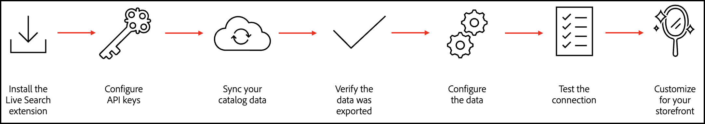
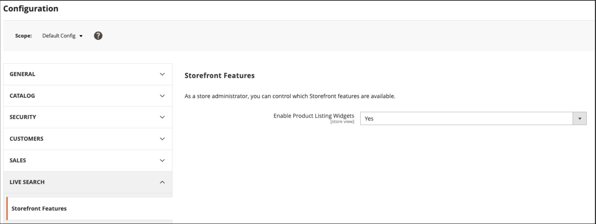

# [!DNL Live Search] で成功するための設定

Adobe Commerce [!DNL Live Search] と [[!DNL Catalog Service]](../catalog-service/guide-overview.md) は連携して、パフォーマンスが高く関連性の高い直感的な検索ソリューションを提供し、顧客が必要なものを正確かつ迅速に見つけられるようにします。 特に、[!DNL Catalog Service] は、使用する [!DNL Live Search] など、SaaS サービスのカタログデータを表示します。

この記事では、[!DNL Catalog Service] を使用して [!DNL Live Search] を実装する手順を説明します。

>[!IMPORTANT]
>
>サイト検索に関しては、Adobe Commerceのオプションが用意されています。 実装する前に、必ず [ 境界と制限 ](boundaries-limits.md) を読み、ビジネスニーズに適合している [!DNL Live Search] とを確認してください。

## オーディエンス

この記事は、Adobe Commerce インスタンスのインストールと設定を担当するデベロッパーまたはシステムインテグレーターを対象としています。

## 要件

- [Adobe Commerce](https://business.adobe.com/products/magento/magento-commerce.html) 2.4.4 以降
- PHP 8.1 / 8.2 / 8.3
- [!DNL Composer]

## サポートされるプラットフォーム

- クラウド上のAdobe Commerce（ECE） :2.4.4 以降
- Adobe Commerce オンプレミス（EE） :2.4.4 以降

## ワークフローの概要

大まかに言えば、オンボーディング [!DNL Live Search] では、次の操作が必要です。



## 1. [!DNL Live Search] 拡張機能をインストールする

[!DNL Live Search] は、[ 拡張機能の Marketplace から {Composer](https://getcomposer.org/) を通じてAdobeと ](https://commercemarketplace.adobe.com/magento-live-search.html) てインスト [ ルされます。 [!DNL Live Search] をインストールして構成すると、Adobe [!DNL Commerce] は検索とカタログ データの SaaS サービスとの共有を開始します。 この時点で、*管理者* ユーザーは、検索ファセット、同義語およびマーチャンダイジングルールの設定、カスタマイズおよび管理を行うことができます。

>[!NOTE]
>
>[!DNL Live Search] 3.0.2 の時点では、[!DNL Catalog Service] 拡張機能は [!DNL Live Search] インストールにバンドルされています。

1. [cron ジョブ ](https://experienceleague.adobe.com/en/docs/commerce-operations/configuration-guide/cli/configure-cron-jobs) と [ インデクサー ](https://experienceleague.adobe.com/en/docs/commerce-admin/systems/tools/index-management) が実行中であることを確認します。

   >[!IMPORTANT]
   >
   >2023 年 8 月のElasticsearch 7 のサポート終了のお知らせに伴い、Adobe Commerceのお客様はすべて OpenSearch 2.x 検索エンジンに移行することをお勧めします。 製品のアップグレード中に検索エンジンを移行する方法については、[ アップグレード ガイド ](https://experienceleague.adobe.com/en/docs/commerce-operations/upgrade-guide/prepare/opensearch-migration) の _OpenSearch への移行_ を参照してください。

1. [Adobeマーケットプレイス ](https://commercemarketplace.adobe.com/magento-live-search.html) から `live-search` パッケージをダウンロードします。

1. コマンドラインから次を実行します。

   ```bash
   composer require magento/live-search
   ```

   [!DNL Live Search] 拡張機能を **新規** Adobe Commerceのインストールに追加する場合は、次の手順を実行して [!DNL OpenSearch] および関連モジュールを無効にし、[!DNL Live Search] をインストールします。 次に、手順 4 に進みます。

   ```bash
      bin/magento module:disable Magento_Elasticsearch Magento_Elasticsearch7 Magento_OpenSearch Magento_ElasticsearchCatalogPermissions Magento_InventoryElasticsearch Magento_ElasticsearchCatalogPermissionsGraphQl
   ```

   **既存** のAdobe Commerceのインストールに [!DNL Live Search] 拡張機能を追加する場合は、次の手順を実行して、ストアフロントの検索結果を提供する [!DNL Live Search] モジュールを一時的に無効にします。 次に、手順 4 に進みます。

   ```bash
      bin/magento module:disable Magento_LiveSearchAdapter Magento_LiveSearchStorefrontPopover Magento_LiveSearchProductListing 
   ```

   [!DNL Live Search] サービス [!DNL Elasticsearch]、バックグラウンドでカタログデータとインデックス製品を同期している間、はストアフロントからの検索要求を引き続き管理します。

1. 次を実行します。

   ```bash
   bin/magento setup:upgrade
   ```

1. 次の [ インデクサー ](https://experienceleague.adobe.com/en/docs/commerce-admin/systems/tools/index-management) が「スケジュールに従って更新」に設定されていることを確認します。

   - 製品フィード
   - 製品バリアントフィード
   - カタログ属性フィード
   - 製品価格フィード
   - Scopes Web サイトデータフィード
   - 範囲顧客グループデータフィード
   - カテゴリフィード
   - カテゴリ権限フィード

1. 新しいCommerce インスタンスに [!DNL Live Search] をインストールする場合は、作業が完了し、[2 にスキップできます。 API キーを設定 ](#2-configure-api-keys) セクション。 Live Search を既存のCommerce インスタンスにインストールする場合は、次の手順に進んでください。

1. 次のコマンドを実行して、[!DNL Live Search] 拡張機能を有効にし、[!DNL OpenSearch] を無効にして、`setup` を実行します。

   ```bash
   bin/magento module:enable Magento_LiveSearchAdapter Magento_LiveSearchStorefrontPopover  Magento_LiveSearchProductListing 
   ```

   ```bash
   bin/magento module:disable Magento_Elasticsearch Magento_Elasticsearch6 Magento_Elasticsearch7 Magento_ElasticsearchCatalogPermissions Magento_InventoryElasticsearch 
   Magento_ElasticsearchCatalogPermissionsGraphQl
   ```

   ```bash
   bin/magento setup:upgrade
   ```

## 2. API キーの設定

Adobe Commerce API キーとそれに関連する秘密鍵は、Adobe Commerceのインストールに接続する [!DNL Live Search] めに必要です。 API キーは、[!DNL Commerce] のライセンス所有者のアカウントで生成および管理され、開発者またはシステムインテグレーターと共有できます。 その後、開発者は、ライセンス所有者に代わって SaaS データスペースを作成および管理できます。 既に一連の API キーがある場合は、それらを再生成する必要はありません。

API キーを設定する方法については、[Commerce サービスコネクタ ](../landing/saas.md) の記事を参照してください。

## 3. カタログデータを同期する {#synchronize-catalog-data}

[!DNL Live Search] は、カタログ・データをAdobeの SaaS インフラストラクチャに移動します。 データにインデックスが作成され、検索結果はこのインデックスからストアフロントに直接配信されます。 サイズと複雑さに応じて、インデックス作成に 30 分から数時間かかる場合があります。

カタログ データを SaaS サービスに初期同期するには、次のコマンドをこの順序で実行します。

```bash
bin/magento saas:resync --feed productattributes
bin/magento saas:resync --feed products
bin/magento saas:resync --feed scopesCustomerGroup
bin/magento saas:resync --feed scopesWebsite
bin/magento saas:resync --feed prices
bin/magento saas:resync --feed productoverrides
bin/magento saas:resync --feed variants
bin/magento saas:resync --feed categories
bin/magento saas:resync --feed categoryPermissions
```

これらのコマンドを実行すると、カタログ データの SaaS サービスへの初期同期が開始されます。

>[!WARNING]
>
> データのインデックスが作成され同期されている間は、ストアフロントで検索およびカテゴリの参照操作を使用できません。 カタログのサイズに応じて、データを SaaS サービスに同期す `cron` ために実行されてから、プロセスには少なくとも 1 時間かかる場合があります。

### 同期の進行状況の監視

[ データ管理ダッシュボード ](https://experienceleague.adobe.com/en/docs/commerce-admin/systems/data-transfer/data-dashboard) を使用して、同期および共有されるデータを表示できます。 このダッシュボードは、ストアフロントの製品データの可用性に関する貴重なインサイトを提供し、買い物客に迅速に表示できるようにします。


#### 今後の製品アップデート

初回同期後、製品の増分更新がストアフロント検索で使用できるようになるまで最大 15 分かかる場合があります。 詳しくは、[ インデックス作成 – ストリーミング製品の更新 ](indexing.md) を参照してください。

## 4. データが書き出されたことを確認します {#verify-export}

カタログデータがAdobe Commerce インスタンスから書き出され、[!DNL Live Search] 用に同期されていることを確認するには、次の 2 つのオプションがあります。

- 次の表のエントリを探します。

   - `catalog_data_exporter_products`
   - `catalog_data_exporter_product_attributes`

- [GraphQL playground](https://developer.adobe.com/commerce/services/graphql/live-search/) をデフォルトのクエリで使用して、次の点を確認してください。

   - 返される製品数は、ストア表示で期待される数に近くなります。
   - ファセットが返されます。

その他のヘルプについては、サポートナレッジベースの [[!DNL Live Search]  同期されていないカタログ ](https://experienceleague.adobe.com/en/docs/commerce-knowledge-base/kb/troubleshooting/miscellaneous/live-search-catalog-data-sync) を参照してください。

## 5. データを設定する

製品データを正しく設定すると、顧客に適した検索結果が得られます。 このセクションでは、製品リストウィジェットを有効にし、カテゴリを割り当てます。

### 製品リストウィジェットの有効化

[!DNL Live Search] 4.0.0 以降をインストールすると、製品リストウィジェットはデフォルトで有効になります。 ウィジェットを有効にすると、検索結果ページとカテゴリ参照の製品リストページで別の UI コンポーネントが使用されます。 この UI コンポーネントは、[Catalog Service API](https://developer.adobe.com/commerce/services/graphql/catalog-service/product-search/) を直接呼び出すことで、応答時間を短縮します。

バージョン 4.0.0 以降の [!DNL Live Search] をお使いの場合は、製品一覧ウィジェットを手動で有効にする必要があります。

1. *管理者* から、**[!UICONTROL Stores]**/_[!UICONTROL Settings]_/**[!UICONTROL Configuration]**に移動します。
1. 「**[!UICONTROL Live Search]**」で、「**[!UICONTROL Storefront Features]**」を選択します。
1. **[!UICONTROL Enable Product Listing Widgets]** を `Yes` に設定します。

   

この設定を変更すると、`Page cache is invalidated` というメッセージが表示されます。 変更内容を保存するには、Magentoキャッシュをフラッシュする必要があります。

1. 次のいずれかの操作を行って、[ キャッシュ管理 ](https://experienceleague.adobe.com/en/docs/commerce-admin/systems/tools/cache-management) ページにアクセスします。

   - ワークスペースの上にあるメッセージ内の「**[!UICONTROL Cache Management]**」リンクをクリックします。
   - _管理者_ サイドバーで、**[!UICONTROL System]**/_[!UICONTROL Tools]_/**[!UICONTROL Cache Management]**に移動します。

1. **Configuration**[!UICONTROL Cache Type] を選択し、「**[!UICONTROL Flush Magento Cache]**」をクリックします。

   ストアフロントに対する変更は、キャッシュをフラッシュした直後に行われます。

### カテゴリの割り当て

[!DNL Live Search] で返された製品は、[ カテゴリ ](https://experienceleague.adobe.com/en/docs/commerce-admin/catalog/categories/categories) に割り当てられている必要があります。 例えば Luma では、製品が「男性」、「女性」、「歯車」などのカテゴリに分類されます。 サブカテゴリも「トップス」、「ボトムス」、「ウォッチポイント」に設定されます。 これにより、フィルタリング時の精度が向上します。

## 6.接続をテストする {#test-connection}

カタログデータを SaaS にして、テストを行い、次のシナリオで製品データが返されることを確認します。

- [!UICONTROL Search] ボックスは正しく結果を返します
- カテゴリの参照で結果が正しく返される
- ファセットは、検索結果ページでフィルターとして使用できます

すべてが正しく動作している場合は、[!DNL Live Search] がインストールされ、接続され、使用できる状態になっています。

ストアフロントで問題が発生した場合は、`var/log/system.log` ファイルで API 通信の失敗やサービス側のエラーを確認します。

ファイアウォールを通過する [!DNL Live Search] を許可するには、`commerce.adobe.io` を許可リストに追加します。

## 7. ストアフロントに合わせたカスタマイズ

[!DNL Live Search] 拡張機能のインストール、データの同期、検証および設定が完了していること。 次に、[!DNL Live Search] ウィジェットがストアのルックアンドフィールに合っていることを確認します。

ポップオーバーウィジェットと PLP ウィジェットのスタイルを設定するには、必要に応じてカスタム CSS ルールを定義します。 [ ポップオーバー要素のスタイル設定 ](storefront-popover.md#styling-popover-example) および [ 製品一覧表示ページウィジェット ](plp-styling.md#styling-example) を参照してください。

ウィジェットの機能を拡張する場合は、各のソースコードを公開リポジトリで入手できます。
このシナリオでは、独自のニーズに合わせてJavaScriptをカスタマイズし、カスタムコードを CDN でホストできます。 このカスタムスクリプトは、[!DNL Live Search] サービスと通信し、通常と同様の結果を返すので、ウィジェットの機能を制御できます。

- [PLP ウィジェットリポジトリ ](https://github.com/adobe/storefront-product-listing-page)
- [ 検索バーのリポジトリ ](https://github.com/adobe/storefront-search-as-you-type)

## [!DNL Live Search] を更新中 {#update}

Live Search を更新する前に、コマンドラインから次のコマンドを実行して、インストールされている Live Search のバージョンを確認します。

```bash
composer show magento/module-live-search | grep version
```

[!DNL Live Search] を更新するには、コマンドラインから次のコマンドを実行します。

```bash
composer update magento/live-search --with-dependencies
```

3.1.1 から 4.0.0 などのメジャーバージョンにアップデートするには、プロジェクトのルート [!DNL Composer] `.json` ファイルを次のように編集します。

1. 現在インストールされている `magento/live-search` のバージョンが `3.1.1` 以下で、バージョン `4.0.0` 以降にアップグレードする場合は、アップグレードの前に次のコマンドを実行します。

   ```bash
   bin/magento module:enable Magento_AdvancedSearch
   ```

   現在インストールされている `magento/live-search` バージョンについて詳しくは、次のコマンドを実行してください。

   ```bash
   composer show magento/live-search
   ```

1. ルート `composer.json` ファイルを開き、`magento/live-search` を検索します。

1. `require` セクションで、バージョン番号を次のように更新します。

   ```json
   "require": {
      ...
      "magento/live-search": "^4.0",
      ...
    }
   ```

1. 保存 `composer.json` ます。 コマンドラインから次のコマンドを実行します。

   ```bash
   composer update magento/live-search --with-dependencies
   ```

## [!DNL Live Search] のアンインストール {#uninstall}

[!DNL Live Search] をアンインストールするには、[ モジュールのアンインストール ](https://experienceleague.adobe.com/en/docs/commerce-operations/installation-guide/tutorials/uninstall-modules) を参照してください。

## [!DNL Live Search] パッケージ {#packages}

[!DNL Live Search] 拡張機能は、次のパッケージで構成されています。

| パッケージ | 説明 |
|--- |--- |
| `module-live-search` | を使用すると、マーチャントは、ファセット、同義語、クエリルールなどの検索設定を指定したり、読み取り専用のGraphQL プレイグラウンドにアクセスして *Admin* からクエリをテストしたりできます。 |
| `module-live-search-adapter` | 検索リクエストをストアフロントから [!DNL Live Search] サービスにルーティングし、結果をストアフロントにレンダリングします。 <br />- カテゴリの参照 – ストアフロント [ 上部のナビゲーション ](https://experienceleague.adobe.com/en/docs/commerce-admin/catalog/catalog/navigation/navigation-top) から検索サービスにリクエストをルーティングします。<br />- グローバル検索 – ストアフロントの右上にある [ クイック検索 ](https://experienceleague.adobe.com/en/docs/commerce-admin/catalog/catalog/search/search) ボックスからリクエストを [!DNL Live Search] サービスにルーティングします。 |
| `module-live-search-storefront-popover` | 「入力中に検索」ポップオーバーは、標準のクイック検索に代わるもので、上位の検索結果のデータとサムネールを返します。 |

## [!DNL Live Search] 依存関係 {#dependencies}

次の [!DNL Live Search] 依存関係が [!DNL Composer] によってキャプチャされます。

- `magento/module-saas-catalog`
- `magento/module-saas-category`
- `magento/module-saas-category-permissions`
- `magento/module-saas-product-override`
- `magento/module-saas-product-variant`
- `magento/module-saas-price`
- `magento/module-saas-scopes`
- `magento/module-bundle-product-data-exporter`
- `magento/module-catalog-inventory-data-exporter`
- `magento/module-catalog-url-rewrite-data-exporter`
- `magento/module-configurable-product-data-exporter`
- `magento/module-parent-product-data-exporter`
- `magento/module-gift-card-product-data-exporter`
- `magento/module-bundle-product-override-data-exporter`
- `data-services`
- `services-id`

## 高度な概念

以下のセクションでは、[!DNL Live Search] と [!DNL Catalog Service] を使用する際の、より高度なトピックを示します。

### エンドポイント

[!DNL Live Search] は、`https://catalog-service.adobe.io/graphql` のエンドポイントを介して通信します。

[!DNL Live Search] は全製品データベースにアクセスできないの [!DNL Live Search]、GraphQLとCommerce core GraphQLは同等のものにはなりません。

SaaS API （特にカタログサービスエンドポイント）を直接呼び出すことをお勧めします。

- Commerce データベース/Graphql プロセスをバイパスすることで、パフォーマンスを向上させ、プロセッサー負荷を軽減します。
- [!DNL Catalog Service] フェデレーションを活用して、1 つのエンドポイントから [!DNL Live Search]、[!DNL Catalog Service]、[!DNL Product Recommendations] を呼び出します。

一部のユースケースでは、製品の詳細や同様のケースについては、[!DNL Catalog Service] に問い合わせることをお勧めします。 詳細については、「[refineProduct](https://developer.adobe.com/commerce/services/graphql/catalog-service/refine-product/)」を参照してください。

カスタムヘッドレス実装がある場合は、[!DNL Live Search] のリファレンス実装を確認してください。

- [PLP ウィジェット ](https://github.com/adobe/storefront-product-listing-page)
- [ ライブ検索フィールド ](https://github.com/adobe/storefront-search-as-you-type)

Luma の検索アダプターやウィジェット、AEM CIFウィジェットなどのデフォルトのコンポーネントを使用しない場合、イベント（インテリジェントマーチャンダイジングおよびパフォーマンス指標をAdobe Senseiにフィードするクリックストリームデータ）は初期設定では機能せず、ヘッドレスイベントを実装するにはカスタム開発が必要です。

[!DNL Live Search] の最新バージョンでは、既に [!DNL Catalog Service] が使用されています。

### 言語サポート

[!DNL Live Search] ウィジェットは次の言語をサポートしています。

|  |  |  |  |
|--- |--- |--- |--- |
| 言語 | 地域 | 言語コード | Magentoーロケール |
| ブルガリア語 | ブルガリア | bg_BG | bg_BG |
| カタルニア語 | スペイン | ca_ES | ca_ES |
| チェコ語 | チェコ共和国 | cs_CZ | cs_CZ |
| デンマーク語 | デンマーク | da_DK | da_DK |
| ドイツ語 | ドイツ | de_DE | de_DE |
| ギリシャ語 | ギリシャ | el_GR | el_GR |
| 英語 | 英国 | en_GB | en_GB |
| 英語 | 米国 | en_US | en_US |
| スペイン語 | スペイン | es_ES | es_ES |
| エストニア語 | エストニア | et_EE | et_EE |
| バスク語 | スペイン | eu_ES | eu_ES |
| ペルシャ語 | イラン | fa_IR | fa_IR |
| フィンランド語 | フィンランド | fi_FI | fi_FI |
| フランス語 | フランス | fr_FR | fr_FR |
| ガリシア語 | スペイン | gl_ES | gl_ES |
| ヒンディー語 | インド | hi_IN | hi_IN |
| ハンガリー語 | ハンガリー | hu_HU | hu_HU |
| インドネシア | インドネシア | id_ID | id_ID |
| イタリア語 | イタリア | it_IT | it_IT |
| 韓国語 | 韓国 | ko_KR | ko_KR |
| リトアニア語 | リトアニア | lt_LT | lt_LT |
| ラトビアン | ラトビア | lv_LV | lv_LV |
| ノルウェー語 | ノルウェーブークマル | nb_NO | nb_NO |
| オランダ語 | オランダ | nl_NL | nl_NL |
| ポーランド語 | ポーランド | pl_PL | pl_PL |
| ポルトガル語 | ブラジル | pt_BR | pt_BR |
| ポルトガル語 | ポルトガル | pt_PT | pt_PT |
| ルーマニア語 | ルーマニア | ro_RO | ro_RO |
| ロシア | ロシア | ru_RU | ru_RU |
| スウェーデン語 | スウェーデン | 参照（_S） | 参照（_S） |
| タイ語 | タイ | th_TH | th_TH |
| トルコ語 | トルコ | tr_TR | tr_TR |
| 中国語 | 中国 | zh_CN | zh_Hans_CN |
| 中国語 | 台湾 | zh_TW | zh_Hant_TW |

Commerce管理者の言語設定（_ストア_/設定/_設定_/_一般_/国のオプション）がサポートされている言語と一致することが検出された場合、デフォルトでその言語に設定されます。 それ以外の場合、ウィジェットのデフォルト値は英語になります。

また、管理者は [ 検索インデックス ](settings.md#language) の言語を設定して、検索結果を向上させることもできます。

### ウィジェットコードリポジトリー

製品一覧ページウィジェットとライブ検索フィールドウィジェットは、どちらも github リポジトリからダウンロードできます。

これにより、開発者は機能とスタイル設定を完全にカスタマイズできます。 これらのユーザーは、[!DNL Live Search] サービスを利用しながら、コードを自分でホストします。

- [PLP ウィジェット ](https://github.com/adobe/storefront-product-listing-page)
- [ 検索バー ](https://github.com/adobe/storefront-search-as-you-type)

### Inventory management

[!DNL Live Search] は、Commerce（旧称：マルチSourceインベントリ、MSI）で [Inventory management](https://experienceleague.adobe.com/en/docs/commerce-admin/inventory/introduction) 機能をサポートしています。 完全なサポートを有効にするには、依存関係モジュールをバージョン 102.2.0 以降に [ 更新 ](install.md#update) する必要 `commerce-data-export` あります。

[!DNL Live Search] は、商品がInventory management内で使用可能かどうかを示すブール値を返しますが、どのソースが在庫を持っているかに関する情報は含まれません。

### 価格インデクサー

Live Search のお客様は、新しい [SaaS 価格インデクサー ](../price-index/price-indexing.md) を使用して、価格変更の更新と同期時間を高速化できます。

### 価格サポート

ライブ検索ウィジェットは、Adobe Commerceでサポートされているすべての価格タイプではなく、ほとんどの価格タイプをサポートしています。

現在、基本価格がサポートされています。 サポートされていない高度な価格は次のとおりです。

- コスト
- 広告の最低価格

より複雑な価格計算については、[API メッシュ ](../catalog-service/mesh.md) を参照してください。

価格フォーマットは、Commerce インスタンス内の次のロケール設定をサポートしています。*ストア* /設定/ *設定* /一般/ *一般* / ローカルオプション / ロケール

### ヘッドレスストアフロントのサポート

オプションで、アプリケーションの既存のGraphQL範囲を拡張する `module-data-services-graphql` モジュールをインストールし、ストアフロントの行動データ収集に必要なフィールドを含める必要が生じる場合があります。

```bash
composer require magento/module-data-services-graphql
```

このモジュールは、GraphQL クエリにコンテキストを追加します。

- `dataServicesStorefrontInstanceContext`
- `dataServicesMagentoExtensionContext`
- `dataServicesStoreConfigurationContext`

### B2B サポート

[!DNL Live Search] では、追加の [ 制限事項 ](boundaries-limits.md#b2b-and-category-permissions) を追加して ](https://experienceleague.adobe.com/en/docs/commerce-admin/b2b/guide-overview)[B2B 機能をサポートしています。

### PWAサポート

[!DNL Live Search] はPWA Studioで動作しますが、他のCommerceの実装と比較すると、わずかな違いがあります。 検索や製品リストのページなどの基本的な機能は Venia で機能しますが、Graphql の一部の並べ替えが正しく機能しない場合があります。 パフォーマンスの違いもあります。

- [!DNL Live Search] の現在のPWA実装では、ネイティブのCommerce ストアフロントに比べて、検索結果を返すた [!DNL Live Search] の処理時間が長くなります。
- PWAの [!DNL Live Search] は [ イベント処理 ](https://developer.adobe.com/commerce/services/shared-services/storefront-events/sdk/) をサポートしていません。 その結果、検索レポートやインテリジェントマーチャンダイジングも機能します。
- `description`、`name`、`short_description` に対する直接フィルタリングは、[PWA](https://developer.adobe.com/commerce/pwa-studio/) で使用した場合はGraphQLでサポートされませんが、より一般的なフィルターで返されます。

[!DNL Live Search] をPWA Studioで使用する場合、インテグレーターは次の要件も満たす必要があります。

1. [livesearch-storefront-utils](https://www.npmjs.com/package/@magento/ds-livesearch-storefront-utils) をインストールします。
1. `storeDetails` オブジェクトに `environmentId` を設定します。

   ```javascript
   const storeDetails: StoreDetailsProps = {
       environmentId: <Storefront_ID>,
       websiteCode: "base",
       storeCode: "main_website_store",
       storeViewCode: "default",
       searchUnitId: searchUnitId,
       config: {
           minQueryLength: 5,
           pageSize: 8,
           currencySymbol: "$",
           },
       };
   ```

### の Cookie

[!DNL Live Search] は、基本機能の一部としてユーザーインタラクションデータを収集し、このデータを保存するために cookie が使用されます。 ユーザー情報を収集する場合、ユーザーは Cookie の保存に同意する必要があります。 [!DNL Live Search] と [!DNL Product Recommendations] はデータストリームを共有するので、同じ cookie メカニズムになります。 詳しくは、[Cookie 制限の処理 ](https://experienceleague.adobe.com/en/docs/commerce-merchant-services/product-recommendations/developer/setting-cookie) を参照してください。
