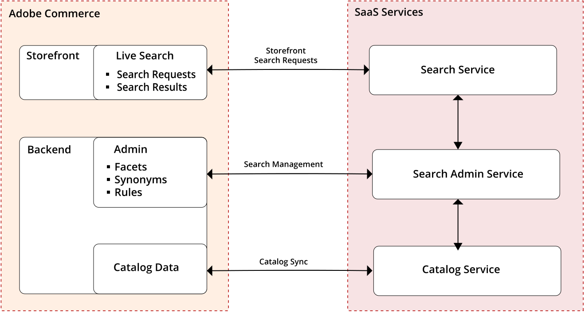

# の概要 [!DNL Live Search]

[!DNL Live Search] は、標準の検索機能に代わる、Adobe Commerce用のスタンドアロンパッケージのセットです。 この [!DNL Live Search] モジュールは、サーバーのコマンドラインからインストールされ、Commerce インストールに as a として接続します。 [サービス](../landing/saas.md). プロセスが完了したら、 [!DNL Live Search] が *マーケティング* 下のメニュー *SEO と検索* 内 [!DNL Commerce] *管理者*.

アーキテクチャのAdobe Commerce側には、検索のホストが含まれます *管理者*、カタログデータの同期、およびクエリサービスの実行を行う。 後 [!DNL Live Search] がインストールおよび設定されると、Adobe Commerceは検索およびカタログデータの SaaS サービスとの共有を開始します。 この時点で、管理者ユーザーは、検索ファセット、シノニムおよびマーチャンダイジングルールを設定、カスタマイズおよび管理できます。

## [!DNL Live Search] デモ

詳しくは、このビデオをご覧ください。 [!DNL Live Search]:

>[!VIDEO](https://video.tv.adobe.com/v/3418679?quality=12)
