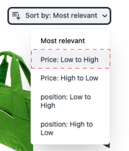

# 製品リストページウィジェット

The [!DNL Live Search Product Listing Page Widget] (PLP) は、コマースサービスプラットフォームを使用して、パフォーマンスの高い、検索可能でファセット可能な製品リストページを提供します。 このトピックでは、PLP ウィジェットを有効にし、スタイルを設定する方法について説明します。

## PLP ウィジェットの有効化

次の場合に [!DNL Live Search] サービスがインストールされている場合、デフォルトの検索機能は [!DNL Live Search] 自動的に。

The [!DNL Live Search] PLP ウィジェットは、新規インストールではデフォルトで有効になっています。 アップグレードする場合 [!DNL Live Search] PLP ウィジェットは既にオフになっていますが、そのまま残ります。

PLP ウィジェットを無効にするには：

1. に移動します。 **ストア** /設定/ **設定** > **[!DNL Live Search]** > **ストアフロント機能** と設定します。 **製品リストウィジェットを有効にする** を「いいえ」に設定します。
1. 選択 **設定を保存** をクリックして設定を保存します。

## ウィジェットの機能

PLP ウィジェットは、検索可能な製品ページで期待される様々な機能を提供します。 これには次が含まれます。

* 属性によるフィルタリング
* カラースウォッチのサポート
* 買い物かごに追加機能
* 複数言語のサポート
* 価格スライダー

## スタイル設定の例

PLP ウィジェットの外観をカスタマイズし、 [CSS](https://developer.adobe.com/commerce/frontend-core/guide/css/).

>[!NOTE]
>
>Adobe Commerceテーマ内のカスタムクラスを持つ要素は継承されません。 これらの要素は、カスタムクラスに一致する特定のクラスによってターゲット設定される必要があります。プライマリアクションクラスは、ウィジェットボタンでは機能しません。
>CSS 内の汎用のターゲット要素は継承されます。 `button` ウィジェットボタンに適用されます。

強調表示された div には、target クラスが含まれています `ds-sdk-product-item__product-name`.


大文字にするルールを追加して、製品名をカスタマイズします。

```css
.ds-sdk-product-item__product-name {
 text-transform: uppercase;
}
```


## CSS クラス

### 製品リスト

* `.ds-sdk-product-list`：外側の div
* `.ds-sdk-product-list__grid`：内部 div


#### 製品リストのページネーション

* `.ds-plp-pagination`


* `.ds-plp-pagination_item`


* `.ds-plp-pagination_item--current`


### ウィジェット

* `.ds-widgets`：外側の div
* `.ds-widgets__actions`：左側の内部 div
* `.ds-widgets__results`：右側の内部 div


### 並べ替えドロップダウン

* `.ds-sdk-sort-dropdown`


* `.ds-sdk-sort-dropdown__button`


* `.ds-sdk-sort-dropdown__items`


* `.ds-sdk-sort-dropdown__items--item`


* `.ds-sdk-sort-dropdown__items--item-selected`


* `.ds-sdk-sort-dropdown__items--item-active`



### ファセット

* `.ds-plp-facets`
* `.ds-plp-facets__header`
* `.ds-plp-facets__header_title`
* `.ds-plp-facets__header__clear-all`

{width="350"}

* `.ds-plp-facets__pills`
* `.ds-sdk-pill`

{width="350"}

* `.ds-sdk-pill__label`
* `.ds-sdk-pill__cta`

{width="350"}

* `.ds-plp-facets__list`

{width="350"}

* `.ds-sdk-input`
* `.ds-sdk-input__label`
* `.ds-sdk-product-item__product-swatch-group`
* `ds-sdk-product-item__product-swatch-item`
* `.ds-sdk-input_fieldset_show-more`


* `.ds-sdk-labelled-input`


* `.ds-sdk-labelled-input__input`
* `.ds-sdk-labelled-input__label`


### 製品項目

* `.ds-sdk-product-item`
* `.ds-sdk-product-item__image`
* `.ds-sdk-product-item__product-name`
* `.ds-sdk-product-item__product-options`
* `.ds-sdk-product-price`
   * `.ds-sdk-product-price--no-discount`
   * `.ds-sdk-product-price--grouped`
   * `.ds-sdk-product-price--bundle`
   * `.ds-sdk-product-price--discount`


### 読み込み

* `.ds-sdk-loading`
* `.ds-sdk-loading__spinner`
* `.ds-sdk-loading__spinner-label`


