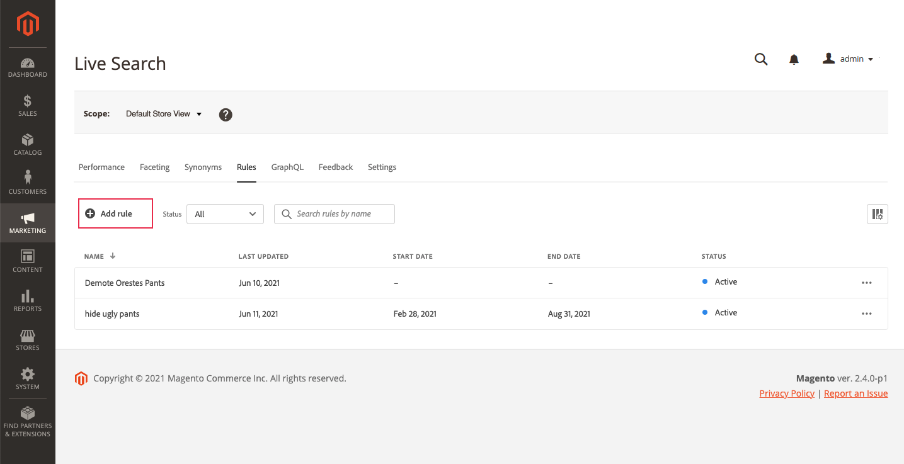

# ルールを追加

ルールを作成するには、ルールエディターを使用して、関連するイベントをトリガーする買い物客のクエリテキストに条件を定義します。 次に、ルールの詳細を入力し、結果をテストして、ルールを公開します。

## 手順 1:ルールを追加

1. 管理者で、に移動します。 **マーケティング** / SEO と検索 > **ライブ検索**.
1. を **範囲** 識別する [ストア表示](https://docs.magento.com/user-guide/configuration/scope.html) ルールを適用する場所
1. 次をクリック： **ルール** タブをクリックします。
1. クリック **ルールを追加** をクリックして、ルールエディターを起動します。

   

## 手順 2:条件の説明

条件とは、イベントをトリガーするための要件です。 1 つのルールには、最大 10 個の条件と 25 個のイベントを含めることができます。

### 単一の条件

1. の下 *ルールの作成*&#x200B;を選択し、 **条件** を満たし、指示に従って文を完了します。

   * 次を含む検索クエリ — 買い物客のクエリに含める必要があるテキストの文字列を入力します。 「一致」設定は、買い物客のクエリがカタログと一致する程度を決定します。 オプション：  任意 — 買い物客のクエリテキストの任意の部分が条件に一致する場合があります。 すべて — 買い物客のクエリのすべてが条件に一致する必要があります。
   * 検索クエリが — 買い物客のクエリと完全に一致するテキストの文字列を入力します。 例：「ヨガパンツ」。 次を含むルール `Search query is` および一致 `All` 条件は 1 つだけです。
   * 次で始まる検索クエリ — 買い物客のクエリの先頭に配置する必要がある文字または文字列を入力します。
   * 次で終わる検索クエリ — 買い物客のクエリの最後に指定する必要がある文字または文字列を入力します。

   結果は、 *ルールをテスト* ウィンドウ枠には、優先度で番号が付けられます。 以下を使用して、 *行ごとの結果* スライダーを使用して、各行の製品数を変更できます。

   

1. 他のクエリをテストするには、 *ルールをテスト* 検索ボックスで **戻る**.
最初に、テストウィンドウでは、[ 条件 ] 検索ボックスからクエリがレンダリングされます。 ただし、これで、テストクエリボックスからクエリをレンダリングしています。 テストウィンドウでは、一度に 1 つのクエリのみがレンダリングされます。

   

1. 結果が必要な場合は、 *条件* 検索ボックス。 次に、ページ上の任意の場所をクリックして、テストウィンドウの結果を更新します。
1. 1 つの条件を持つ単純なルールを作成するには、手順 3 に進みます。 [イベントを追加](#events).

### 複数の条件

1. 複数の条件を持つルールを作成するには、 **条件を追加**.
1 つのルールには、最大 10 個の条件を設定できます。 2 つの条件を結合する論理演算子は、現在の *一致* 設定。 デフォルトでは、 *一致* が `All` また、論理演算子は `AND`.

   

1. 2 つ目の条件を選択し、必要なクエリテキストを入力します。

   

1. ルールのロジックを変更するには、 **一致** を設定して、買い物客の検索条件がクエリ条件にどの程度近く一致する必要があるかを決定します。 設定 **一致** を次のいずれかに変更します。

   * Any — （デフォルト）ルール内のすべての論理演算子がに設定されます。 `OR` 結果がテストペインに表示されます。
   * すべて — ルール内のすべての論理演算子がに設定されます。 `AND` 結果がテストペインに表示されます。

   この *一致* 値は、複数の条件を結合するために使用される論理演算子を決定します。 変更 *一致* を設定すると、ルール内のすべての論理演算子が変更されます。 組み合わせることはできません `AND` および `OR` 同じ規則で

   この例では、「ヨガパンツ」を検索するのではなく、「yoga」または「pants」を検索する 2 つの異なるクエリがあります。 このルールは具体的ではなく、他のルールよりもストアフロントでトリガーされる頻度が高くなります。

   

1. 別の条件を追加するには、 **条件を追加** プロセスを繰り返します。

## 手順 3:イベントを追加

イベントとは、条件が満たされた場合に検索結果を変更するアクションです。 1 つのルールに最大 25 個のイベントを設定できます。

1. の下 *イベント*、 **イベント** を設定します。

   例えば、「 `Pin a product`. 次に、ピン留めする製品の名前を入力します。 ヘルプが必要な場合は、テストウィンドウで名前を確認できます。
次に、 *位置* ピンで留められた製品が表示される場所 製品がテストペインの新しい位置に移動し、 *ピン留め* プレビューバッジ。

   

1. 複数のイベントの場合、条件が満たされたときにトリガーを設定する他のイベントを選択します。

   * ブースト — 「ブースト」を選択します。 次に、検索結果の上位に移動する製品名または SKU を入力します。 テストペインでは、ブーストされた各製品には *ブースト* プレビューバッジ。
   * Bury — 検索結果内で SKU を下に移動します。 各 SKU は *埋め込み* テストウィンドウの「プレビュー」バッジ。
   * 製品のピン留め — 製品名または SKU を入力します。 次に、検索結果で商品が表示される位置を選択します。 製品に *ピン留め* テストウィンドウの「プレビュー」バッジ。
   * 製品の非表示 — SKU を検索結果から除外します。

## 手順 4:詳細を入力

ここで入力した情報は、 [ルールの詳細](rules-workspace.md) パネル。

1. の下 *詳細*、 **名前** 」と入力します。
1. 概要を入力 **説明** ルールの
1. 次を入力します。 **開始日** および **終了日** ルールをアクティブにするか、カレンダーから日付を選択します。

   日付の範囲を選択するには、最初の日付をクリックし、ドラッグして範囲を選択します。

   

## 手順 5:ルールをテストする

1. テストペインでルールの結果を確認します。
1. ルールに複数のクエリがある場合、ルールの影響を受ける可能性のあるクエリをそれぞれテストします。

## 手順 6:保存して公開

1. 完了したら、「 **保存して公開**.

   ルールがルールワークスペースのリストに追加されます。

1. アクティブなルールはすぐに有効になりますが、キャッシュされたクエリの結果がストアフロントで更新されるまで、最大 15 分待つ必要が生じる場合があります。

## フィールドの説明

### 条件 (if)

| 条件 | 説明 |
|--- |--- |
| 検索クエリに含む文字 | 買い物客のクエリに含まれるテキストの文字または文字列。 買い物客のクエリでは、この条件を満たすために一致する必要があるのは 1 文字だけです。 |
| 検索クエリ： | 買い物客のクエリと完全に一致するテキストの文字または文字列。 この条件を使用する場合、複数の条件を持つ複雑なクエリは構成できません。 |
| 次で始まる検索クエリ | 買い物客のクエリは、この文字またはテキストの文字列で始まります。 |
| 検索クエリの末尾が次の値 | 買い物客のクエリは、この文字またはテキスト文字列で終わります。 |

### 論理演算子

| 演算子 | 説明 |
|--- |--- |
| または | （デフォルト）論理演算子 `OR` 2 つの条件を比較し、少なくとも 1 つの条件が true の場合にイベントをトリガー化するための要件を満たします。 |
| および | 論理演算子 `AND` 2 つの条件を比較し、両方の条件が true の場合にイベントをトリガー化するための要件を満たします。 |

### 一致演算子

| 演算子 | 説明 |
|--- |--- |
| 任意 | ルール内のすべての論理演算子を `OR` と指定すると、一致する製品のセットが返されます。 |
| すべて | ルール内のすべての論理演算子を `AND` と指定すると、一致する製品のセットが返されます。 |

### イベント

| イベント | 説明 |
|--- |--- |
| ブースト | 検索結果で、SKU または SKU の範囲を高くします。 テスト検索結果では、それぞれに「ブーストされた」プレビューバッジが付けられます。 |
| ベリー | 検索結果内で SKU または SKU の範囲を下に移動します。 テスト検索結果には、それぞれに「埋め込み」プレビューバッジが付けられます。 |
| 製品のピン留め | 1 つの SKU を検索結果内の特定の位置に付加します。 製品には、テスト検索結果に「ピン留めされた」プレビューバッジが付けられます。 |
| 製品を非表示にする | SKU（SKU の範囲）を検索結果から除外します。 |

### 詳細

| フィールド | 説明 |
|--- |--- |
| 名前 | ルールの名前。 |
| 開始日 | ルールの開始日（スケジュールされている場合）。 |
| 終了日 | スケジュールに沿った場合の、ルールの終了日。 |
| 説明 | ルールの簡単な説明。 |
