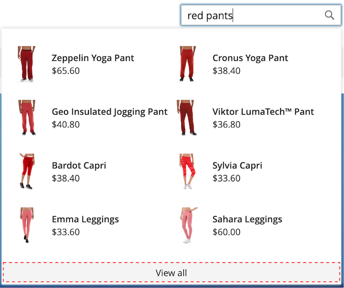

# スタイル設定 [!DNL Popover] 要素

この [[!DNL storefront popover]](storefront-popover.md) 常に製品を表示 `name` および `price`の場合、フィールドの選択は設定できません。 しかし、 [!DNL popover] 要素は、CSS クラスを使用してスタイルを設定できます。 例えば、次の宣言では、 [!DNL popover] コンテナとフッター。

```css
.livesearch.popover-container {
    background-color: lavender;
}

.livesearch.view-all-footer {
    background-color: magenta;
}
```

## コンテナの表示

の親コンポーネント `.livesearch.popover-container` が `.search-autocomplete`.  この `.active` クラスは、コンテナの表示を示します。 この `.active` クラスは条件付きで [!DNL popover] が開いている。

```css
.search-autocomplete.active   /* visible */
.search-autocomplete          /* not visible */
```

ストアフロント要素のスタイル設定について詳しくは、 [カスケードスタイルシート (CSS)](https://developer.adobe.com/commerce/frontend-core/guide/css/) 内 [フロントエンド開発者ガイド](https://developer.adobe.com/commerce/frontend-core/guide/).

## クラスセレクター

次のクラスセレクターを使用して、 [!DNL popover].

* `.livesearch.popover-container`
* `.livesearch.view-all-footer`
* `.livesearch.products-container`
* `.livesearch.product-result`
* `.livesearch.product-name`
* `.livesearch.product-price`

### コンテナクラスセレクター

#### .livesearch.popover-container

![[!DNL Popover] コンテナ](assets/livesearch-popover-container.png)

#### .livesearch.view-all-footer



### 製品クラスセレクター

#### .livesearch.products-container


#### .livesearch.product-result


#### .livesearch.product-name


#### .livesearch.product-price


## 変更したテーマの使用 {#working-with-modified-theme}

この [!DNL storefront popover] カスタマイズされた [テーマ](https://developer.adobe.com/commerce/frontend-core/guide/themes/) が *Luma*. この `top.search` ブロックを `header-wrapper` の `Magento_Search` モジュールは変更できません。

```html
<referenceContainer name="header-wrapper">
   <block class="Magento\Framework\View\Element\Template" name="top.search" as="topSearch" template="Magento_Search::form.mini.phtml">
      <arguments>
         <argument name="configProvider" xsi:type="object">Magento\Search\ViewModel\ConfigProvider</argument>
      </arguments>
   </block>
</referenceContainer>
```

## の無効化 [!DNL popover]

を無効にするには、以下を実行します。 [!DNL popover] 標準に戻す [クイック検索](https://experienceleague.adobe.com/docs/commerce-admin/catalog/catalog/search/search.html#quick-search) 機能には、次のコマンドを入力します。

```bash
bin/magento module:disable Magento_LiveSearchStorefrontPopover
```
