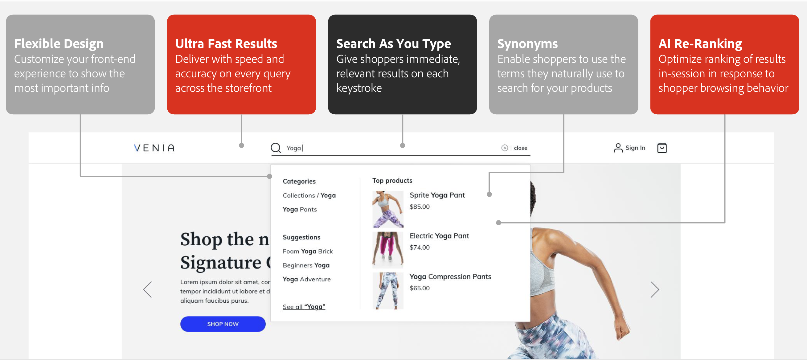

# ストアフロントウィジェット

のインストール時 [!DNL Live Search] ストアフロントには 2 つの新しいウィジェットがあります。

- [!DNL Live Search] [ポップオーバーウィジェット](storefront-popover.md) は、検索結果を含む検索フィールドの下に開くボックスです。
- [製品一覧ページウィジェット](plp-styling.md) （PLP）は、ファセットと同義語のサポートを備えた検索可能な製品リストページを提供します。 このウィジェットは Live Search 4.0.0 以降にインストールされ、有効になっています。

会社のスタイルやブランディングガイドラインに最も合うように、これらのウィジェットのルックアンドフィールをカスタマイズできます。

## ライブ検索ポップオーバーウィジェット

Commerce ストアフロントの検索ボックスにと入力を開始すると、 [!DNL Live Search] は、製品の提案と、での上位の検索結果のサムネール画像を返します。 [ポップオーバーウィジェット](storefront-popover.md).

ポップオーバーウィジェットの詳細と、ストアフロント用にウィジェットをカスタマイズする方法については、を参照してください。 [[!DNL Storefront Popover]](storefront-popover.md).

## 製品一覧ページウィジェット

ストアフロントポップオーバーのすべての結果をクリックして表示すると、製品リストページウィジェットに機能が表示されます。この機能を使用して、検索を継続的に絞り込むことができます。

製品一覧ページウィジェットの詳細と、ストアフロント用にウィジェットをカスタマイズする方法については、を参照してください。 [製品一覧ページウィジェット](plp-styling.md).
