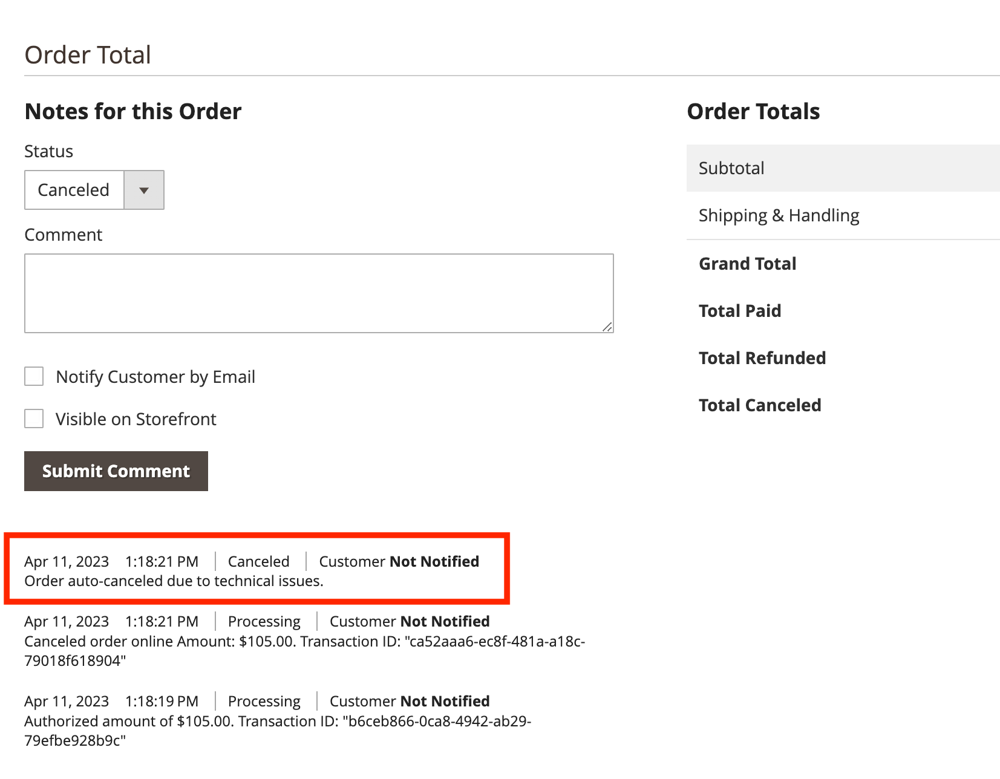

# チェックアウト

Adobe Commerceのチェックアウトを設定できます [!DNL Payment Services] 買い物客に最適な方法です。 機能（例： ） [注文の自動無効化](#order-auto-voided-if-error) および [クレジットカードの保管](#credit-card-vaulting) 買い物客がスムーズなユーザーエクスペリエンスを得られるようにします。

## エラーの場合に自動的に無効化される注文

チェックアウト中にエラーが発生した場合、 [!DNL Payment Services] 順序を自動的に無効にするかキャンセルします。

買い物客のチェックアウトページにエラーメッセージが表示されます。 メッセージは異なる場合があります。

キャンセルされたオーダーに関するコメントは、特定の [注文](https://experienceleague.adobe.com/docs/commerce-admin/stores-sales/order-management/orders/orders.html?lang=en).

買い物客が注文の認証を受けたが、その注文は作成されず、 `Capture`の場合、順序は自動的に無効化されます。 このプロセスにより、買い物客のクレジットカードにクレジットが予約されなくなり、標準の 29 日間の期間の終わりに承認が無効になった場合に発生する支払いプロバイダーの料金が回避されます。

>[!NOTE]
>
>注文の自動無効化は、顧客が次のように設定された支払い方法を使用している場合にのみ発生します `Authorize` mode, not `Authorize and Capture` モード。

## 製品ページからのチェックアウト

顧客が PayPal または [!DNL Pay Later] ボタンを使用すると、現在の製品ページに表示される品目のみが購入されます。 顧客の買い物かごに既に存在する品目は、チェックアウトフローに追加されず、購入もされません。

この機能を使用すると、顧客は現在表示中の品目をすばやく購入し、以前買い物かごに追加した品目を保持できます。
顧客が注文をキャンセルすると、現在の製品ページの品目が顧客の買い物かごに追加されます。

顧客が製品ページからチェックアウトフローに入ると、チェックアウトページは簡略化され、注文関連のデータとオプションのみが表示されます。

## クレジットカードの保管

買い物客は、Web サイトレベル（同じ商人のアカウント内の任意の店舗）での将来の購入に備えて、クレジットカード情報を保管（保存）できます。

詳しくは、 [クレジットカードの保管](vaulting.md) 詳細情報
