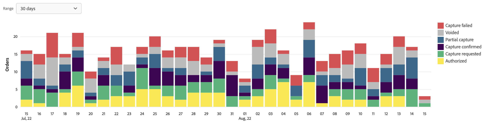

# 注文の支払いステータスレポート

[!DNL Payment Services] 対象： [!DNL Adobe Commerce] および [!DNL Magento Open Source] は、ストアの [取引](transactions.md)、注文、支払い。

注文の支払い状況をすばやく表示できるように、注文の支払い状況レポートの 2 つの表示を使用できます。

* **[注文の支払い状態のビジュアライゼーションビュー](#order-payment-status-data-visualization-view)** — 支払サービス・ホームで使用可能なグラフ。注文支払ステータス・レポート・ビューから 1 日あたりの支払ステータスを視覚的に表したグラフです。
* **[注文の支払状況レポートビュー](#order-payment-status-report-view)** — すべての取引の詳細な支払い、請求済み、出荷済み、返金、紛争状態を示す注文支払ステータスで使用可能なレポート

注文の支払ステータス・ビューは、特定の注文がキャッシュ・プロセス・フローの注文内のどこにあるかを容易に把握するのに役立ちます。 これらのレポートを使用すると、支払い状況と支払い日に基づいて注文をすばやく確認し、潜在的な問題を特定できます。

以下が可能です。 [注文の支払いステータスのダウンロード](#download-order-payment-statuses) 既存の会計または注文管理ソフトウェアで使用する.csv ファイル形式。

>[!NOTE]
>
>財務レポートを表示できないのは、 [オンボード済みでアクティブ化されたライブモード](production.md#enable-live-payments) 対象： [!DNL Payment Services].

## 注文の支払ステータスのデータ視覚化ビュー

注文の支払いステータスのデータビジュアライゼーションビューは、支払いサービスホームで使用できます。 詳細な表から 1 日あたりの集計された支払いステータスが視覚的に表示されます [注文の支払状況レポートビュー](#order-payment-status-report-view).

次の日： _管理者_ サイドバー、移動 **セールス** > **支払いサービス** > _購入回数_ データのビジュアライゼーションを表示するには [支払状況表](#statuses-information).

{width="800" zoomable="yes"}

クリック **[!UICONTROL View Report]** 詳細な表に移動するには [注文の支払状況レポートビュー](#order-payment-status-report-view).

### ステータスの期間のカスタマイズ

デフォルトでは、30 日間の支払いステータスが表示されます。

注文の支払いステータスビジュアライゼーションビューで、日付範囲を選択して、表示する支払いステータスの期間をカスタマイズできます。

1. 次の日： _管理者_ サイドバー、移動 **[!UICONTROL Sales]** > **[!UICONTROL Payment Services]**. 注文の支払いステータスのデータビジュアライゼーションビューは、 _購入回数_ 」セクションに入力します。
1. 次をクリック： **[!UICONTROL Range]** セレクターフィルター。
1. 該当する日付範囲（30 日、15 日、7 日）を選択します。
1. 指定した日付のステータス情報を表示します。

### ステータス情報

選択した日付範囲の支払いステータスが、注文の支払いステータスのデータ視覚化表示の左側に表示されます。 選択した日付範囲の日付がビューの下部に表示されます。 特定の日付に注文がなかった場合は、その日付は表示されません。

注文の支払いステータスのデータビジュアライゼーションビューには、次の情報が含まれています。

| データ | 説明 |
| ------------ | -------------------- |
| [!UICONTROL Orders] | 指定した期間の注文の金額範囲、Y 軸のデータ（左） |
| 日付範囲 | 指定した期間の日付範囲。X 軸のデータ（下部） |
| 認証済み | 承認された注文 |
| キャプチャリクエスト済み | 注文に対してキャプチャがリクエストされました |
| キャプチャ確認済み | 注文キャプチャが完了しました |
| 部分取得 | 部分的にキャプチャされた注文 |
| キャプチャに失敗しました | 注文キャプチャに失敗しました |
| 無効 | 注文が無効です |

## 注文の支払状況レポートビュー

注文の支払い状況レポートビューは、支払いサービスのホームビューで使用できます。 すべてのトランザクションに関する詳細なステータス（支払い、請求済み、発送済み、返金、紛争など）が含まれます。

次の日： _管理者_ サイドバー、移動 **[!UICONTROL Sales]** > **[!UICONTROL Payment Services]** > _[!UICONTROL Orders]_>**[!UICONTROL View Report]**詳細な表形式の注文の支払ステータスレポートビューを表示するには、次の手順に従います。

{width="800" zoomable="yes"}

このトピックのセクションごとに、このビューを設定して、表示するデータを最適に表示できます。

以下が可能です。 [支払トランザクションのダウンロード](#download-order-payment-statuses) 既存の会計または注文管理ソフトウェアで使用する.csv ファイル形式。

>[!NOTE]
>
>この表に示すデータは降順 (`DESC`) デフォルトでは、 `TRANS DATE`. The `TRANS DATE` は、トランザクションが開始された日時です。

### 支払ステータスの更新

特定の支払い方法では、支払いを取得するのに期間が必要です。 [!DNL Payment Services] では、次の方法で、注文の支払トランザクションの保留状態を検出します。

* 同期的検出 `pending capture` 取引
* 非同期監視 `pending capture` 取引

>[!NOTE]
>
>注文中の支払トランザクションの保留状態を検出すると、支払がまだ受け取られていない場合に、誤って発注が発送されるのを防ぐことができます。 これは、e-check および PayPal トランザクションで発生する可能性があります。

#### 保留中の取得トランザクションの同期検出

次に示すキャプチャトランザクションを自動的に検出： `Pending` ステータスと注文が入力されないようにする `Processing` ステータスを返します。

顧客のチェックアウト時、または管理者が以前に承認された支払いの請求書を作成した場合、 [!DNL Payment Services] でのキャプチャトランザクションを自動的に検出します。 `Pending` 対応する注文を次に移す `Payment Review` ステータス。

#### 保留中の取得トランザクションの非同期監視

保留中の取得トランザクションが次の条件に入る時期を検出 `Completed` ステータスを使用して、マーチャントが影響を受けるオーダーの処理を再開できるようにします。

このプロセスが期待どおりに動作するように、マーチャントは新しい cron ジョブを設定する必要があります。 ジョブが自動的に実行するように設定された後は、マーチャントからの他の介入は期待されません。

詳しくは、 [cron ジョブの設定](https://experienceleague.adobe.com/docs/commerce-operations/configuration-guide/cli/configure-cron-jobs.html). 設定が完了すると、新しいジョブが 30 分ごとに実行され、 `Payment Review` ステータス。

マーチャントは、注文の支払い状況レポートビューで、更新された支払い状況を確認できます。

### レポートで使用されるデータ

[!DNL Payment Services] は注文データを使用し、他のソース（PayPal を含む）からの集計された支払いデータと組み合わせて、意味のある非常に有用なレポートを提供します。

注文データは、支払いサービスでエクスポートおよび保持されます。 次の場合： [注文のステータスを変更または追加する](https://docs.magento.com/user-guide/sales/order-status-custom.html) または [ストア表示の編集](https://docs.magento.com/user-guide/stores/stores-all-view-edit.html), [保存する](https://docs.magento.com/user-guide/stores/store-information.html)または Web サイト名を入力すると、そのデータと支払いデータが結合され、注文の支払いステータスレポートに結合された情報が入力されます。

このプロセスには、次の 2 つの手順があります。

1. インデックスは、データを変更します `ON SAVE` （注文情報またはストア情報が変更されるたびに）または `BY SCHEDULE` （事前設定された Cron スケジュールに基づく）、 [インデックス管理](https://docs.magento.com/user-guide/system/index-management.html) 」と入力します。

   デフォルトでは、データのインデックス作成がおこなわれます `ON SAVE`：つまり、注文、注文ステータス、ストア表示、ストアまたは Web サイトで何かが変更された場合には、そのたびに再インデックス化処理がおこなわれます。

1. インデックス付きのデータが支払いサービスに送信され、注文の支払いステータスレポートに入力されます。

レポート目的でエクスポートおよび照合されるデータは、注文の支払いステータスレポートで使用されるデータのみです。

>[!NOTE]
>
>この表に示すデータは降順 (`DESC`) デフォルトでは、 `ORDER DATE`. The `ORDER DATE` は、注文が作成された日付のタイムスタンプです。

#### データエクスポートの設定

ただし、デフォルトでは、インデックスの再作成は `ON SAVE` モードの場合は、 `BY SCHEDULE` モード。 The `BY SCHEDULE` インデックスは cron スケジュールで 1 分間実行され、変更されたデータはデータの変更から 2 分以内に注文ステータスレポートに表示されます。 このスケジュールされたインデックス再作成により、（各注文がおこなわれるのではなく）スケジュールに基づいて発生するので、特に大量の受信注文がある場合に、ストアの負担を軽減できます。

インデックスモードを変更できます。`ON SAVE` または `BY SCHEDULE`—[管理者](https://docs.magento.com/user-guide/system/index-management.html#change-the-index-mode).

データエクスポートを設定する方法については、 [コマンドライン設定](configure-cli.md#configure-data-export).

### データソースを選択

注文の支払いステータスレポートビューで、データソースを選択できます。**[!UICONTROL Live]** _または **[!UICONTROL Sandbox]** — レポートの結果を表示する対象です。

{width="300" zoomable="yes"}

次の場合 _[!UICONTROL Live]_が選択されたデータソースの場合は、 [!DNL Payment Services] 実稼動モードで使用できます。 次の場合_[!UICONTROL Sandbox]_ が選択されたデータソースの場合は、サンドボックスモードのレポート情報を表示できます。

データソースの選択は、次のように動作します。

* を使用するストアがない場合は、 [!DNL Payment Services] ライブモードでは、データソースの選択はデフォルトでに設定されます。 _[!UICONTROL Sandbox]_.
* を使用するストア（1 つ以上）がある場合 [!DNL Payment Services] ライブモードでは、データソースの選択はデフォルトでに設定されます。 _[!UICONTROL Live]_.
* レポートの書き出しは、常にデータソースの選択に従います。

のデータソースを選択するには、以下を実行します。 [!UICONTROL Order Payment Status] レポート：

1. 次の日： _管理者_ サイドバー、移動 **[!UICONTROL Sales]** > **[!UICONTROL [!DNL Payment Services]]** > **[!UICONTROL Orders]** > **[!UICONTROL View Report]**.
1. 次をクリック： _[!UICONTROL Data source]_セレクターフィルターと選択&#x200B;**[!UICONTROL Live]**または&#x200B;**[!UICONTROL Sandbox]**.

   レポート結果は、選択したデータソースに基づいて再生成されます。

### 注文日の期間のカスタマイズ

注文の支払い状況レポートビューで、特定の日付を選択することで、表示するステータスの結果の期間をカスタマイズできます。 デフォルトでは、30 日間の注文支払いステータスがグリッドに表示されます。

1. 次の日： _管理者_ サイドバー、移動 **[!UICONTROL Sales]** > **[!UICONTROL [!DNL Payment Services]]** > _[!UICONTROL Orders]_>**[!UICONTROL View Report]**.
1. 次をクリック： _[!UICONTROL Order dates]_カレンダーセレクターフィルター。
1. 適用可能な日付範囲を選択します。
1. グリッドで指定した日付の注文支払ステータスを表示します。

### レポート情報をフィルター

注文の支払いステータスレポートビューで、フィルタ条件を選択して、表示するステータスの結果をフィルタできます。

1. 次の日： _管理者_ サイドバー、移動 **[!UICONTROL Sales]** > **[!UICONTROL [!DNL Payment Services]]** > _[!UICONTROL Orders]_>**[!UICONTROL View Report]**.
1. 次をクリック： **[!UICONTROL Filter]** セレクター。
1. 切り替え _支払いステータス_ 選択した注文の支払ステータスのレポート結果のみを表示するオプションです。
1. 次の項目を入力して、注文額の範囲内のレポート結果を表示します： _[!UICONTROL Min Order Amount]_または_[!UICONTROL Max Order Amount_].
1. クリック **[!UICONTROL Hide filters]** をクリックして、フィルターを非表示にします。

### 列の表示と非表示を切り替える

「受注支払ステータス」レポートには、デフォルトで、使用可能なすべての情報列が表示されます。 ただし、レポートに表示する列をカスタマイズすることはできます。

1. 次の日： _管理者_ サイドバー、移動 **[!UICONTROL Sales]** > **[!UICONTROL [!DNL Payment Services]]** > _[!UICONTROL Orders]_>**[!UICONTROL View Report]**.
1. 次をクリック： _列設定_ アイコン ({width="20" zoomable="yes"}) をクリックします。
1. レポートに表示する列をカスタマイズするには、リストの列をオンまたはオフにします。

   注文の支払い状況レポートには、列設定メニューで行った変更がすぐに表示されます。 列の環境設定は保存され、レポート表示から移動しても有効になります。

### ステータスの表示

注文の支払いステータスレポートビューには、各注文に関する包括的な支払いステータス情報が表示されます。

デフォルトでは、30 日間の注文支払いステータスがグリッドに表示されます。

左右にスクロールして表示します [注文の支払い状況情報](#column-descriptions)（受注日、承認日、請求済み、発送済み、支払いステータスなどを含む）

検索で返された行数、またはデフォルトの 30 日間の注文支払いステータスに表示される行数は、注文日カレンダーセレクターフィルターの横にある注文の支払いステータス表示グリッドの上に表示されます。

#### 支払ステータス

「支払ステータス」列には、すべての支払の現在のステータスが表示されます。 A `Capture failed` 支払いには、赤いアラートステータスと `Voided` 支払いには、灰色のアラートステータスが表示されます。

#### 払い戻しステータス

返金ステータス列には、返金に関する現在のステータスが表示されます。 A `Capture failed` 支払いには、赤いアラートステータスと `Voided` 支払いには、灰色のアラートステータスが表示されます。

### レポートデータを更新

注文の支払いステータスレポートビューには、 _[!UICONTROL Last updated]_レポート情報が最後に更新された時刻を示すタイムスタンプ。 デフォルトでは、注文の支払いステータスレポートデータは、3 時間ごとに自動で更新されます。

注文の支払いステータスレポートデータを手動で更新し、最新のレポート情報を表示することもできます。

1. 次の日： _管理者_ サイドバー、移動 **[!UICONTROL Sales]** > **[!UICONTROL [!DNL Payment Services]]** > _[!UICONTROL Orders]_>**[!UICONTROL View Report]**.
1. 次をクリック： _更新_ アイコン ({width="20" zoomable="yes"}) をクリックします。

   注文の支払いステータスレポートデータが更新され、 *[!UICONTROL Update complete]* 確認が表示され、最新の情報がグリッドに表示されます。

### 争議の表示

店舗の注文に関する紛争を表示し、PayPal Resolution Center にアクセスして、注文の支払い状況レポート内から対処を行うことができます。

1. 次の日： _管理者_ サイドバー、移動 **[!UICONTROL Sales]** > **[!UICONTROL [!DNL Payment Services]]** > _[!UICONTROL Orders]_>**[!UICONTROL View Report]**.
1. 次に移動： **[!UICONTROL Disputes column]**.
1. 特定の注文に関する紛争を表示し、 [紛争の状況](#order-payment-status-information).
1. 次の場所から紛争の詳細を確認 [PayPal Resolution Center](https://www.paypal.com/us/cshelp/article/what-is-the-resolution-center-help246) 次の語句で始まる紛争 ID リンクをクリックすると、 _PP-D-_.
1. 必要に応じて、紛争に対して適切な措置をとる。

   順序の争議をステータスで並べ替えるには、 [!UICONTROL Disputes] 列ヘッダー。

### 注文の支払いステータスをダウンロード

デフォルトの 30 日間のステータスを表示しているか、カスタマイズされた期間を表示しているかに関わらず、すべてのステータスを含む.csv ファイルを注文の支払いステータス表示グリッドに表示してダウンロードできます。

1. 次の日： _管理者_ サイドバー、移動 **[!UICONTROL Sales]** > **[!UICONTROL [!DNL Payment Services]]** > _[!UICONTROL Orders]_>**[!UICONTROL View Report]**.
1. 過去 30 日以外の期間のステータスを表示するには、 [ステータスの日付範囲期間のカスタマイズ](#customize-dates-timeframe).
1. 次をクリック： _ダウンロード_ ({width="20" zoomable="yes"}) アイコンをクリックします。

注文の支払いステータスは、.csv 形式でダウンロードされます。

### 列の説明

注文の支払いステータスレポートには、次の情報が含まれます。

| 列 | 説明 |
| ------------ | -------------------- |
| [!UICONTROL Order ID] | コマース注文 ID   関連する [注文情報](https://docs.magento.com/user-guide/sales/orders.html){target="_blank"}、「 ID 」をクリックします。 |
| [!UICONTROL Order Date] | 注文日のタイムスタンプ |
| [!UICONTROL Authorized Date] | 支払承認の日付タイムスタンプ |
| [!UICONTROL Order Status] | 現在のコマース [注文ステータス](https://docs.magento.com/user-guide/sales/order-status.html){target="_blank"} |
| [!UICONTROL Invoiced] | 注文の請求書ステータス —*[!UICONTROL No]*, *[!UICONTROL Partial]*&#x200B;または *[!UICONTROL Yes]* |
| [!UICONTROL Shipped] | 注文の発送ステータス —*[!UICONTROL No]*, *[!UICONTROL Partial]*&#x200B;または *[!UICONTROL Yes]* |
| [!UICONTROL Order Amt] | 注文の総合計金額 |
| [!UICONTROL Cur] | 注文の通貨タイプ |
| [!UICONTROL Pay Status] | 特定の注文の支払いステータス |
| [!UICONTROL Paid Amt] | 注文で支払われた金額 |
| [!UICONTROL Cur] | 注文で支払われた金額の通貨タイプ |
| [!UICONTROL Refund Status] | 注文の返金のステータス（返品、RMA、クレジット・メモからの情報など）:   *[!UICONTROL Requires refund]*, *[!UICONTROL Refund requested]*, *[!UICONTROL Refunded]*, *[!UICONTROL Refund failed]*&#x200B;または *[!UICONTROL Voided]* |
| [!UICONTROL Refund Amount] | 注文の払い戻し済み金額の合計 |
| [!UICONTROL Cur] | 注文に対して払い戻された金額の通貨タイプ |
| [!UICONTROL Disputes] | オーダーに関する紛争のステータス（紛争やチャージバックからの情報）*[!UICONTROL Open]*, *[!UICONTROL Waiting for buyer response]*, *[!UICONTROL Waiting for seller response]*, *[!UICONTROL Under review]*, *[!UICONTROL Resolved]*&#x200B;または *[!UICONTROL Other]* |
| [!UICONTROL Payment Method] | 注文のコマーストランザクションで使用される支払い方法 |
| [!UICONTROL Website] | 注文元の Web サイト |
| [!UICONTROL Store] | 注文が行われた店舗 |
| [!UICONTROL Store View] | 注文がおこなわれたストア表示 |
