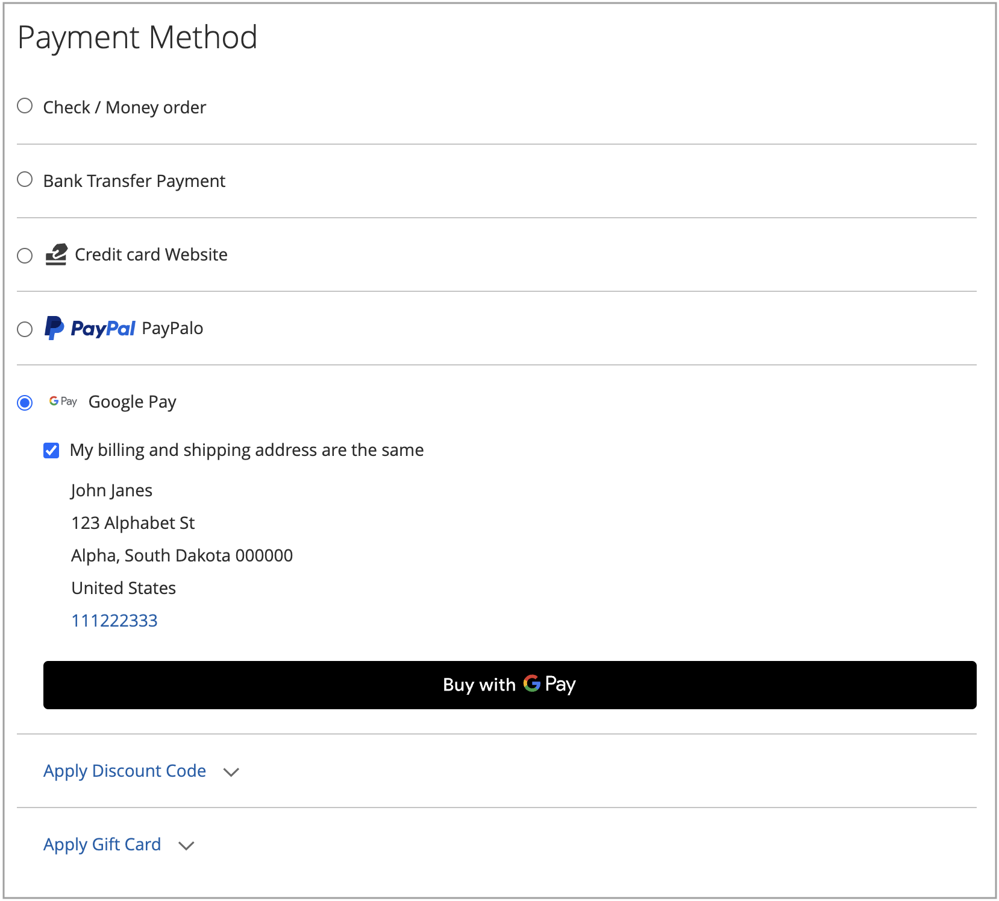

# 支払いオプション

（を使用） [!DNL Adobe Commerce] および [!DNL Magento Open Source] [!DNL Payment Services]複数のお支払い方法をご利用いただけます。

これらの支払いオプションは、 [ホーム設定](payments-home.md) または [ストアの設定](configure-admin.md) （従来の支払いオプションまたはマルチストア設定の場合にお勧めします）。

チェックアウトプロセスの位置に応じて、支払い方法ごとに異なる動作があります。

* 製品ページ – 品目の製品ページ
* ミニ・カート – 製品がカートに追加されたときにカート・アイコンをクリックすると使用可能です。
* 買い物かご – クリック時に利用可能 _買い物かごの表示と編集_ ミニカートから
* チェックアウトビュー – クリック時に使用可能 _チェックアウトに進む_ ミニカートまたは買い物かごから

>[!IMPORTANT]
>
>[!DNL Payment Services] 支払いを処理する前に、オンボーディングを完了する必要があります。

## 標準支払と高度な支払いの比較

[!DNL Payment Services] 提供する **詳細** （完全にサポート）と **標準** （エクスプレスチェックアウト）お支払いオプションとオンボーディングフローは、お使いの国によって異なります。

* **詳細**  – すべて利用可能 [支払いオプション](../payment-services/payments-options.md) は現在のに利用可能です [完全に支援されている国](../payment-services/overview.md#availability). ライブ支払いを有効にするためのオンボーディング中に、 [高度なオンボーディングオプション](../payment-services/production.md#advanced-onboarding).
* **標準**  – 支払いオプション（エクスプレスチェックアウト）のサブセット（PayPal のクレジットカードとデビットカード）は、サポートされている他の国で利用できます。 [クレジットカードのフィールド](#credit-card-fields) および [Apple ペイ](#apple-pay-button) は、このオンボーディングオプションでは使用できません。 ライブ支払いを有効にするためのオンボーディング中に、 [標準のオンボーディングオプション](../payment-services/production.md#standard-onboarding).

参照： [Enable （有効） [!DNL Payment Services] 本番用](../payment-services/production.md#complete-merchant-onboarding) 高度なオンボーディングと標準オンボーディングの完了について説明します。

## [!UICONTROL Credit Card Fields]

[!UICONTROL Credit Card Fields] クレジットカードまたはデビットカードの支払い方法に対して、シンプルで安全なチェックアウトを提供します。 買い物客がクレジットカードのフィールドを使用してチェックアウトする際は、名前、請求先住所、クレジットカードまたはデビットカードの情報を入力して注文を行います。 顧客の顧客情報は、購入セッション中に安全に使用され、チェックアウトフローをシームレスに導きます。

{width="500" zoomable="yes"}

Enable （有効） [クレジットカードの保管](#vaulting) ストアで、買い物客が後ですばやくチェックアウトするために、クレジットカード情報を保管（保存）できるようにします。

以下を設定できます [!UICONTROL Credit Card Fields] ストア設定または [!DNL Payment Services] ホーム。 参照： [設定](settings.md#credit-card-fields) を参照してください。

また、クレジットカードフィールドのレイアウト、幅、高さおよび外部スタイル設定を変更することもできます。 参照： [PayPal ドキュメント](https://developer.paypal.com/docs/checkout/advanced/customize/card-field-style/) を参照してください。

## [!DNL Apple Pay] ボタン

顧客は以下を使用できます [[!DNL Apple Pay]](https://www.apple.com/apple-pay/)は、iOSまたはmacOS デバイスに保存されたクレジットカードおよびデビットカードの支払資格情報を使用して購入します。

[!DNL Apple Pay] は、Safari ブラウザーでのみ使用できます。 マーチャントは、マーチャントアカウント 1 件につき最大 99 個のドメインを追加できます。

{width="500" zoomable="yes"}

この [!DNL Apple Pay] ボタンは、製品ページ、ミニカート、買い物かご、チェックアウト表示から表示されます。

>[!NOTE]
>
> 使用目的 [!DNL Apple Pay] ストアに対して、次を完了します [での自己登録 [!DNL Apple Pay]](https://developer.paypal.com/docs/checkout/apm/apple-pay/#register-your-live-domain) （_ライブドメインを登録_ セクションのみ）と [のストア用に設定します。 [!DNL Payment Services]](settings.md#payment-buttons).

以下を設定できます [!UICONTROL Apple Pay] ストア設定または支払いサービス ホームで入力します。 参照： [設定](settings.md#apple-pay) を参照してください。

## [!DNL Google Pay] ボタン

顧客は以下を使用できます [[!DNL Google Pay]](https://pay.google.com/about/) 支払いの詳細をGoogle アカウントに追加し、シームレスなチェックアウトエクスペリエンスのために安全に保存する

[!DNL Google Pay] は、特定の国または地域、および特定のデバイスでのみ使用できます。 参照： [[!DNL Google Pay] 詳細を見る](https://developer.paypal.com/docs/checkout/apm/google-pay/#link-googlepayintegration) を参照してください。

{width="500" zoomable="yes"}

この [!DNL Google Pay] ボタンは、製品ページ、ミニカート、買い物かご、チェックアウト表示から表示されます。

以下を設定できます [!UICONTROL Google Pay] ストア設定または支払いサービス ホームで入力します。 参照： [設定](configure-admin.md) を参照してください。

>[!NOTE]
>
> この [!DNL Google Pay] API は、安全なコンテキストの web サイトでのみ使用できます。 参照： [トラブルシューティング](https://developers.google.com/pay/api/web/support/troubleshooting) 詳しくは、ドキュメントを参照してください。

## [!DNL PayPal Payment Buttons]

[!DNL PayPal payment buttons]は、PayPal を使用して購入を完了し、買い物客の配送先住所、請求先住所、支払い詳細を保存して後で使用します。 買い物客は、以前に保存または PayPal によって提供されたあらゆる支払い方法を使用できます。

{width="350" zoomable="yes"}

以下を設定できます [!UICONTROL PayPal payment buttons] ストア設定または [!DNL Payment Services] ホーム。 参照： [設定](settings.md#payment-buttons) を参照してください。

PayPal の国ごとの支払い方法の可用性について学ぶ [支払い方法ドキュメント](https://developer.paypal.com/docs/checkout/payment-methods/).

### [!DNL PayPal] ボタン

PayPal ボタンを使用すると、お客様は安心してチェックアウトできます。

この [!DNL PayPal] ボタンは、製品ページ、ミニカート、買い物かご、チェックアウト表示から表示されます。

### [!DNL Venmo] ボタン

ユーザーは次を使用してチェックアウトできます [ベンモ](https://venmo.com/) ボタン。

この [!DNL Venmo] ボタンは、製品ページ、ミニカート、買い物かご、チェックアウト表示から表示されます。

### PayPal の「デビット」ボタンまたは「クレジットカード」ボタン

お客様は PayPal のデビットカードまたはクレジットカードのボタンを使用してチェックアウトできます。

PayPal の「デビット」または「クレジットカード」ボタンがチェックアウトページに表示されます。

このオプションは、クレジットカード統合の代わりに、PayPal がホストするボタンを使用して、買い物客にデビットまたはクレジットカードの支払いオプションを提示するために使用できます。

### [!DNL Pay Later] ボタン

今すぐ購入して後で支払うことができるように、顧客に対して短期、無利子の支払い、その他の資金調達オプションを提供する [!DNL Pay Later] ボタン。

この [!DNL Pay Later] ボタンは、製品ページ、ミニカート、買い物かご、チェックアウト表示から表示されます。

の Pay Later オファーに関する情報を参照してください [PayPal の Pay Later オファードキュメント](https://developer.paypal.com/docs/checkout/pay-later/us/). の使用 **国または地域** 目的の地域をドロップダウンから選択します。

を無効または有効にする方法については、こちらを参照してください [!DNL Pay Later] を更新したメッセージング [設定](settings.md#payment-buttons) 設定。

## PayPal 支払いボタンのみを使用

ストアを実稼動モードにすばやく切り替えるには、次を設定できます _のみ_ PayPal 支払いボタン（Venmo、PayPal など）- PayPal クレジットカードの支払いオプションも使用する代わりに、

これにより、次のことが可能になります。

* Venmo や PayPal の支払いボタンなど、顧客に対して様々な支払いオプションを提供します。PayPal でホストされるカードフィールドをオフにしたり、既存のクレジットカードプロバイダーを使用したりするオプションもあります。
* クレジットカード決済には既存のクレジットカード会社を使用し、PayPal の他の支払いオプションも使用します。
* PayPal の支払いボタンは、PayPal が支払いオプションとしてクレジットカードをサポートしていない地域で使用してください。

終了 **～を使って支払いをキャプチャする _のみ_ PayPal 支払いボタン （_ではない_ （PayPal クレジットカード決済オプション）**:

1. ストアがであることを確認します [実稼動モード](settings.md#enable-payment-services).
1. [目的の PayPal 支払いボタンの設定](settings.md#payment-buttons) （設定）に移動します。
1. 回転 _オフ_ この **[[!UICONTROL Show PayPal Credit and Debit card button]](settings.md#payment-buttons)** のオプション _[!UICONTROL Payment buttons]_セクション。

終了 **既存のクレジットカード会社との支払いのキャプチャ _および_ PayPal 支払いボタン**:

1. ストアがであることを確認します [実稼動モード](settings.md#enable-payment-services).
1. [目的の PayPal 支払いボタンの設定](settings.md#payment-buttons).
1. 回転 _オフ_ この **[[!UICONTROL PayPal Show Credit and Debit card button]](settings.md#payment-buttons)** のオプション _[!UICONTROL Payment buttons]_セクション。
1. 回転 _オフ_ この **[[!UICONTROL Show on checkout page]](settings.md#credit-card-fields)** のオプション _[!UICONTROL Credit card fields]_セクションと使用 [既存のクレジット カード プロバイダーアカウント](https://experienceleague.adobe.com/docs/commerce-admin/stores-sales/payments/payments.html#payments).

## 注文の再計算

お客様がミニカート、買い物かご、または商品ページからチェックアウトフローに入ると、注文レビューページに移動し、PayPal ポップアップウィンドウで選択した配送先住所を確認できます。 顧客が配送方法を選択すると、注文金額が適切に再計算され、顧客は配送料と税金を確認できます。

顧客がチェックアウトページからチェックアウトフローに入ると、システムは既に配送先住所と最終的な計算金額を認識しており、合計が適切に表されます。

祝日、送料、消費税は場所によって大きく異なる場合があります。 後 [!DNL Payment Services] 配送先住所と料金を受け取り、適用可能なすべてのコストをすばやく再計算し、チェックアウトの最後の段階でそれらを適切に表示します。

## クレジットカードの保管

買い物客は、クレジットカード情報をヴォールティング（保存）して、Web サイト・レベル（同じマーチャントのアカウント内のあらゆる店舗）で今後の購入に利用できます。

参照： [クレジットカードの保管](vaulting.md) を参照してください。

## セキュリティ

参照： [PCI コンプライアンス](security.md#pci-compliance) を参照してください。
