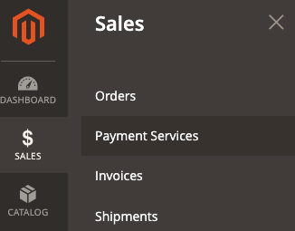

# 設定

カスタマイズ可能 [!DNL Payment Services] の設定が役に立ちます。 [!DNL Payment Services] ホーム。

を設定するには、以下を実行します。 [!DNL Payment Services] 対象 [!DNL Adobe Commerce] および [!DNL Magento Open Source] クリック **[!UICONTROL Settings]**. これらの設定オプションは、 _[!UICONTROL Payment mode]_フィールドを選択します。

詳しくは、 [[!UICONTROL General] 設定セクション](#general-settings) を参照してください。

>[!IMPORTANT]
>
> マルチストアまたはレガシー設定については、 [管理での設定](configure-admin.md) トピック。

## 支払いサービスの有効化

次を有効にすることができます。 [!DNL Payment Services] を有効にします。 [!UICONTROL General] 」セクションに入力します。

1. の _管理者_ サイドバー、移動 **[!UICONTROL Sales]** > **[!UICONTROL Payment Services]**.

   

1. クリック **[!UICONTROL Settings]**. 詳しくは、 [の概要 [!DNL Payment Services] ホーム](payments-home.md) を参照してください。

   この _[!UICONTROL General]_セクションには、を有効にするための設定が含まれています [!DNL Payment Services] を支払い方法として使用します。

1. 有効にするには [!DNL Payment Services] をストアの支払い方法として、**[!UICONTROL Enable Payment Services as payment method]**) から `Yes`.

1. まだテストを行っている場合 [!DNL Payment Services] お客様のストアには、 **支払いモード** から `Sandbox`. ライブ支払いを有効にする準備が整ったら、次のように設定します。 `Production`.

   >[!WARNING]
   >
   >お使いの _[!UICONTROL Sandbox Merchant ID]_および_[!UICONTROL Production Merchant ID]_ は自動生成され、サンドボックスや実稼動のオンボーディングを完了すると、該当するフィールドに存在します。 これらの ID を削除または変更しないでください。

1. ストア表示を選択します ( **[!UICONTROL Scope]** 支払い方法を有効にするドロップダウンメニュー。
1. 支払い関数とストアフロント表示のデフォルト設定を変更するには、必要に応じて追加のオプションを設定します。

   - [クレジットカードのフィールド](#credit-card-fields)
   - [支払いボタン](#payment-buttons)
   - [ボタンのスタイル](#button-style)

1. クリック **[!UICONTROL Save]**.

   変更を保存せずにこのビューから移動しようとすると、モーダルが表示され、変更の破棄、編集の続行、変更の保存を求めるプロンプトが表示されます。

1. に移動します。 **[!UICONTROL System]** > **[!UICONTROL Cache Management]** をクリックし、 **[!UICONTROL Flush Cache]** 無効なキャッシュをすべて更新します。

### クレジットカードのフィールド

この _[!UICONTROL Credit Card Fields]_設定は、クレジットカードまたはデビットカードの支払い方法のためのシンプルでセキュアなチェックアウトオプションを提供します。

詳しくは、 [支払いオプション](payments-options.md#paypal-smart-buttons) を参照してください。

1. チェックアウト時に表示される支払い方法の名前を変更するには、 **[!UICONTROL Checkout title]** フィールドに入力します。
1. 宛先 [支払い処理を設定](production.md#set-payment-services-as-payment-method)，切り替え **[!UICONTROL Payment action]** から `Authorize` または `Authorize and Capture`.
1. デバッグモードを有効にするには、 **[!UICONTROL Debug Mode]** セレクター。

   デバッグモードを有効にすると、クレジットカードの支払いに関する追加のデバッグ情報が `var/log/payment.log` ファイル。 この情報は、特定の支払いに関する詳細な情報を提供し、トラブルシューティングに役立てることができます。

1. クリック **[!UICONTROL Save]**.

   変更を保存せずにこのビューから移動しようとすると、モーダルが表示され、変更の破棄、編集の続行、変更の保存を求めるプロンプトが表示されます。

1. に移動します。 **[!UICONTROL System]** > **[!UICONTROL Cache Management]** をクリックし、 **[!UICONTROL Flush Cache]** 無効なキャッシュをすべて更新します。

### 支払いボタン

この [!DNL PayPal Smart Buttons] 支払いオプションは、お客様に対して、シンプルで迅速かつ安全なチェックアウトプロセスを提供します。 詳しくは、 [支払いオプション](payments-options.md#paypal-smart-buttons) を参照してください。

「支払い」ボタンを有効にして設定できます。

1. チェックアウト時に表示される支払い方法の名前を変更するには、 **[!UICONTROL Checkout Title]** フィールドに入力します。
1. 宛先 [支払い処理を設定](production.md#set-payment-services-as-payment-method)，切り替え **[!UICONTROL Payment action]** から `Authorize` または `Authorize and Capture`.
1. 切り替えセレクターを使用して、有効または無効にします [!DNL PayPal smart button] 表示機能：
   - **[!UICONTROL Show PayPal buttons on product detail page]**
   - **[!UICONTROL Show PayPal buttons on mini cart preview]**
   - **[!UICONTROL Show PayPal buttons on cart page]**
   - **[!UICONTROL Show PayPal Pay Later button]**
   - **[!UICONTROL Show Venmo button]**

1. 次の手順で [後で支払うメッセージ](payments-options.md#pay-later-button)、切り替え **[!UICONTROL Show PayPal Pay Later message]** オプション。
1. デバッグモードを有効にするには、 **[!UICONTROL Debug Mode]** セレクター。

   デバッグモードを有効にすると、PayPal の支払いに関する追加のデバッグ情報が `var/log/payment.log` ファイル。 この情報は、特定の支払いに関する詳細な情報を提供し、トラブルシューティングに役立てることができます。

1. クリック **[!UICONTROL Save]**.

   変更を保存せずにこのビューから移動しようとすると、モーダルが表示され、変更の破棄、編集の続行、変更の保存を求めるプロンプトが表示されます。

1. に移動します。 **[!UICONTROL System]** > **[!UICONTROL Cache Management]** をクリックし、 **[!UICONTROL Flush Cache]** 無効なキャッシュをすべて更新します。

#### ボタンのスタイル

また、 _[!UICONTROL Button style]_「支払い」ボタンのオプション：

1. 次の手順で **[!UICONTROL Layout]**&#x200B;を選択します。 `Vertical` または `Horizontal`.

   >[!NOTE]
   >
   > ボタンのスタイルが `Horizontal` お客様のストアが複数の支払いボタンを表示するように設定されている場合、製品ページ、チェックアウトページ、ミニカートに 2 つのボタンと、カートに 1 つのボタンのみが表示されます。

1. 横置きレイアウトでタグラインを有効にするには、 **[!UICONTROL Show tagline]** セレクター。
1. 次の手順で **[!UICONTROL Color]**」で、目的のカラーオプションを選択します。
1. 次の手順で **[!UICONTROL Shape]**&#x200B;を選択します。 `Pill` または `Rect`.
1. ボタンの高さセレクターを有効にするには、 **[!UICONTROL Responsive button height]** セレクター。
1. 次の手順で **[!UICONTROL Label]**」で、目的のラベルオプションを選択します。
1. クリック **[!UICONTROL Save]**.

   変更を保存せずにこのビューから移動しようとすると、モーダルが表示され、変更の破棄、編集の続行、変更の保存を求めるプロンプトが表示されます。

1. に移動します。 **[!UICONTROL System]** > **[!UICONTROL Cache Management]** をクリックし、 **[!UICONTROL Flush Cache]** 無効なキャッシュをすべて更新します。

次の項目を設定できます。 [!DNL PayPal Smart Buttons] 管理者でのスタイル設定または [!DNL Payment Services Home]. 詳しくは、 [PayPal のボタンスタイルガイド](https://developer.paypal.com/docs/checkout/standard/customize/buttons-style-guide/) を参照してください。
