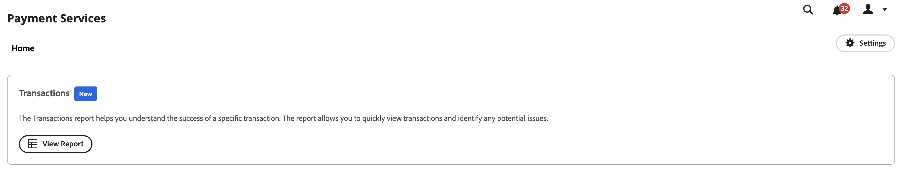

# トランザクションレポート

[!DNL Payment Services] 対象： [!DNL Adobe Commerce] および [!DNL Magento Open Source] は、店舗のトランザクション、注文、支払いを明確に把握できるように、包括的なレポートを提供します。

{width="700" zoomable="yes"}

トランザクションレポートでは、トランザクションの承認率とネガティブなトランザクションの傾向を確認できるので、ストアの状態を効果的に監視し、トランザクションの問題を事前に特定して対処できます。

ストアフロントに発行された注文と、その支払い方法、結果、支払い応答コードなどに関する個々のトランザクションを確認します。

トランザクションレポートで提供される情報は、商人が使用する目的でのみ使用されます。 この情報を顧客や他の潜在的な不正者と共有しないでください。 トランザクション情報を使用して、セキュリティチェックを回避したり、チャージバックを発生させる注文を行うことができます。

既存の会計または注文管理ソフトウェアで使用するために、トランザクションレポートを.csv ファイル形式でダウンロードできます。

>[!NOTE]
>
>財務レポートを表示できないのは、 [オンボード済みでアクティブ化されたライブモード](production.md#enable-live-payments) 対象： [!DNL Payment Services].

## トランザクションレポート表示

「取引」レポート・ビューは、Payment Services の「取引」ビューで使用できます。 ストアのトランザクションに関する利用可能なすべての情報が含まれます。

次の日： _管理者_ サイドバー、移動 **[!UICONTROL Sales]** > **[!UICONTROL Payment Services]** > _[!UICONTROL Transactions]_>**[!UICONTROL View Report]**詳細な表形式のトランザクションレポートビューを表示するには、次の手順に従います。

{width="600" zoomable="yes"}

このトピックのセクションごとに、このビューを設定して、表示するデータを最適に表示できます。

このレポート内のリンクされたコマース注文 ID とプロバイダーのトランザクション ID、トランザクション金額、トランザクションごとの支払い方法などを確認します。

すべての支払い方法が同じ精度の情報を提供しているわけではありません。 例えば、クレジットカードトランザクションは、応答、AVS、CCV コード、およびトランザクションレポートのカードの最後の 4 桁を提供します。PayPal スマートボタンは提供しません。

以下が可能です。 [トランザクションをダウンロード](#download-transactions) 既存の会計または注文管理ソフトウェアで使用する.csv ファイル形式。

### データソースを選択

トランザクションレポートビューで、データソースを選択できます。**[!UICONTROL Live]** または **[!UICONTROL Sandbox]** — レポートの結果を表示する対象です。

{width="300" zoomable="yes"}

次の場合 _[!UICONTROL Live]_が選択されたデータソースの場合は、 [!DNL Payment Services] 実稼動モードで使用できます。 次の場合_[!UICONTROL Sandbox]_ が選択されたデータソースの場合は、サンドボックスモードのレポート情報を表示できます。

データソースの選択は、次のように動作します。

* を使用するストアがない場合は、 [!DNL Payment Services] 実稼働モードでは、データソースの選択はデフォルトでに設定されます。 _[!UICONTROL Sandbox]_.
* を使用するストア（1 つ以上）がある場合 [!DNL Payment Services] 実稼働モードでは、データソースの選択はデフォルトでに設定されます。 _[!UICONTROL Live]_.
* レポートの書き出しは、常にデータソースの選択に従います。

のデータソースを選択するには、以下を実行します。 [!UICONTROL Transactions] レポート：

1. 次の日： _管理者_ サイドバー、移動 **[!UICONTROL Sales]** > **[!UICONTROL [!DNL Payment Services]]** > _[!UICONTROL Transactions]_>**[!UICONTROL View Report]**.
1. クリック **[!UICONTROL Data source]** を選択し、 **[!UICONTROL Live]** または **[!UICONTROL Sandbox]**.

   レポート結果は、選択したデータソースに基づいて再生成されます。

### 日付の期間をカスタマイズ

トランザクションレポートビューでは、特定の日付を選択して、表示するトランザクションの期間をカスタマイズできます。 デフォルトでは、30 日間のトランザクションがグリッドに表示されます。

1. 次の日： _管理者_ サイドバー、移動 **[!UICONTROL Sales]** > **[!UICONTROL [!DNL Payment Services]]** > _[!UICONTROL Transactions]_>**[!UICONTROL View Report]**.
1. 次をクリック： **[!UICONTROL Transaction dates]** カレンダーセレクターフィルター。
1. 適用可能な日付範囲を選択します。
1. グリッドで指定した日付のトランザクションを表示します。

### レポート情報をフィルター

「トランザクション」レポート・ビューで、フィルタ条件を選択して、表示するステータスの結果をフィルタできます。

1. 次の日： _管理者_ サイドバー、移動 **[!UICONTROL Sales]** > **[!UICONTROL [!DNL Payment Services]]** > _[!UICONTROL Transactions]_>**[!UICONTROL View Report]**.
1. 次をクリック： **[!UICONTROL Filter]** セレクター。
1. 切り替え _[!UICONTROL Transaction Result]_選択した注文トランザクションのレポート結果のみを表示するオプション。
1. 切り替え _[!UICONTROL Payment Method]_選択した支払い方法のレポート結果のみを表示するオプションです。
1. を入力します。 _最小注文額_ または _最大注文額_ をクリックして、その注文金額範囲内のレポート結果を確認します。
1. を入力します。 _[!UICONTROL Order ID]_特定のトランザクションを検索する場合。
1. 次を入力します。 _[!UICONTROL Card Last Four Digits]_をクリックして、特定のクレジットカードまたはデビットカードを検索します。
1. クリック **[!UICONTROL Hide filters]** をクリックして、フィルターを非表示にします。

### 列の表示と非表示を切り替える

トランザクションレポートには、デフォルトで、使用可能なすべての情報列が表示されます。 ただし、レポートに表示する列をカスタマイズすることはできます。

1. 次の日： _管理者_ サイドバー、移動 **[!UICONTROL Sales]** > **[!UICONTROL [!DNL Payment Services]]** > _[!UICONTROL Transactions]_>**[!UICONTROL View Report]**.
1. 次をクリック： **[!UICONTROL Column settings]** アイコン {width="20" zoomable="yes"}.
1. レポートに表示する列をカスタマイズするには、リストの列をオンまたはオフにします。

   トランザクションレポートには、列設定メニューで行った変更がすぐに表示されます。 列の環境設定は保存され、レポート表示から移動しても有効になります。

### レポートデータを更新

トランザクションレポートビューには、 _[!UICONTROL Last updated]_レポート情報が最後に更新された時刻を示すタイムスタンプ。 デフォルトでは、トランザクションレポートデータは 3 時間ごとに自動で更新されます。

また、レポートデータの更新を手動で強制して、最新のレポート情報を表示することもできます。

1. 次の日： _管理者_ サイドバー、移動 **[!UICONTROL Sales]** > **[!UICONTROL [!DNL Payment Services]]** > _[!UICONTROL Transactions]_>**[!UICONTROL View Report]**.
1. 次をクリック： _更新_ アイコン ({width="20" zoomable="yes"}) をクリックします。

   トランザクションレポートデータが更新され、 *[!UICONTROL Update complete]* 確認が表示され、最新の情報がグリッドに表示されます。

### トランザクションをダウンロード

デフォルトの 30 日間のトランザクションを表示しているか、カスタマイズされた期間を表示しているかに関わらず、すべてのトランザクションがトランザクション表示グリッドに表示された.csv ファイルをダウンロードできます。

1. 次の日： _管理者_ サイドバー、移動 **[!UICONTROL Sales]** > **[!UICONTROL [!DNL Payment Services]]** > **[!UICONTROL Transactions]**.
1. 過去 30 日間以外の期間のトランザクションを表示する場合は、 [ステータスの日付範囲期間のカスタマイズ](#customize-dates-timeframe).
1. 次をクリック： _ダウンロード_ {width="20" zoomable="yes"} アイコン。

トランザクションは.csv 形式でダウンロードされます。

### 列の説明

トランザクションレポートには、次の情報が含まれます。

| 列 | 説明 |
| ------------ | -------------------- |
| [!UICONTROL Order ID] | コマース注文 ID （成功したトランザクションの値のみが含まれ、却下されたトランザクションの場合は空です）   関連する [注文情報](https://docs.magento.com/user-guide/sales/orders.html){target="_blank"}、「 ID 」をクリックします。 |
| [!UICONTROL Provider Transaction ID] | 支払プロバイダーから提供されるトランザクション ID。トランザクションが成功した場合の値のみが含まれ、却下されたトランザクションの場合はダッシュが含まれます。 |
| [!UICONTROL Transaction Date] | トランザクション日のタイムスタンプ |
| [!UICONTROL Payment Method] | ブランドとカードの種類に関する詳細情報を含むトランザクションの支払い方法。 詳しくは、 [カードの種類](https://developer.paypal.com/docs/api/orders/v2/#definition-card_type) 詳細は、Payment Services バージョン 1.6.0 以降で利用可能 |
| [!UICONTROL Card Last Four Digits] | トランザクションに使用するクレジットカードまたはデビットカードの最後の 4 桁 |
| [!UICONTROL Result] | 取引の結果：*[!UICONTROL OK]* （成功したトランザクション）、 *[!UICONTROL Rejected by Payment Provider]* （PayPal によって却下）、 *[!UICONTROL Rejected by Bank]* （カードを発行した銀行により却下） |
| [!UICONTROL Response Code] | 支払いプロバイダーまたは銀行から拒否理由を提供するエラーコード。次の項目について、考えられる応答コードと説明のリストを参照してください： [`Rejected by Bank` ステータス](https://developer.paypal.com/docs/api/orders/v2/#definition-processor_response) および [`Rejected by Payment Provider` ステータス](https://developer.paypal.com/api/rest/reference/orders/v2/errors/). |
| [!UICONTROL AVS Code] | 住所検証サービスコード。支払い要求のプロセッサ応答情報。 詳しくは、 [使用可能なコードと説明のリスト](https://developer.paypal.com/docs/api/orders/v2/#definition-processor_response) を参照してください。 |
| [!UICONTROL CVV Code] | クレジット・カードとデビット・カードのカード検証値コード。詳しくは、 [使用可能なコードと説明のリスト](https://developer.paypal.com/docs/api/orders/v2/#definition-processor_response) を参照してください。 |
| [!UICONTROL Amount] | トランザクションの注文金額 |
| [!UICONTROL Currency] | トランザクションで注文に使用される通貨 |
| [!UICONTROL Type] | [支払いアクション](../payment-services/production.md#set-payment-services-as-payment-method) 取引のための`Authorize` または `Authorize and Capture` |

### エラー応答コード

The _応答コード_ 列には、トランザクションに関連する特定のエラーまたは成功コードが表示されます。 表示される一般的なエラーコードには次のようなものがあります。

* `PAYMENT_DENIED` — 不正の疑いがあったため、PayPal は取引を拒否しました。
* `INTERNAL_SERVER_ERROR` — トランザクションは PayPal によって拒否され、PayPal サーバーエラーが発生しました。 トランザクションは再試行できます。
* `INSTRUMENT_DECLINED` — お客様は、選択した支払い方法ごとに PayPal によって拒否されました。 トランザクションは、別の支払い方法で再試行できます。
* `9500`同氏は、「詐欺の疑いがある」として、連銀が取引を却下した、と述べた。
* `5120`同氏は、顧客が支払いに必要な資金を持っていないため、取引は、関連銀行によって却下された、と述べた。
* `5650` — 取引は、銀行が強力な顧客認証 ([3DS](security.md#3ds)) をクリックします。

失敗したトランザクションに関する詳細なエラー応答コードは、2023 年 6 月 1 日より新しいトランザクションで使用できます。 2023 年 6 月 1 日より前に発生したトランザクションに関する部分的なレポートデータが表示されます。
