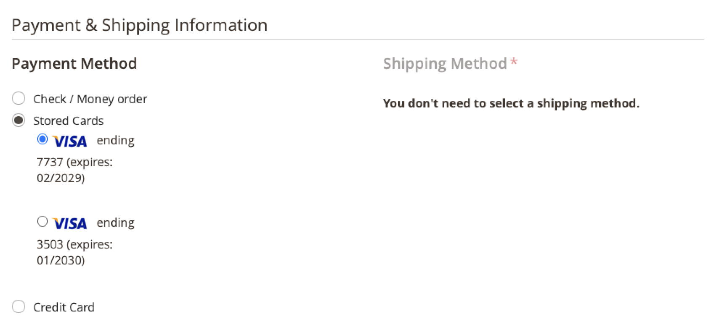

# クレジットカード保管

1 回限りの顧客を、クレジットカードの保管機能を備えた常連客に変換します。 買い物客は、チェックアウト時にクレジットカードの資格情報を保存 (「vault」) して、同じ商人アカウント内で後の購入で使用することも、別の商人アカウント内で保存することもできます。

{width="400" zoomable="yes"}

買い物客は、保存されたトークンを使用して、保存されたクレジットカード情報で将来のチェックアウトを完了します。

{width="400" zoomable="yes"}

また、Vault に登録されたクレジットカードを [保管済支払い方法](https://docs.magento.com/user-guide/customers/account-dashboard-stored-payment-methods.html) マイアカウント内にあります。

{width="400" zoomable="yes"}

>[!WARNING]
>
>現在、PayPal は最大で 5 枚の Vault カードを保存できます。

## ヴォールティングを有効化

お客様向けのクレジットカード保管機能を有効にできます。 _および_ 管理人の商人 [!DNL Payment Services] [設定](settings.md#card-vaulting).

## 管理での Vaulting の使用

顧客が以前に Vault に登録されたクレジットカードを持っている場合、マーチャントは、管理者でその顧客の後続の注文を、Vault に登録された支払い方法を使用して作成できます。

顧客が既存のアカウントと、以前に完了した支払いからシステムに保存された有効なトークンの両方を持っている場合にのみ、管理者で Vaulted カードを使用できます。

管理者で、保留中のクレジットカードを使用して顧客の注文を作成する手順は、次のとおりです。

1. [注文の作成と製品の追加](https://experienceleague.adobe.com/docs/commerce-admin/stores-sales/point-of-purchase/assist/customer-account-create-order.html).
1. In _[!UICONTROL Payment & Shipping Information]_を選択します。**[!UICONTROL Stored Cards]**を支払い方法として使用します。
1. 適切な Vaulted クレジットカードの支払い方法を選択します。
1. オーダーに必要な他の手順を完了した後、 [送信](https://experienceleague.adobe.com/docs/commerce-admin/stores-sales/point-of-purchase/assist/customer-account-create-order.html?lang=en#step-3%3A-submit-the-order).

   {width="600" zoomable="yes"}

## セキュリティ

最小限のクレジットカード情報は買い物客と共有され、買い物客には、最後の 4 桁、有効期限、および 2 枚目のクレジットカードのブランドのみが表示されます。 クレジットカード情報は、支払いプロバイダーと共に、満たすために保存されます [PCI](security.md#PCI-compliance) コンプライアンス基準。
