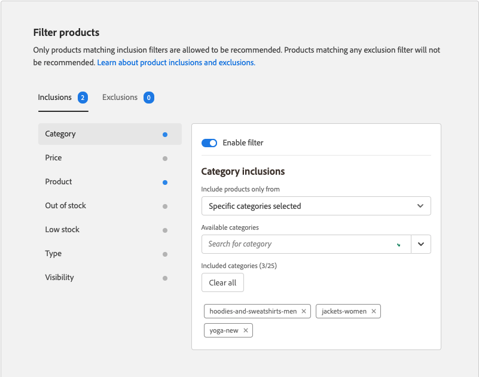

# レコメンデーションを編集

レコメンデーションの編集ページでは、レコメンデーションを構成する個々の設定を調整できます。 ページタイプとレコメンデーションタイプを除くすべての設定を編集できます。 次の設定を編集できます。

- [レコメンデーション名](#name)
- [ストアフロントラベル](#label)
- [製品数](#number)
- [配置と位置](#placement)
- [製品のフィルタリング](#filters)

ページの右側のプレビューは、現在の設定を含むレコメンデーションがストアフロントにどのように表示されるかを示します。 The _推奨製品のプレビュー_ は、ページを下にスクロールすると、参照用に表示されたままになります。 プレビューには、返される各製品のサムネール製品画像、製品名、SKU、価格および結果のタイプが表示されます。 結果のタイプは、レコメンデーションを生成するのに十分な主要行動データがあるか、または代替行動データを使用しているかを示します。

## レコメンデーションの編集

1. 次の日： _管理者_ サイドバー、移動 **マーケティング** > _プロモーション_ > **製品Recommendations**.

1. 編集するレコメンデーションを選択します。

1. クリック **編集**. 次に、以下の手順に従って、必要な変更を行います。

1. 完了したら、「 **変更を保存**.

### レコメンデーション名 {#name}

レコメンデーションの目的を示すわかりやすい名前を選択します。 名前は内部参照用で、ストアフロントには表示されません。

### ストアフロントラベル {#label}

ストアフロントでレコメンデーション単位のラベルとして使用するテキストを入力します。

### 製品数 {#number}

スライダーを調整して、レコメンデーション単位で最大 20 個の製品を表示します。

### 配置と位置 {#placement}

1. レコメンデーション単位をストアフロントに表示するページの場所を選択します。

   - メインコンテンツの下部
   - メインコンテンツの先頭

   

1. 単位に含まれるレコメンデーションの順序を変更するには、 **移動**  コントロールを使用して、レコメンデーションを位置にドラッグします。

   

### 製品のフィルタリング {#filters}

製品に対して行われた変更 [フィルター](filters.md) が _推奨製品のプレビュー_. インクルージョンフィルターに一致する製品のみをレコメンデーションできます。 除外フィルターに一致する製品は、お勧めしません。

The _含む_ および _除外_ タブには、各タイプで使用可能なフィルターが一覧表示されます。 この一覧では、各アクティブなフィルターに青い点が付いています。

- 各フィルターの詳細を表示するには、フィルター名をクリックします。
- フィルターステータスを変更するには、 **フィルターを有効にする** 切り替える `on` または `off` 位置。

フィルター設定は、レコメンデーション単位に含めるまたは除外する商品を記述します。 例えば、 _カテゴリ_ フィルター包含設定を使用すると、選択したカテゴリの製品のみを含めることができます。

