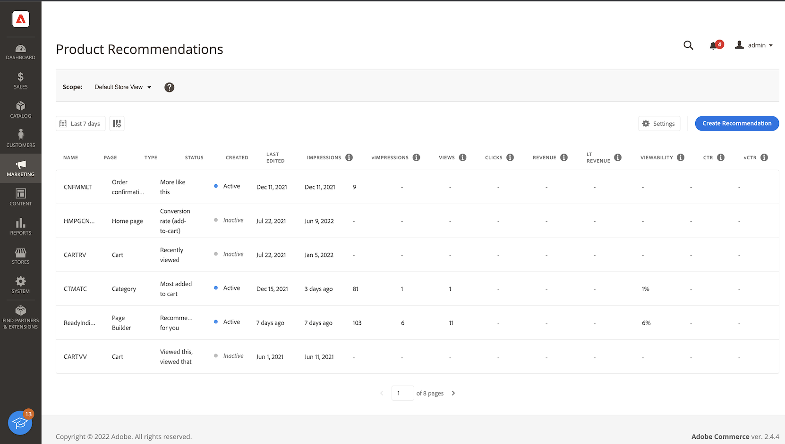

# [!DNL Product Recommendations] Workspace

[!DNL Product Recommendations] ワークスペースには、以前設定したレコメンデーションのリストと、各レコメンデーションの成功を追跡するのに役立つ指標が表示されます。 このリストは、最終日、週または月の指標を計算するように設定できます。 指標を使用すると、レコメンデーションユニットが表示またはクリックされた頻度に基づいて実用的なインサイトを作成したり、レコメンデーションがどの程度実行されたかを分析したりできます。

_RecommendationsWorkspace_

## 範囲を設定

最初は、すべてのレコメンデーション設定の [ 範囲 ](https://experienceleague.adobe.com/docs/commerce-admin/start/setup/websites-stores-views.html) が `Default Store View` に設定されます。 Commerceのインストールに複数のストア表示が含まれる場合、お勧めが適用される **ストア表示** に [ 範囲 ](https://experienceleague.adobe.com/docs/commerce-admin/start/setup/websites-stores-views.html#scope-settings) を設定します。

## 指標の日付範囲を設定

1. **カレンダー** コントロールをクリックします。

1. 次のいずれかの操作を行います。

   - 過去 24 時間
   - 過去 7 日間
   - 過去 30 日間

   指標列の計算値は、現在の日付範囲を反映して変更されます。

## 列の表示/非表示

1. 左上隅の **表示/非表示** 列をクリックします。

   表示されている列には、青いチェックマークが付いています。

1. メニューで、次のいずれかの操作を行います。

   - 非表示の列を表示するには、チェック マークのない任意の列名をクリックします。
   - 表示されている列を非表示にするには、チェックマークが付いている任意の列名をクリックします。

   テーブルが更新され、選択した列のみが含まれます。

   
   _列の表示/非表示_

## 設定

設定によって、推奨行動データを提供する SaaS データ領域が決まります。

- レコメンデーション行動データの作成元を変更するには、別の SaaS データ領域を選択します。

- 新しい SaaS データ領域を構成するには、[**構成の編集**] をクリックします。 詳しくは、[ 設定 ](settings.md) を参照してください。

_Recommendationsの設定_

## 詳細を表示

1. テーブルで、調査するレコメンデーションをクリックします。

   
   _ホームページのコンバージョン率の詳細_

1. レコメンデーションのステータスを変更するには、「**アクティブ化**」または **非アクティブ化** をクリックします。

## レコメンデーションを編集

レコメンデーションの詳細ページで、「**編集**」をクリックします。 詳しくは、[Recommendationsを編集 ](edit.md) を参照してください。

## レコメンデーションの作成

レコメンデーションの詳細ページで、「**作成**」をクリックします。 詳しくは、[Recommendationsの作成 ](create.md) を参照してください。

## Workspaceの制御

| 制御 | 説明 |
|---|---|
|  | 指標の計算に使用される時間範囲を決定します。 オプション：24 時間/7 日/30 日 |
|  | [!DNL Product Recommendations] テーブルに表示される列を決定します。 |
| 設定 | レコメンデーション行動データが取得される SaaS データ領域を決定し、視覚的な類似性レコメンデーションタイプも有効にします。 |
| レコメンデーションの作成 | [ 新しいレコメンデーションを作成 ](create.md) ページを開きます。 |

## 列の説明

| 列 | 説明 |
|---|---|
| 名前 | 推奨事項の名前。 |
| ページ | 推奨事項が表示されるページ。 |
| タイプ | レコメンデーションタイプ。 |
| ステータス | 推奨ステータス。 オプション：非アクティブ/アクティブ/ドラフト |
| 作成日時 | レコメンデーションが作成された日付。 |
| 最終編集日時 | レコメンデーションが最後に編集された日付。 |
| インプレッション | レコメンデーションユニットがページに読み込まれてレンダリングされた回数。 ブラウザーのビューポートの折りたたみの下にあるレコメンデーションユニットは、ページ上にレンダリングされますが、買い物客には表示されません。 この場合、レンダリングされた単位はインプレッションとしてカウントされますが、ビューは、ユーザーが単位をスクロールして表示した場合にのみカウントされます。 |
| インプレッション | （ビューアブルインプレッション数）少なくとも 1 つのビューを登録するレコメンデーションユニットの数。 |
| ビュー | 買い物客のブラウザーのビューポートに表示されるレコメンデーション単位の数。 このイベントは、1 つのページで複数回発生する可能性があります。 |
| クリック数 | 買い物客がレコメンデーションユニット内の項目をクリックした回数と、買い物客がレコメンデーションユニット内の **買い物かごに追加** ボタンをクリックした回数の合計 |
| 収益 | 現在の時間範囲のレコメンデーションによって生じる売上高。 |
| 長期収益 | （生涯売上高）レコメンデーションによって生じる生涯売上高。 |
| 視認性 | ビューに登録するレコメンデーションユニットの割合。 |
| 中央 | （クリックスルー率）クリックを登録したレコメンデーションに対する単位インプレッションの割合。 |
| vCtr | （表示可能なクリックスルー率）クリックを登録したレコメンデーションユニットに対する表示可能なインプレッションの割合。 |
