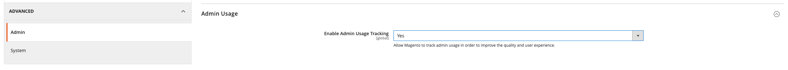

# [!DNL Quick Checkout] オンボーディング

を使い始めるには、以下を実行します。 [!DNL Quick Checkout] Adobe Commerce拡張機能の場合、インスタンスをアドビのチェックアウト機能に接続するには、いくつかのオンボーディング手順を実行する必要があります。

1. [拡張機能の取得](#get-extension).
1. [での実稼動またはサンドボックスマーチャントアカウントの作成 [!DNL Bolt]](#create-account-with-bolt). ID を検証するために必要な情報をすべて入力します。
1. [一意の [!DNL API Key] および [!DNL Publishable Key]](#obtain-api-credentials) で生成済み [!DNL Bolt].
1. [支払いプロバイダーを [!DNL Bolt] アカウント](#configure-payment-providers).
1. [「有効にする」ドロップダウンを「はい」に設定します。](#enable-extension) をクリックして、拡張機能を有効にします。
1. [サービス設定を定義する](#complete-admin-configuration) を設定するには、以下を実行します。 [!DNL Quick Checkout] 拡張子。
1. [「設定を保存」をクリックします。](#enable-live-quick-checkout) ボタンをクリックして拡張機能を有効にします。
1. 範囲をに切り替え **メイン Web サイト** および [「コールバック URL を設定」をクリックします。](#check-shopper-valid-account) 」ボタンをクリックします。

Gainsight が有効な場合、トリガー **ツアーに参加する** 」ボタン [!DNL Quick Checkout] 管理パネル：概要 [!DNL Quick Checkout] Adobe Commerceの場合：

1. 次の日： _管理者_ サイドバー、移動 **[!UICONTROL Stores]** > **[!UICONTROL Configuration]** /詳細：

   

Gainsight が有効になっていない場合は、オンボーディング手順を続行します。

詳しくは、 [[!DNL Quick Checkout] 管理パネル](../quick-checkout/admin-panel.md) トピックを参照してください。

>[!NOTE]
>
> を設定しない場合、 [!DNL Bolt] アカウントは、サンドボックス環境または実稼動環境を設定できません。

## 前提条件

を使用するには、 [!DNL Quick Checkout]を使用するには、以下を利用できる必要があります。 [!DNL Bolt]:

- サポートされる支払いプロバイダー
- のマーチャントおよび実稼動アカウント [!DNL Bolt]
- API および [!DNL Publishable key] で生成済み [!DNL Bolt]

詳しくは、 [前提条件](../quick-checkout/prerequisites.md) トピックを参照してください。

詳しくは、 [API 資格情報](#obtain-api-credentials) を作成し、 [!DNL API keys] 例えば、

## 拡張機能の取得

詳しくは、 [install](../quick-checkout/install.md) トピックを参照してください。

## でアカウントを作成 [!DNL Bolt]

を設定する前に [!DNL Quick Checkout] Adobe Commerce Admin で、 [sandbox](https://merchant-sandbox.bolt.com/register?platform=magento2){target="_blank"} and [production](https://merchant.bolt.com/register?platform=magento2){target="_blank"}  ～の商人口座 [!DNL Bolt]. アカウントを作成するために必要なすべての詳細を指定します。 [!DNL Bolt].

詳しくは、 [テストと検証](../quick-checkout/testing.md) トピックを参照してください。

## API 資格情報の取得

次の手順で [!DNL Quick Checkout] 必要な項目 [!DNL Bolt] 一意のキーと [!DNL signing secret]. 次の情報を入手します。 [!DNL API keys] 移動して **開発者** > **API** > **キー** （内） **Bolt Merchant Dashboard**.

- [!DNL API key]：バックエンドがとのやり取りに使用する秘密鍵 [!DNL Bolt] API
- [!DNL Publishable key]：フロントエンドがとのやり取りに使用するキー [!DNL Bolt] API
- [!DNL Signing secret]：から受信した要求の署名検証に使用されます。 [!DNL Bolt].

  

詳しくは、 [[!DNL Bolt] 環境の詳細](https://help.bolt.com/developers/references/environment-details/#about-keys){target="_blank"} キーと署名の秘密鍵についての詳細は、次のページを参照してください： [!DNL Bolt] （の） [!DNL Quick Checkout] 拡張子。

>[!CAUTION]
>
> 次を作成する必要があります： [!DNL API keys] サンドボックス環境と実稼動環境の両方に対して使用できます。

## 支払いプロバイダーの設定

お客様の支払いサービスプロバイダーに接続するには、 [プロセッサー設定](https://help.bolt.com/integrations/adobe-quick-checkout/set-up/){target="_blank"} 開発者 [!DNL Bolt] ページに貼り付けます。

## 拡張機能を有効にする

1. 次の日： _管理者_ サイドバー、移動 **ストア** > _設定_ > **設定**.
1. 左側のパネルで、を展開します。 **セールス** を選択し、 **チェックアウト**.
1. Adobe Analytics の [!DNL Quick Checkout] 表示、設定 **有効にする** から `Yes`.

>[!CAUTION]
>
> クイックチェックアウトフィールドは、 **有効にする** が `Yes`.

1. 使用するメソッド（サンドボックスまたは実稼動）を選択します。

   - テストおよび開発のためのサンドボックス
   - 生産：生の支払処理者との取引を処理します。

1. 一意の API を指定した後で資格情報を検証し、 [!DNL Publishable keys].

詳しくは、 [設定](../quick-checkout/settings-quick-checkout.md) トピックを参照してください。 [!DNL Quick Checkout] Adobe Commerce拡張機能の場合。

>[!CAUTION]
>
> 一意の API と [!DNL Publishable] キーを押してから拡張機能を有効にします。そうしないと、顧客は支払いフォームを表示し、注文できなくなります。

## 管理者設定を完了

1. 次の日： _管理者_ サイドバー、次に移動 **ストア** > **設定** > **チェックアウト** をクリックして、一般的な「チェックアウト管理者設定」ページにアクセスします。
1. Adobe Analytics の _サービス設定_ 「 」セクションでは、拡張機能を有効にするために必要なすべての詳細を指定します。
1. 設定 _支払いアクション_ を次のいずれかのオプションに設定します。

   - `Authorize`：認証時にトランザクションを自動的に取り込まないでください。
   - `Authorize and Capture`：認証時にトランザクションを自動的にキャプチャします。

Adobe Commerceの標準チェックアウトオプションについて詳しくは、 [checkout](https://docs.magento.com/user-guide/configuration/sales/checkout.html) トピック。

## ライブクイックチェックアウトを有効にする

を有効にするには、以下を実行します。 [!DNL Quick Checkout] Adobe Commerce拡張機能の場合：

1. 以下を確認します。 [!UICONTROL Enable] ドロップダウンが **はい** をクリックして、拡張機能を有効にします。
1. クリック **設定を保存**.

## 買い物客の有効なアカウントを確認

買い物客が [!DNL Bolt] アカウント：

1. 範囲をに切り替えます。 **メイン Web サイト**.
1. 次をクリック： **コールバック URL の設定** 」ボタンをクリックします。 これにより、 [!DNL Bolt] をクリックして、買い物客がアカウントを持っているかどうかを判断します。 存在する場合は、OTP ポップアップが表示されます。

   >[!CAUTION]
   >
   > スコープを **メイン Web サイト** は、適切な URL が設定されていることを確認します。 各 Web サイトには複数のドメインを含めることができます。

詳しくは、 [サイト、ストア、および表示範囲](https://experienceleague.adobe.com/docs/commerce-admin/start/setup/websites-stores-views.html#scope-settings){target="_blank"} Adobe Commerceのスコープの詳細については、トピックを参照してください。

## サービス設定の指定

1. 設定 **チェックアウトの追跡を有効にする** から `Yes`.

   >[!CAUTION]
   >
   > このオプションを無効にすると、Adobe Commerceはチェックアウトトラッキング情報を Bolt と共有できないので、レポートに影響を与えます。

1. を選択します。 **ログイン後の次のステージ** オプションを使用して、ユーザーがログインした後にナビゲーションフローを変更できます。 デフォルトでは、 **支払い** ページに貼り付けます。
1. 次の場合に定義 [!DNL Quick Checkout] を許可 **自動ログイン** チェックアウト時に。 デフォルトでは、 [!DNL Bolt] ネットワーク。

   >[!NOTE]
   >
   > 詳しくは、 [Bolt&#39;s Enable Automatic Login documentation](https://help.bolt.com/products/embedded/direct-api/auto-login/) を参照してください。

## お問い合わせ

オンボーディングプロセスは、 [!DNL Express Checkout] 機能。

を通じてAdobe Commerceサポートに問い合わせる [Adobe Commerce Help Center](https://experienceleague.adobe.com/docs/commerce-knowledge-base/kb/help-center-guide/magento-help-center-user-guide.html) 何か助けが必要な場合は

詳しくは、 [テストと検証](../quick-checkout/testing.md) トピックを参照してください。
