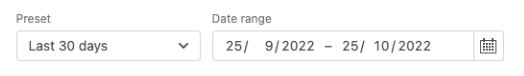

# レポート

[!DNL Quick Checkout] Adobe CommerceとMagento Open Sourceの場合は、包括的なレポートを使用して、ストアのチェックアウトエクスペリエンスの統計に関する詳細な情報を取得できます。

>[!WARNING]
>
> Adobe Commerceがチェックアウト情報を Bolt と共有できるようにするには、 [**チェックアウトの追跡**](../quick-checkout/settings-quick-checkout.md)  設定は管理で有効にする必要があります。 デフォルトでは、この設定オプションはに設定されています。 **はい**. このオプションが **いいえ**&#x200B;に値を指定しない場合、レポートに影響が出ます。 Bolt は、東部標準時 (EST) の午前 3 時に、レポート情報を 1 日に 1 回更新します。

## 概要レポート

「概要」セクションのグラフには、平均チェックアウト時間、チェックアウト中またはチェックアウト中断中に作成された新規アカウントなど、ストアのチェックアウトパフォーマンスに関する詳細情報が表示されます。

| グラフ | 説明 |
|---|---|
| [!UICONTROL Checkout abandonment] | 購入を完了せずにチェックアウトプロセスを終了した訪問者の割合。 |
| [!UICONTROL Checkout abandonment breakdown] | チェックアウトの中断を訪問者のタイプで割ります。 ツールチップは、ボルトとゲストの間のパーセンテージの差を示します。 オプション： [!UICONTROL Bolt] / [!UICONTROL Merchant] / [!UICONTROL Guest] |
| [!UICONTROL Average checkout time] | 訪問者がチェックアウトプロセスを完了するまでの平均時間。 |
| [!UICONTROL Average checkout time breakdown] | 平均チェックアウト時間を訪問者のタイプで割った値です。 ツールチップは、ボルトとゲストの間のパーセンテージの差を示します。 オプション： [!UICONTROL Bolt] / [!UICONTROL Merchant] / [!UICONTROL Guest] |
| [!UICONTROL Orders by account type] | 注文を訪問者のタイプで割った値です。 オプション： [!UICONTROL Bolt] / [!UICONTROL Merchant] / [!UICONTROL Guest] |

## トレンドレポート

「トレンド」セクションのグラフには、アカウントタイプ別にフィルターされたチェックアウトエクスペリエンスのトレンド、またはチェックアウト時に作成された新しいアカウントが表示されます。

| グラフ | 説明 |
|---|---|
| [!UICONTROL Checkout abandonment by account type] | チェックアウトの中断の傾向を訪問者のタイプで割った値です。 オプション： [!UICONTROL Bolt] / [!UICONTROL Merchant] / [!UICONTROL Guest] |
| [!UICONTROL Orders by account type] | 注文件数のトレンドを訪問者のタイプで割った値です。 オプション： [!UICONTROL Bolt] / [!UICONTROL Merchant] / [!UICONTROL Guest] |
| [!UICONTROL New accounts on your store] | ストアトレンドの新しいアカウント。 |

## データをフィルター

日付別に表示される結果や、既存のプリセット ( **過去 30 日間**.

| フィールド | 説明 |
|---|---|
| [!UICONTROL Preset] | 特定の範囲のデータを表示するために使用できるデフォルトのプリセットを表示するドロップダウン。 デフォルトでは：過去 30 日間 |
| [!UICONTROL Date range] | 選択した日付に応じて特定の範囲のデータを選択できるドロップダウン。 |
