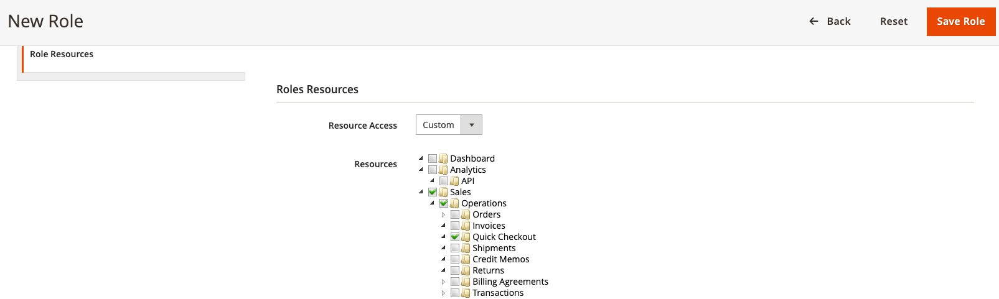

# [!DNL Quick Checkout] ユーザー設定

[!DNL Quick Checkout] は、オンボーディングを開始したり、拡張機能を使用したり、ドキュメントやドキュメントへのアクセスなどのリソースを含めたりするために必要なすべての情報を管理パネルに提供します。 [!DNL Bolt] merchant dashboard またはリリースノート。

次の手順で [!DNL Quick Checkout] 管理パネル：

1. 次の日： _管理者_ サイドバー、次に移動 **[!UICONTROL Sales]** > **[!UICONTROL Quick Checkout]**.

   {width="600" zoomable="yes"}

詳しくは、 [オンボーディング](../quick-checkout/onboarding.md) の設定方法の詳細に関するトピック [!DNL Quick Checkout] Adobe Commerceの

ユーザーが [!DNL Quick Checkout] 管理パネルで、ユーザーに適切な役割リソースが付与されていることを確認する必要があります。

1. 次の日： _管理者_ サイドバー、移動 **[!UICONTROL System]** /権限 > **[!UICONTROL User Roles]**.

   {width="300" zoomable="yes"}

1. Adobe Analytics の _役割_ 表示、クリック **新しいロールの追加**
1. を選択します。 [!DNL Quick Checkout] リソース：

   {width="300" zoomable="yes"}

1. クリック **ロールを保存**.

詳しくは、 [ユーザーの役割](https://docs.magento.com/user-guide/system/permissions-user-roles.html) ロールの定義、またはユーザーへのロールの割り当てに関する詳細は、ページを参照してください。
